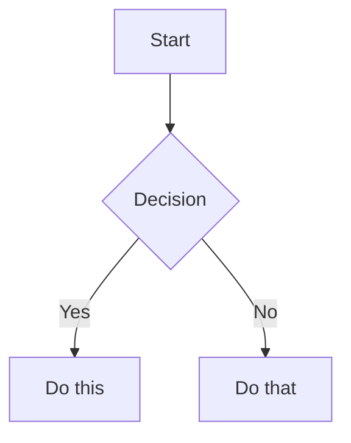

# Obsidian Flavored Markdown Skill

Create and edit valid Obsidian Flavored Markdown. Obsidian extends CommonMark and GFM with wikilinks, embeds, callouts, properties, comments, and other syntax. This skill covers only Obsidian-specific extensions -- standard Markdown (headings, bold, italic, lists, quotes, code blocks, tables) is assumed knowledge.

## GitHub Compatibility Rules

Obsidian notes in this repo are also rendered by GitHub. Follow these rules so content renders correctly in both:

1. **Callout markers must be alone on the first line** (`> [!type]`, nothing else on that line). Write all text — including any intended title — on a following `> ` line. Single-line callouts (`> [!note] text`) and inline titles fall back to plain blockquotes on GitHub.
2. **Use only GitHub's five alert types** (`note`, `tip`, `important`, `warning`, `caution`) when GitHub rendering matters. Map other Obsidian types per the [Alert Type Mapping](#github-alert-type-mapping).
3. **No display-text wikilinks inside tables** (`[[Note|Display]]` breaks GFM table parsing). Use bare `[[Note]]` or restructure.
4. **Prefer standard Markdown where possible**: `[text](url)` for external links, fenced code blocks with language tags, GFM tables, standard task lists.
5. **Obsidian-only syntax degrades on GitHub**: wikilinks render as plain text, `==highlight==` and `%%comments%%` are not rendered, embeds (`![[...]]`) show as literal text. Acceptable in vault-only notes; avoid in files published to GitHub, or provide fallbacks (e.g., a standard markdown link alongside the wikilink).

## Workflow: Creating an Obsidian Note

1. **Add frontmatter** with properties (title, tags, aliases) at the top of the file. See [PROPERTIES.md](references/PROPERTIES.md) for all property types. For entity notes, set `entity_type_1` as a tag — see [ENTITY_TYPES.md](references/ENTITY_TYPES.md) for the full schema.
2. **Write content** using standard Markdown for structure, plus Obsidian-specific syntax below.
3. **Link related notes** using wikilinks (`[[Note]]`) for internal vault connections, or standard Markdown links for external URLs.
4. **Embed content** from other notes, images, or PDFs using the `![[embed]]` syntax. See [EMBEDS.md](references/EMBEDS.md) for all embed types.
5. **Add callouts** for highlighted information using `> [!type]` syntax. See [CALLOUTS.md](references/CALLOUTS.md) for all callout types.
6. **Verify** the note renders correctly in Obsidian's reading view.

> When choosing between wikilinks and Markdown links: use `[[wikilinks]]` for notes within the vault (Obsidian tracks renames automatically) and `[text](url)` for external URLs only.

## Internal Links (Wikilinks)

```markdown
[[Note Name]]                          Link to note
[[Note Name|Display Text]]             Custom display text
[[Note Name#Heading]]                  Link to heading
[[Note Name#^block-id]]                Link to block
[[#Heading in same note]]              Same-note heading link
```

> [!warning]
> Pipe conflict in markdown tables — The `|` in `[[Link|Display Text]]` is interpreted as a table column separator inside markdown tables. **Never use display-text wiki links (`[[Note|Display]]`) inside table cells.** Use bare `[[Note]]` instead, or restructure the content to avoid wiki links in tables. This applies to all GFM/CommonMark table syntax.

Define a block ID by appending `^block-id` to any paragraph:

```markdown
This paragraph can be linked to. ^my-block-id
```

For lists and quotes, place the block ID on a separate line after the block:

```markdown
> A quote block

^quote-id
```

## Embeds

Prefix any wikilink with `!` to embed its content inline:

```markdown
![[Note Name]]                         Embed full note
![[Note Name#Heading]]                 Embed section
![[image.png]]                         Embed image
![[image.png|300]]                     Embed image with width
![[document.pdf#page=3]]               Embed PDF page
```

See [EMBEDS.md](references/EMBEDS.md) for audio, video, search embeds, and external images.

## Callouts

Callouts use `> [!type]` with the marker alone on the first line and the content on the following lines (see rule 1 in [GitHub Compatibility Rules](#github-compatibility-rules)):

```markdown
> [!note]
> Basic callout.

> [!warning]
> Title text goes here as the first content line.
```

Obsidian-only callout features — custom titles, foldable callouts (`+`/`-`), nesting, custom CSS types — work in Obsidian but will not render as alerts on GitHub:

```markdown
> [!faq]- Collapsed by default
> Foldable callout (- collapsed, + expanded).
```

### GitHub Alert Type Mapping

GitHub alerts support only five types: `note`, `tip`, `important`, `warning`, `caution`. When GitHub rendering matters, restrict callouts to these types and map other Obsidian types accordingly. Note that `important` is an alias of `tip` in Obsidian but a distinct alert type on GitHub — pick deliberately:

| Obsidian type | Use on GitHub |
|---------------|---------------|
| `info`, `abstract`, `todo` | `[!note]` |
| `tip`, `hint` | `[!tip]` |
| `important` | `[!important]` (GitHub-distinct; alias of `tip` in Obsidian) |
| `success`, `example` | `[!tip]` |
| `question`, `faq`, `quote` | `[!note]` or plain blockquote (no true equivalent) |
| `warning`, `caution`, `attention` | `[!warning]` |
| `danger`, `error`, `failure`, `bug` | `[!caution]` |

Common types: `note`, `tip`, `warning`, `info`, `example`, `quote`, `bug`, `danger`, `success`, `failure`, `question`, `abstract`, `todo`.

See [CALLOUTS.md](references/CALLOUTS.md) for the full list with aliases, nesting, and custom CSS callouts.

## Properties (Frontmatter)

```yaml
---
title: My Note
date: 2024-01-15
tags:
  - project
  - active
aliases:
  - Alternative Name
cssclasses:
  - custom-class
---
```

Default properties: `tags` (searchable labels), `aliases` (alternative note names for link suggestions), `cssclasses` (CSS classes for styling).

See [PROPERTIES.md](references/PROPERTIES.md) for all property types, tag syntax rules, and advanced usage.

## Tags

```markdown
#tag                    Inline tag
#nested/tag             Nested tag with hierarchy
```

Tags can contain letters, numbers (not first character), underscores, hyphens, and forward slashes. Tags can also be defined in frontmatter under the `tags` property.

## Comments

```markdown
This is visible %%but this is hidden%% text.

%%
This entire block is hidden in reading view.
%%
```

## Obsidian-Specific Formatting

```markdown
==Highlighted text==                   Highlight syntax
```

## Math (LaTeX)

```markdown
Inline: $e^{i\pi} + 1 = 0$

Block:
$$
\frac{a}{b} = c
$$
```

## Diagrams (Mermaid)

````markdown

````

To link Mermaid nodes to Obsidian notes, add `class NodeName internal-link;`.

## Footnotes

```markdown
Text with a footnote[^1].

[^1]: Footnote content.

Inline footnote.^[This is inline.]
```

## Complete Example

````markdown
---
title: Project Alpha
date: 2024-01-15
tags:
  - project
  - active
status: in-progress
---

# Project Alpha

This project aims to [[improve workflow]] using modern techniques.

> [!important]
> Key Deadline — The first milestone is due on ==January 30th==.

## Tasks

- [x] Initial planning
- [ ] Development phase
  - [ ] Backend implementation
  - [ ] Frontend design

## Notes

The algorithm uses $O(n \log n)$ sorting. See [[Algorithm Notes#Sorting]] for details.

![[Architecture Diagram.png|600]]

Reviewed in [[Meeting Notes 2024-01-10#Decisions]].
````

## Document Enrichment Pattern

When enriching an existing entity note with information from an ingested document, follow this pattern to ensure substantive context is woven into the entity body, not just appended as a reference.

### Steps

1. **Identify** which facts/mechanisms from the document are NEW to this entity
2. **Place** each fact in the most relevant body section using callout attribution
3. **Connect** each new fact to related entities in the Connections section
4. **Attribute** the source in both the body callout and the Documents section

### Callout Attribution Pattern

Use `> [!info]` callouts to attribute document-derived insights within entity body sections:

```markdown
### Mechanism of Action

- Existing content about IL-6 signaling...

> [!info]
> Source: [[SASP: The Dark Side of Tumor Suppression]]
> IL-6 secretion is directly controlled by persistent DNA-damage signaling through ATM and CHK2, independent of the p53 pathway.

- Additional existing content...
```

### Connections Pattern

Each new connection must describe HOW the entities interact, not just that they are related:

```markdown
## Connections

- [[ATM]] — Persistent DNA damage signaling through ATM and CHK2 directly controls IL-6 secretion, independent of p53
- [[p53]] — p53 restrains IL-6 expression; p53 loss amplifies SASP-driven cancer promotion
- [[Tumor Microenvironment]] — IL-6 from senescent cells reshapes the tumor microenvironment to support cancer growth
```

### Anti-Patterns to Avoid

- **Don't** only update the Documents section — every document insight must appear in at least one body section
- **Don't** write vague connections — always include mechanism, pathway, or direction of effect
- **Don't** skip the callout attribution — readers need to know where the insight came from
- **Don't** duplicate the same fact in multiple body sections — place it in the most relevant section once

## References

- [Obsidian Flavored Markdown](https://help.obsidian.md/obsidian-flavored-markdown)
- [Internal links](https://help.obsidian.md/links)
- [Embed files](https://help.obsidian.md/embeds)
- [Callouts](https://help.obsidian.md/callouts)
- [GitHub Alerts](https://docs.github.com/en/get-started/writing-on-github/getting-started-with-writing-and-formatting-on-github/basic-writing-and-formatting-syntax#alerts)
- [Properties](https://help.obsidian.md/properties)
