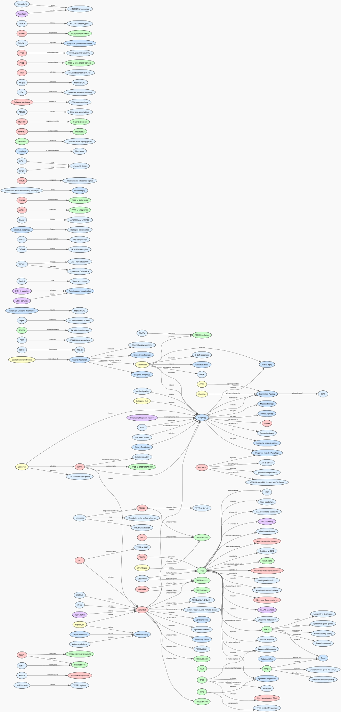
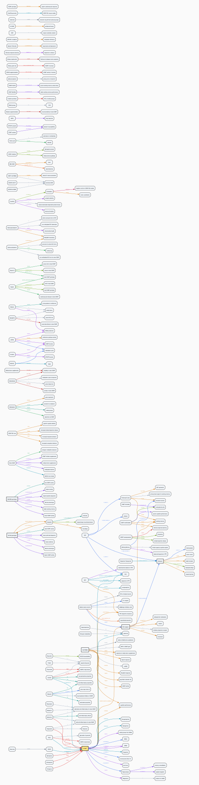
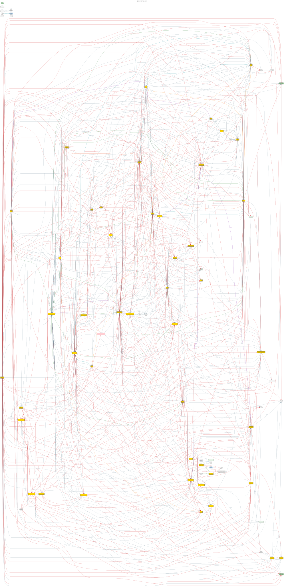
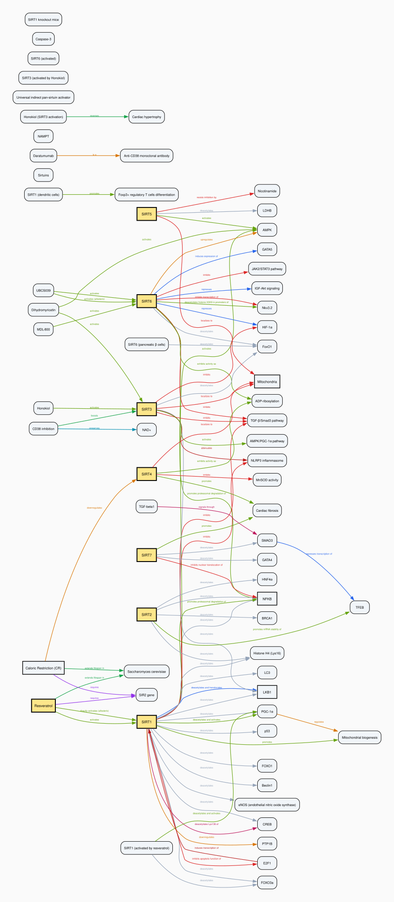

---

> - Mechanistic extraction — what it produces, predicate types, use cases, and what 80–99% means
> - Co-occurrence extraction — confidence model, scale comparison, design for discovery, and what 20–30% means
> - Complementary nature — neither is "better", confidence as cohesion metric, no fixed target

| Topic            | High %    | Edges | Predicates | Top predicate                                                                               | Extraction style |
| ---------------- | --------- | ----- | ---------- | ------------------------------------------------------------------------------------------- | ---------------- |
| adrenochrome     | **90.6%** | 64    | 37         | `is (9), promotes (4), activates (4), induces (3), causes (3)`                              | mechanistic      |
| autophagy        | **89.6%** | 154   | 79         | `phosphorylates (19), activates (11), inhibits (10), regulates (8), induces (6)`            | mechanistic      |
| comt             | **83.5%** | 200   | 89         | `is (29), is_associated_with (11), modulates (7), supports (6), impacts (6)`                | mechanistic      |
| epigenetics      | **30.3%** | 7338  | 19         | `co_occurs_with (4528), mentions (1803), causes (406), connected_to (322), links_to (90)`   | co-occurrence    |
| neuromelanin     | **97.7%** | 218   | 25         | `bidirectionally_linked_with (104), is_a (30), causes (18), converts_to (12), binds_to (8)` | mechanistic      |
| oxidative_stress | **99.2%** | 236   | 127        | `produces (13), causes (13), activates (11), contributes to (9), reduces (7)`               | mechanistic      |
| sirtuins         | **97.7%** | 305   | 119        | `deacetylates (53), inhibits (30), activates (22), localizes to (10), represses (10)`       | mechanistic      |

> [!Note]
> Two extraction styles produce the triples above, each serving a different analytical purpose.

> Entity count (summary table) vs. triples nodes/edges: The summary table "entities" column counts all markdown files in `notes/<topic>/` (created during ingestion step 4 for every mentioned concept). The triples "nodes" and "edges" count only entities with extracted relationships. For mechanistic topics (all except epigenetics), nodes ≪ entity notes because extraction captures only direct causal/functional relations (e.g., adrenochrome: 289 notes → 81 nodes, 64 edges). Epigenetics uses co-occurrence extraction yielding more nodes (830) and far more edges (7,338) by linking any co-mentioned entities.

**Mechanistic extraction** (filtered: excludes `has_type` triples) outputs tight knowledge graphs with domain-specific predicates — `deacetylates`, `phosphorylates`, `activates`, `inhibits`, `causes` — each encoding a direct causal or functional relationship. These graphs are small (~150–250 edges) and high precision, best for pathway verification, drug mechanism reasoning, and literature-backed claims. They answer _"what does X directly do to Y?"_ 80–99% in this style indicates a mature, cohesive field where entities routinely co-occur in the same sentence (textbook knowledge).

**Co-occurrence extraction** (epigenetics, 30.3% high confidence) prioritizes recall over precision. Entities are linked when they appear in the same textual context; confidence is determined by textual proximity (same sentence = high, same paragraph = medium, same document = low). With 7,338 edges across 830 nodes — 30–50× larger than any mechanistic topic — and predicates dominated by `co_occurs_with` (4,528) and `mentions` (1,803), this graph captures bibliometric associations rather than causal mechanisms. It is designed for _discovery_: surfacing weak signals and cross-domain connections in fragmented or emerging fields. 20–30% in this style indicates a research frontier where most links are document-level, not yet tightly coupled in the literature.

Neither style is "better" — they are complementary. Mechanistic confirms known pathways; co-occurrence reveals potential connections. Confidence % in co-occurrence acts as a **cohesion metric**: how tightly entities cluster in the literature, not how "correct" the triples are. There is no fixed target — the appropriate range depends on the goal (90%+ for verification, 20–40% for exploration).

---

#### adrenochrome triples

**adrenochrome** — 81 nodes · 64 edges · 37 relation types · 90.6% high confidence

| Metric            | Value                                                                                                     |
| ----------------- | --------------------------------------------------------------------------------------------------------- |
| Entities (nodes)  | 81                                                                                                        |
| Triples (edges)   | 64                                                                                                        |
| Unique predicates | 37                                                                                                        |
| Confidence high   | 58 (90.6%)                                                                                                |
| Top subjects      | Adrenochrome (9), Epinephrine (3), Leuco-adrenochrome (3), Adrenochrome Hypothesis (3), Methemoglobin (2) |
| Top objects       | Epinephrine (4), Adrenochrome (4), Adrenochrome formation (3), Oxidative Stress (2), PGC1α (2)            |
| Top predicates    | is (9), promotes (4), activates (4), induces (3), causes (3)                                              |

---

#### autophagy triples

**autophagy** — 179 nodes · 154 edges · 79 relation types · 89.6% high confidence

| Metric            | Value                                                                             |
| ----------------- | --------------------------------------------------------------------------------- |
| Entities (nodes)  | 179                                                                               |
| Triples (edges)   | 154                                                                               |
| Unique predicates | 79                                                                                |
| Confidence high   | 138 (89.6%)                                                                       |
| Top subjects      | TFEB (18), mTORC1 (14), Autophagy (8), Spermidine (7), HLH-30 (5)                 |
| Top objects       | Autophagy (15), mTORC1 (6), TFEB at S211 (5), Intermittent Fasting (3), Aging (3) |
| Top predicates    | phosphorylates (19), activates (11), inhibits (10), regulates (8), induces (6)    |

---

#### comt triples

**comt** — 228 nodes · 200 edges · 89 relation types · 83.5% high confidence

| Metric            | Value                                                                                                 |
| ----------------- | ----------------------------------------------------------------------------------------------------- |
| Entities (nodes)  | 228                                                                                                   |
| Triples (edges)   | 200                                                                                                   |
| Unique predicates | 89                                                                                                    |
| Confidence high   | 167 (83.5%)                                                                                           |
| Top subjects      | COMT (15), Val158Met (9), D2 receptor (6), Met/Met genotype (6), Val/Val genotype (6)                 |
| Top objects       | COMT (9), alternative anti-inflammatory for slow COMT (3), PFC (3), catechols (3), working memory (3) |
| Top predicates    | is (29), is_associated_with (11), modulates (7), supports (6), impacts (6)                            |

---

#### adrenochrome triples

**adrenochrome** — 81 nodes · 64 edges · 37 relation types · 90.6% high confidence

| Metric            | Value                                                                                                     |
| ----------------- | --------------------------------------------------------------------------------------------------------- |
| Entities (nodes)  | 81                                                                                                        |
| Triples (edges)   | 64                                                                                                        |
| Unique predicates | 37                                                                                                        |
| Confidence high   | 58 (90.6%)                                                                                                |
| Top subjects      | Adrenochrome (9), Epinephrine (3), Leuco-adrenochrome (3), Adrenochrome Hypothesis (3), Methemoglobin (2) |
| Top objects       | Epinephrine (4), Adrenochrome (4), Adrenochrome formation (3), Oxidative Stress (2), PGC1α (2)            |
| Top predicates    | is (9), promotes (4), activates (4), induces (3), causes (3)                                              |

---

#### autophagy triples

**autophagy** — 179 nodes · 154 edges · 79 relation types · 89.6% high confidence

| Metric            | Value                                                                             |
| ----------------- | --------------------------------------------------------------------------------- |
| Entities (nodes)  | 179                                                                               |
| Triples (edges)   | 154                                                                               |
| Unique predicates | 79                                                                                |
| Confidence high   | 138 (89.6%)                                                                       |
| Top subjects      | TFEB (18), mTORC1 (14), Autophagy (8), Spermidine (7), HLH-30 (5)                 |
| Top objects       | Autophagy (15), mTORC1 (6), TFEB at S211 (5), Intermittent Fasting (3), Aging (3) |
| Top predicates    | phosphorylates (19), activates (11), inhibits (10), regulates (8), induces (6)    |

---

#### comt triples

**comt** — 228 nodes · 200 edges · 89 relation types · 83.5% high confidence

| Metric            | Value                                                                                                 |
| ----------------- | ----------------------------------------------------------------------------------------------------- |
| Entities (nodes)  | 228                                                                                                   |
| Triples (edges)   | 200                                                                                                   |
| Unique predicates | 89                                                                                                    |
| Confidence high   | 167 (83.5%)                                                                                           |
| Top subjects      | COMT (15), Val158Met (9), D2 receptor (6), Met/Met genotype (6), Val/Val genotype (6)                 |
| Top objects       | COMT (9), alternative anti-inflammatory for slow COMT (3), PFC (3), catechols (3), working memory (3) |
| Top predicates    | is (29), is_associated_with (11), modulates (7), supports (6), impacts (6)                            |

---

#### epigenetics triples

**epigenetics** — 830 nodes · 7338 edges · 19 relation types · 30.3% high confidence

| Metric            | Value                                                                                                                                                                                               |
| ----------------- | --------------------------------------------------------------------------------------------------------------------------------------------------------------------------------------------------- |
| Entities (nodes)  | 830                                                                                                                                                                                                 |
| Triples (edges)   | 7338                                                                                                                                                                                                |
| Unique predicates | 19                                                                                                                                                                                                  |
| Confidence high   | 2225 (30.3%)                                                                                                                                                                                        |
| Top subjects      | Cellular Mechanisms and Regulation of Quiescence (179), Epigenetics and aging (121), Small molecule compounds that induce cellular senescence (112), Induced Pluripotent Stem Cells (96), OSKM (94) |
| Top objects       | Induced Pluripotent Stem Cells (134), Yamanaka Factors (130), Cancer (123), Cellular Reprogramming (93), Aging (77)                                                                                 |
| Top predicates    | co_occurs_with (4528), mentions (1803), causes (406), connected_to (322), links_to (90)                                                                                                             |

---

#### neuromelanin triples

**neuromelanin** — 139 nodes · 218 edges · 25 relation types · 97.7% high confidence

| Metric            | Value                                                                                                 |
| ----------------- | ----------------------------------------------------------------------------------------------------- |
| Entities (nodes)  | 139                                                                                                   |
| Triples (edges)   | 218                                                                                                   |
| Unique predicates | 25                                                                                                    |
| Confidence high   | 213 (97.7%)                                                                                           |
| Top subjects      | Neuromelanin (35), Autophagy (8), Parkinson's Disease (8), Dopamine (7), Alpha-Synuclein (4)          |
| Top objects       | Parkinson's Disease (28), Neuromelanin (25), Dopamine (8), Neuroinflammation (7), Alpha-Synuclein (6) |
| Top predicates    | bidirectionally_linked_with (104), is_a (30), causes (18), converts_to (12), binds_to (8)             |

---

#### oxidative_stress triples

**oxidative_stress** — 239 nodes · 236 edges · 127 relation types · 99.2% high confidence

| Metric            | Value                                                                                                                              |
| ----------------- | ---------------------------------------------------------------------------------------------------------------------------------- |
| Entities (nodes)  | 239                                                                                                                                |
| Triples (edges)   | 236                                                                                                                                |
| Unique predicates | 127                                                                                                                                |
| Confidence high   | 234 (99.2%)                                                                                                                        |
| Top subjects      | Peroxynitrite (11), Oxidative Stress (8), Superoxide Radicals (7), Hydroxyl Radicals (6), NADPH Oxidase (6)                        |
| Top objects       | Lipid Peroxidation (9), Superoxide Radicals (8), notes/\_link/Hydrogen Peroxide (7), NF-kappa B (7), notes/\_link/Nitric Oxide (6) |
| Top predicates    | produces (13), causes (13), activates (11), contributes to (9), reduces (7)                                                        |

---

#### sirtuins triples

**sirtuins** — 320 nodes · 305 edges · 119 relation types · 97.7% high confidence

| Metric            | Value                                                                               |
| ----------------- | ----------------------------------------------------------------------------------- |
| Entities (nodes)  | 320                                                                                 |
| Triples (edges)   | 305                                                                                 |
| Unique predicates | 119                                                                                 |
| Confidence high   | 298 (97.7%)                                                                         |
| Top subjects      | SIRT1 (65), SIRT6 (25), Resveratrol (25), SIRT3 (19), SIRT2 (14)                    |
| Top objects       | SIRT1 (8), Mitochondria (6), NFKB (6), SIRT6 (5), AMPK (4)                          |
| Top predicates    | deacetylates (53), inhibits (30), activates (22), localizes to (10), represses (10) |

#### adrenochrome triples

**adrenochrome** — 195 nodes · 213 edges · 38 relation types · 97.2% high confidence

| Metric             | Value                                                                                                                                                                                                                   |
| ------------------ | ----------------------------------------------------------------------------------------------------------------------------------------------------------------------------------------------------------------------- |
| Entities (nodes)   | 195                                                                                                                                                                                                                     |
| Triples (edges)    | 213                                                                                                                                                                                                                     |
| Unique predicates  | 38                                                                                                                                                                                                                      |
| Confidence high    | 207 (97.2%)                                                                                                                                                                                                             |
| Top subjects       | Adrenochrome (10), Epinephrine (4), Leuco-adrenochrome (4), Adrenochrome Hypothesis (4), Methemoglobin (3)                                                                                                              |
| Top domain objects | Epinephrine (4), Adrenochrome (4), Adrenochrome formation (3), PGC1α (2), Oxidative Stress (2)                                                                                                                          |
| Top predicates     | has_type (149), is (9), promotes (4), activates (4), induces (3)                                                                                                                                                        |
| zh-TW              | 主詞：腎上腺素紅(10)、腎上腺素(4)、白腎上腺素紅(4)、腎上腺素紅假說(4)、變性血紅蛋白(3)；受詞：腎上腺素(4)、腎上腺素紅(4)、腎上腺素紅形成(3)、PGC1α(2)、氧化壓力(2)；謂語：類型為(149)、是(9)、促進(4)、激活(4)、誘導(3) |

---

#### autophagy triples

**autophagy** — 179 nodes · 154 edges · 79 relation types · 89.6% high confidence

| Metric            | Value                                                                                                                                                                                 |
| ----------------- | ------------------------------------------------------------------------------------------------------------------------------------------------------------------------------------- |
| Entities (nodes)  | 179                                                                                                                                                                                   |
| Triples (edges)   | 154                                                                                                                                                                                   |
| Unique predicates | 79                                                                                                                                                                                    |
| Confidence high   | 138 (89.6%)                                                                                                                                                                           |
| Top subjects      | TFEB (18), mTORC1 (14), Autophagy (8), Spermidine (7), HLH-30 (5)                                                                                                                     |
| Top objects       | Autophagy (15), mTORC1 (6), TFEB at S211 (5), Intermittent Fasting (3), Aging (3)                                                                                                     |
| Top predicates    | phosphorylates (19), activates (11), inhibits (10), regulates (8), induces (6)                                                                                                        |
| zh-TW             | 主詞：TFEB(18)、mTORC1(14)、自噬(8)、亞精胺(7)、HLH-30(5)；受詞：自噬(15)、mTORC1(6)、S211位點TFEB(5)、間歇性禁食(3)、衰老(3)；謂語：磷酸化(19)、激活(11)、抑制(10)、調控(8)、誘導(6) |

---

#### comt triples

**comt** — 228 nodes · 200 edges · 89 relation types · 83.5% high confidence

| Metric            | Value                                                                                                                                                                                              |
| ----------------- | -------------------------------------------------------------------------------------------------------------------------------------------------------------------------------------------------- |
| Entities (nodes)  | 228                                                                                                                                                                                                |
| Triples (edges)   | 200                                                                                                                                                                                                |
| Unique predicates | 89                                                                                                                                                                                                 |
| Confidence high   | 167 (83.5%)                                                                                                                                                                                        |
| Top subjects      | COMT (15), Val158Met (9), D2 receptor (6), Met/Met (6), Val/Val (6)                                                                                                                                |
| Top objects       | COMT (9), alternative anti-inflammatory for slow COMT (3), PFC (3), catechols (3), working memory (3)                                                                                              |
| Top predicates    | is (29), is_associated_with (11), modulates (7), supports (6), impacts (6)                                                                                                                         |
| zh-TW             | 主詞：COMT(15)、Val158Met(9)、D2受體(6)、Met/Met(6)、Val/Val(6)；受詞：COMT(9)、慢COMT替代抗炎劑(3)、前額葉皮層(3)、兒茶酚(3)、工作記憶(3)；謂語：是(29)、與...相關(11)、調節(7)、支持(6)、影響(6) |

---

#### epigenetics triples

**epigenetics** — 830 nodes · 7,338 edges · 19 relation types · 30.3% high confidence

| Metric            | Value                                                                                                                                                                                                                                                                       |
| ----------------- | --------------------------------------------------------------------------------------------------------------------------------------------------------------------------------------------------------------------------------------------------------------------------- |
| Entities (nodes)  | 830                                                                                                                                                                                                                                                                         |
| Triples (edges)   | 7,338                                                                                                                                                                                                                                                                       |
| Unique predicates | 19                                                                                                                                                                                                                                                                          |
| Confidence high   | 2,225 (30.3%)                                                                                                                                                                                                                                                               |
| Top subjects      | Cellular Mechanisms and Regulation of Quiescence (179), Epigenetics and aging (121), Small molecule compounds that induce cellular senescence (112), Induced Pluripotent Stem Cells (96), OSKM (94)                                                                         |
| Top objects       | Induced Pluripotent Stem Cells (134), Yamanaka Factors (130), Cancer (123), Cellular Reprogramming (93), Aging (77)                                                                                                                                                         |
| Top predicates    | co_occurs_with (4,528), mentions (1,803), causes (406), connected_to (322), links_to (90)                                                                                                                                                                                   |
| zh-TW             | 主詞：細胞靜止機制與調控(179)、表觀遺傳學與衰老(121)、誘導細胞衰老的小分子化合物(112)、誘導多能幹細胞(96)、OSKM(94)；受詞：誘導多能幹細胞(134)、山中因子(130)、癌症(123)、細胞重編程(93)、衰老(77)；謂語：與...共現(4,528)、提及(1,803)、導致(406)、連接至(322)、鏈接至(90) |

---

#### neuromelanin triples

**neuromelanin** — 139 nodes · 218 edges · 25 relation types · 97.7% high confidence

| Metric            | Value                                                                                                                                                                                                                 |
| ----------------- | --------------------------------------------------------------------------------------------------------------------------------------------------------------------------------------------------------------------- |
| Entities (nodes)  | 139                                                                                                                                                                                                                   |
| Triples (edges)   | 218                                                                                                                                                                                                                   |
| Unique predicates | 25                                                                                                                                                                                                                    |
| Confidence high   | 213 (97.7%)                                                                                                                                                                                                           |
| Top subjects      | Neuromelanin (35), Autophagy (8), Parkinson's Disease (8), Dopamine (7), Alpha-Synuclein (4)                                                                                                                          |
| Top objects       | Parkinson's Disease (28), Neuromelanin (25), Dopamine (8), Neuroinflammation (7), Alpha-Synuclein (6)                                                                                                                 |
| Top predicates    | bidirectionally_linked_with (104), is_a (30), causes (18), converts_to (12), binds_to (8)                                                                                                                             |
| zh-TW             | 主詞：神經黑色素(35)、自噬(8)、帕金森病(8)、多巴胺(7)、α-突觸核蛋白(4)；受詞：帕金森病(28)、神經黑色素(25)、多巴胺(8)、神經炎症(7)、α-突觸核蛋白(6)；謂語：雙向關聯(104)、是一種(30)、導致(18)、轉化為(12)、結合至(8) |

---

#### oxidative_stress triples

**oxidative_stress** — 239 nodes · 236 edges · 127 relation types · 99.2% high confidence

| Metric            | Value                                                                                                                                                                                                         |
| ----------------- | ------------------------------------------------------------------------------------------------------------------------------------------------------------------------------------------------------------- |
| Entities (nodes)  | 239                                                                                                                                                                                                           |
| Triples (edges)   | 236                                                                                                                                                                                                           |
| Unique predicates | 127                                                                                                                                                                                                           |
| Confidence high   | 234 (99.2%)                                                                                                                                                                                                   |
| Top subjects      | Peroxynitrite (11), Oxidative Stress (8), Superoxide Radicals (7), Hydroxyl Radicals (6), NADPH Oxidase (6)                                                                                                   |
| Top objects       | Lipid Peroxidation (9), Superoxide Radicals (8), Hydrogen Peroxide (7), NF-kappa B (7), Nitric Oxide (6)                                                                                                      |
| Top predicates    | produces (13), causes (13), activates (11), contributes to (9), reduces (7)                                                                                                                                   |
| zh-TW             | 主詞：過氧亞硝酸鹽(11)、氧化壓力(8)、超氧自由基(7)、羥自由基(6)、NADPH氧化酶(6)；受詞：脂質過氧化(9)、超氧自由基(8)、過氧化氫(7)、NF-κB(7)、一氧化氮(6)；謂語：產生(13)、導致(13)、激活(11)、促成(9)、減少(7) |

---

#### sirtuins triples

**sirtuins** — 320 nodes · 305 edges · 119 relation types · 97.7% high confidence

| Metric            | Value                                                                                                                                                                                   |
| ----------------- | --------------------------------------------------------------------------------------------------------------------------------------------------------------------------------------- |
| Entities (nodes)  | 320                                                                                                                                                                                     |
| Triples (edges)   | 305                                                                                                                                                                                     |
| Unique predicates | 119                                                                                                                                                                                     |
| Confidence high   | 298 (97.7%)                                                                                                                                                                             |
| Top subjects      | SIRT1 (65), SIRT6 (25), Resveratrol (25), SIRT3 (19), SIRT2 (14)                                                                                                                        |
| Top objects       | SIRT1 (8), Mitochondria (6), NFKB (6), SIRT6 (5), AMPK (4)                                                                                                                              |
| Top predicates    | deacetylates (53), inhibits (30), activates (22), localizes to (10), represses (10)                                                                                                     |
| zh-TW             | 主詞：SIRT1(65)、SIRT6(25)、白藜蘆醇(25)、SIRT3(19)、SIRT2(14)；受詞：SIRT1(8)、線粒體(6)、NFKB(6)、SIRT6(5)、AMPK(4)；謂語：去乙醯化(53)、抑制(30)、激活(22)、定位至(10)、抑制轉錄(10) |

