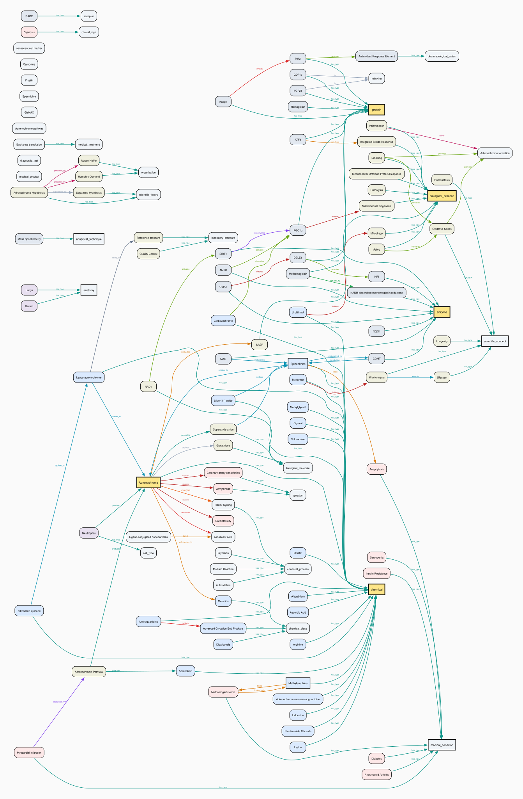
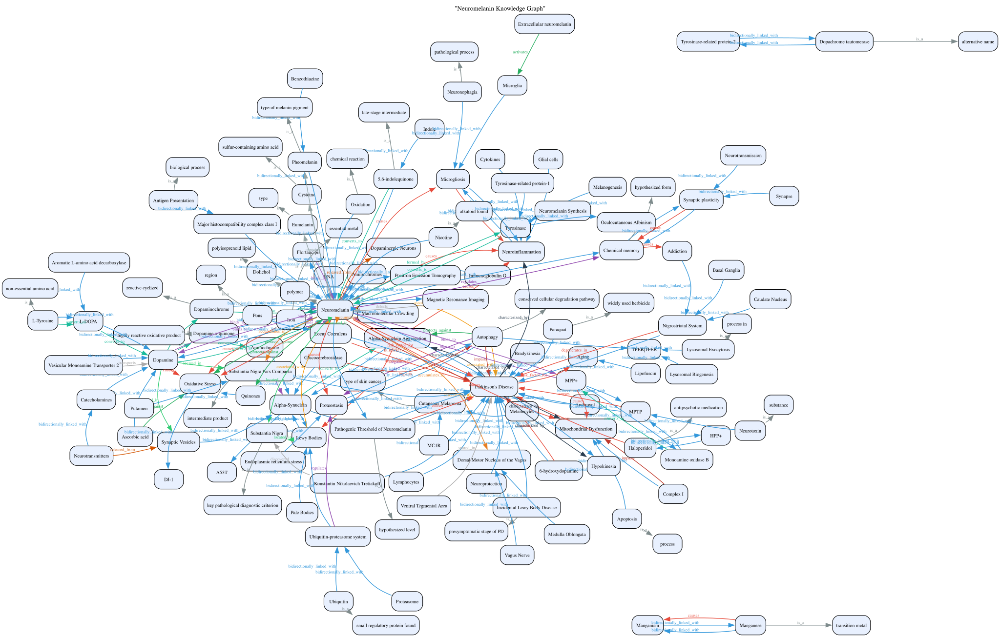
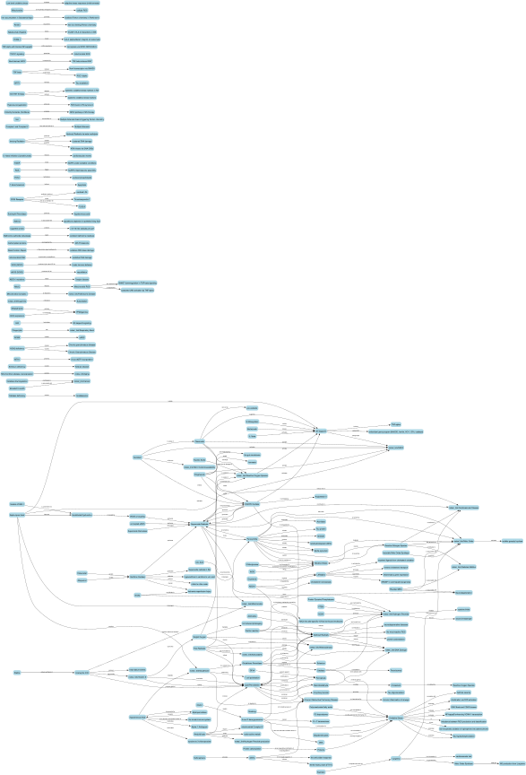
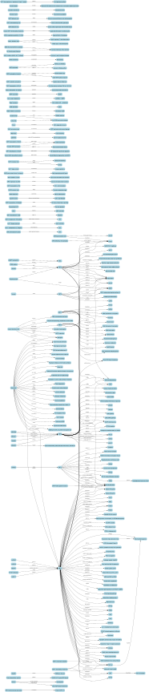

# llm-wiki-jk

<!-- GENERATED: summary_table -->
## Summary Table
| topic | updated | documents | entities | words | disk | wiki |
| :--- | :--- | :---: | :---: | :---: | :---: | :--- |
| [_link](https://github.com/jkuo45/llm-wiki/tree/dev/notes/_link) | 09_JUL_2026 | 17 | 902 | 496,896 | 4.05 MB | [[notes/_link/README\|link]] |
| [adrenochrome](https://github.com/jkuo45/llm-wiki/tree/dev/notes/adrenochrome) | 09_JUL_2026 | 19 | 253 | 189,314 | 1.95 MB | [[notes/adrenochrome/README\|link]] |
| [autophagy](https://github.com/jkuo45/llm-wiki/tree/dev/notes/autophagy) | 09_JUL_2026 | 11 | 235 | 158,146 | 1.45 MB | [[notes/autophagy/README\|link]] |
| [cancer](https://github.com/jkuo45/llm-wiki/tree/dev/notes/cancer) | 08_JUL_2026 | 8 | 245 | 211,447 | 1.97 MB | [[notes/cancer/README\|link]] |
| [comt](https://github.com/jkuo45/llm-wiki/tree/dev/notes/comt) | 08_JUL_2026 | 2 | 35 | 21,034 | 0.52 MB | [[notes/comt/README\|link]] |
| [epigenetics](https://github.com/jkuo45/llm-wiki/tree/dev/notes/epigenetics) | 08_JUL_2026 | 9 | 194 | 200,648 | 4.84 MB | [[notes/epigenetics/README\|link]] |
| [neuromelanin](https://github.com/jkuo45/llm-wiki/tree/dev/notes/neuromelanin) | 08_JUL_2026 | 2 | 84 | 59,129 | 0.81 MB | [[notes/neuromelanin/README\|link]] |
| [oxidative_stress](https://github.com/jkuo45/llm-wiki/tree/dev/notes/oxidative_stress) | 08_JUL_2026 | 1 | 65 | 69,196 | 0.96 MB | [[notes/oxidative_stress/README\|link]] |
| [sirtuins](https://github.com/jkuo45/llm-wiki/tree/dev/notes/sirtuins) | 09_JUL_2026 | 6 | 105 | 173,244 | 1.55 MB | [[notes/sirtuins/README\|link]] |
| --- | --- | ---: | ---: | ---: | ---: | --- |
| **subtotal** | 09_JUL_2026 | **75** | **2118** | **1,579,054** | **18.09 MB** | |
<!-- END GENERATED: summary_table -->

_\*notes directory only_\*

---

## 📝 updates

> [!NOTE] Current
> NAD+, Sirtuins, raw(Clippings), `task_output`, Expert Judgement in Financial Tasks, etc.

### 📌 notable:

`from recent modified or notes directory: sirtuins, NAD+, Urolithin A, SIRT1, inflammation, etc.`

- 🔬 [sirtuins in health and disease](https://github.com/jkuo45/llm-wiki-jk/blob/dev/notes/sirtuins/_document_%20-%20sirtuins%20in%20health%20and%20disease%20s41392-022-01257-8.md)
  - Comprehensive review of the seven mammalian sirtuins (SIRT1–7), NAD⁺-dependent deacetylases regulating inflammation, metabolism, oxidative stress, and apoptosis, with roles in cancer, CVD, and other diseases; surveys SIRT modulators in clinical trials.
  - 🀄️ (zh-TW): 綜述七種哺乳動物去乙醯酶（SIRT1–7），為NAD⁺依賴性酵素，調控發炎、代謝、氧化壓力與細胞凋亡，在癌症、心血管疾病等病理中扮演角色，並回顧SIRT調節劑的臨床試驗。
- 💊 [Nicotinamide Riboside — Current State of Research](https://github.com/jkuo45/llm-wiki/blob/dev/notes/adrenochrome/_document_%20-%20Nicotinamide%20Riboside%E2%80%94The%20Current%20State%20of%20Research%20and%20Therapeutic%20Uses.md)
  - Reviews NR as an NAD⁺ precursor for treating metabolic, cardiovascular, and neurodegenerative disorders, covering bioavailability, safety, and potential against SARS-CoV-2.
  - 🀄️ (zh-TW): 探討菸醯胺核醣苷（NR）作為NAD⁺前驅物，用於治療代謝、心血管及神經退化性疾病，涵蓋生物利用度、安全性及對抗SARS-CoV-2的潛力。
- ⚡ [Oxidative Stress: Harms and Benefits for Human Health](https://github.com/jkuo45/llm-wiki/blob/dev/notes/oxidative_stress/_document_%20-%20Oxidative%20Stress%20Harms%20and%20Benefits%20for%20Human%20Health.md)
  - Describes ROS as a double-edged sword: physiological roles in signaling/immunity vs. pathological roles in cancer, diabetes, and CVD; discusses therapeutic exploitation of oxidative stress.
  - 🀄️ (zh-TW): 闡述活性氧（ROS）的雙面性——在訊息傳遞與免疫中的生理角色，與在癌症、糖尿病、心血管疾病中的病理作用，並討論氧化壓力的治療性應用。
- 📈 [Biochemical Basis of Hormesis](https://github.com/jkuo45/llm-wiki/blob/dev/raw/_document_%20-%20biochemical_basis_hormesis_2026.04.20.719646v1.full.md)
  - Uses high-throughput computational screening to show hormetic (biphasic) dose-responses arise from an incoherent bivalent network motif, with rapamycin/mTOR as a case study.
  - 🀄️ (zh-TW): 透過高通量計算篩選，證明毒物興奮效應（雙相劑量反應）源自以藥物標靶為中心的「不相干雙價網路模組」，並以雷帕黴素/mTOR為案例說明。

---

### 📅 recent:

`from notes, raw: expert judgement in biomedical tasks, wine grape calculation for resvertrol, task_output recommendations, expert judgement fine-tuning (zh-TW), etc.`

- 📋 [research-scientist: sirtuins recommendations](https://github.com/jkuo45/llm-wiki/blob/dev/tasks/task_output_sirtuins_recommendations_03_JULY_2026_03_55_PM_PDT.md)
  - Strategic report outlining five targeted sirtuin-centric longevity interventions: SIRT6 allosteric activation, SIRT3/SIRT4 mitochondrial axis modulation, SIRT2-TFEB autophagy pathway enhancement, CD38-mediated NAD⁺ restoration, and miRNA-based SIRT1 epigenetic derepression.
  - 🀄️ (zh-TW): 戰略報告提出五項針對性去乙醯酶長壽干預策略：SIRT6異位激活、SIRT3/SIRT4粒線體軸調控、SIRT2-TFEB自噬路徑增強、CD38介導的NAD⁺恢復及miRNA基礎的SIRT1表觀遺傳去抑制。
- 🤖 [Learning to Replicate Expert Judgment in Financial Tasks](https://github.com/jkuo45/llm-wiki/blob/dev/raw/_document_%20-%20Learning%20to%20Replicate%20Expert%20Judgment%20in%20Financial%20Tasks.md)
  - Demonstrates that models fine-tuned on expert-labeled financial data outperform frontier LLMs on information-filtering tasks at a fraction of the cost, advancing the concept of "differentiated intelligence."
  - 🀄️ (zh-TW): 展示以專家標註金融數據微調的模型，在資訊篩選任務上以極低成本超越前沿LLM，推動「差異化智能」概念。
- 🌿 [Fisetin — A Senotherapeutic That Extends Health and Lifespan](https://github.com/jkuo45/llm-wiki/blob/dev/raw/_document_%20-%20Fisetin%20is%20a%20senotherapeutic%20that%20extends%20health%20and%20lifespan.md)
  - Screened 10 flavonoids; fisetin was the most potent senolytic. Intermittent treatment in aged mice reduced senescence markers, restored tissue homeostasis, and extended median and maximum lifespan.
  - 🀄️ (zh-TW): 篩選10種類黃酮，非瑟酮為最強衰老細胞清除劑。間歇性治療老年小鼠可降低衰老標誌物、恢復組織穩態，並延長中位數與最大壽命。
- 💪 [Creatine in Health and Disease](https://github.com/jkuo45/llm-wiki/blob/dev/raw/_document_%20-%20Creatine%20in%20Health%20and%20Disease.md)
  - Systematic review showing creatine benefits beyond ergogenic aid: supports muscle mass, bone density, cognitive function, and glycemic control, with therapeutic potential in sarcopenia, neurodegeneration, and rehabilitation.
  - 🀄️ (zh-TW): 系統性回顧顯示肌酸益處超越運動增能：支持肌肉量、骨密度、認知功能與血糖控制，在肌少症、神經退化與復健中具治療潛力。

---

### 💾 project:

`from latest changes in git: open knowledge format, etc.`

- 🛠️ [obsidian agent skills](https://github.com/jkuo45/llm-wiki/blob/dev/raw/_document_%20-%20kepanoobsidian-skills%20Agent%20skills%20for%20Obsidian.%20Teach%20your%20agent%20to%20use%20Obsidian%20CLI%20and%20open%20formats%20including%20Markdown%2C%20Bases%2C%20JSON%20Canvas..md)
- 📐 [open knowledge spec](https://github.com/jkuo45/llm-wiki/blob/dev/raw/_article%20-%20knowledge-catalogokfSPEC.md%20at%20main.md)

#### triples overview (as of 05_JUL_2026)

---

> - Mechanistic extraction — what it produces, predicate types, use cases, and what 80–99% means
> - Co-occurrence extraction — confidence model, scale comparison, design for discovery, and what 20–30% means
> - Complementary nature — neither is "better", confidence as cohesion metric, no fixed target

| Topic            | High %    | Edges | Predicates | Top predicate                                                                               | Extraction style |
| ---------------- | --------- | ----- | ---------- | ------------------------------------------------------------------------------------------- | ---------------- |
| adrenochrome     | **90.6%** | 64    | 37         | `is (9), promotes (4), activates (4), induces (3), causes (3)`                              | mechanistic      |
| autophagy        | **89.6%** | 154   | 79         | `phosphorylates (19), activates (11), inhibits (10), regulates (8), induces (6)`            | mechanistic      |
| comt             | **83.5%** | 200   | 89         | `is (29), is_associated_with (11), modulates (7), supports (6), impacts (6)`                | mechanistic      |
| epigenetics      | **30.3%** | 7338  | 19         | `co_occurs_with (4528), mentions (1803), causes (406), connected_to (322), links_to (90)`   | co-occurrence    |
| neuromelanin     | **97.7%** | 218   | 25         | `bidirectionally_linked_with (104), is_a (30), causes (18), converts_to (12), binds_to (8)` | mechanistic      |
| oxidative_stress | **99.2%** | 236   | 127        | `produces (13), causes (13), activates (11), contributes to (9), reduces (7)`               | mechanistic      |
| sirtuins         | **97.7%** | 305   | 119        | `deacetylates (53), inhibits (30), activates (22), localizes to (10), represses (10)`       | mechanistic      |

> [!Note]
> Two extraction styles produce the triples above, each serving a different analytical purpose.

> Entity count (summary table) vs. triples nodes/edges: The summary table "entities" column counts all markdown files in `notes/<topic>/` (created during ingestion step 4 for every mentioned concept). The triples "nodes" and "edges" count only entities with extracted relationships. For mechanistic topics (all except epigenetics), nodes ≪ entity notes because extraction captures only direct causal/functional relations (e.g., adrenochrome: 289 notes → 81 nodes, 64 edges). Epigenetics uses co-occurrence extraction yielding more nodes (830) and far more edges (7,338) by linking any co-mentioned entities.

**Mechanistic extraction** (filtered: excludes `has_type` triples) outputs tight knowledge graphs with domain-specific predicates — `deacetylates`, `phosphorylates`, `activates`, `inhibits`, `causes` — each encoding a direct causal or functional relationship. These graphs are small (~150–250 edges) and high precision, best for pathway verification, drug mechanism reasoning, and literature-backed claims. They answer _"what does X directly do to Y?"_ 80–99% in this style indicates a mature, cohesive field where entities routinely co-occur in the same sentence (textbook knowledge).

**Co-occurrence extraction** (epigenetics, 30.3% high confidence) prioritizes recall over precision. Entities are linked when they appear in the same textual context; confidence is determined by textual proximity (same sentence = high, same paragraph = medium, same document = low). With 7,338 edges across 830 nodes — 30–50× larger than any mechanistic topic — and predicates dominated by `co_occurs_with` (4,528) and `mentions` (1,803), this graph captures bibliometric associations rather than causal mechanisms. It is designed for _discovery_: surfacing weak signals and cross-domain connections in fragmented or emerging fields. 20–30% in this style indicates a research frontier where most links are document-level, not yet tightly coupled in the literature.

Neither style is "better" — they are complementary. Mechanistic confirms known pathways; co-occurrence reveals potential connections. Confidence % in co-occurrence acts as a **cohesion metric**: how tightly entities cluster in the literature, not how "correct" the triples are. There is no fixed target — the appropriate range depends on the goal (90%+ for verification, 20–40% for exploration).

---

#### adrenochrome triples

**adrenochrome** — 81 nodes · 64 edges · 37 relation types · 90.6% high confidence

| Metric            | Value                                                                                                     |
| ----------------- | --------------------------------------------------------------------------------------------------------- |
| Entities (nodes)  | 81                                                                                                        |
| Triples (edges)   | 64                                                                                                        |
| Unique predicates | 37                                                                                                        |
| Confidence high   | 58 (90.6%)                                                                                                |
| Top subjects      | Adrenochrome (9), Epinephrine (3), Leuco-adrenochrome (3), Adrenochrome Hypothesis (3), Methemoglobin (2) |
| Top objects       | Epinephrine (4), Adrenochrome (4), Adrenochrome formation (3), Oxidative Stress (2), PGC1α (2)            |
| Top predicates    | is (9), promotes (4), activates (4), induces (3), causes (3)                                              |

---

#### autophagy triples

**autophagy** — 179 nodes · 154 edges · 79 relation types · 89.6% high confidence

| Metric            | Value                                                                             |
| ----------------- | --------------------------------------------------------------------------------- |
| Entities (nodes)  | 179                                                                               |
| Triples (edges)   | 154                                                                               |
| Unique predicates | 79                                                                                |
| Confidence high   | 138 (89.6%)                                                                       |
| Top subjects      | TFEB (18), mTORC1 (14), Autophagy (8), Spermidine (7), HLH-30 (5)                 |
| Top objects       | Autophagy (15), mTORC1 (6), TFEB at S211 (5), Intermittent Fasting (3), Aging (3) |
| Top predicates    | phosphorylates (19), activates (11), inhibits (10), regulates (8), induces (6)    |

---

#### comt triples

**comt** — 228 nodes · 200 edges · 89 relation types · 83.5% high confidence

| Metric            | Value                                                                                                 |
| ----------------- | ----------------------------------------------------------------------------------------------------- |
| Entities (nodes)  | 228                                                                                                   |
| Triples (edges)   | 200                                                                                                   |
| Unique predicates | 89                                                                                                    |
| Confidence high   | 167 (83.5%)                                                                                           |
| Top subjects      | COMT (15), Val158Met (9), D2 receptor (6), Met/Met genotype (6), Val/Val genotype (6)                 |
| Top objects       | COMT (9), alternative anti-inflammatory for slow COMT (3), PFC (3), catechols (3), working memory (3) |
| Top predicates    | is (29), is_associated_with (11), modulates (7), supports (6), impacts (6)                            |

---

#### adrenochrome triples

**adrenochrome** — 81 nodes · 64 edges · 37 relation types · 90.6% high confidence

| Metric            | Value                                                                                                     |
| ----------------- | --------------------------------------------------------------------------------------------------------- |
| Entities (nodes)  | 81                                                                                                        |
| Triples (edges)   | 64                                                                                                        |
| Unique predicates | 37                                                                                                        |
| Confidence high   | 58 (90.6%)                                                                                                |
| Top subjects      | Adrenochrome (9), Epinephrine (3), Leuco-adrenochrome (3), Adrenochrome Hypothesis (3), Methemoglobin (2) |
| Top objects       | Epinephrine (4), Adrenochrome (4), Adrenochrome formation (3), Oxidative Stress (2), PGC1α (2)            |
| Top predicates    | is (9), promotes (4), activates (4), induces (3), causes (3)                                              |

---

#### autophagy triples

**autophagy** — 179 nodes · 154 edges · 79 relation types · 89.6% high confidence

| Metric            | Value                                                                             |
| ----------------- | --------------------------------------------------------------------------------- |
| Entities (nodes)  | 179                                                                               |
| Triples (edges)   | 154                                                                               |
| Unique predicates | 79                                                                                |
| Confidence high   | 138 (89.6%)                                                                       |
| Top subjects      | TFEB (18), mTORC1 (14), Autophagy (8), Spermidine (7), HLH-30 (5)                 |
| Top objects       | Autophagy (15), mTORC1 (6), TFEB at S211 (5), Intermittent Fasting (3), Aging (3) |
| Top predicates    | phosphorylates (19), activates (11), inhibits (10), regulates (8), induces (6)    |

---

#### comt triples

**comt** — 228 nodes · 200 edges · 89 relation types · 83.5% high confidence

| Metric            | Value                                                                                                 |
| ----------------- | ----------------------------------------------------------------------------------------------------- |
| Entities (nodes)  | 228                                                                                                   |
| Triples (edges)   | 200                                                                                                   |
| Unique predicates | 89                                                                                                    |
| Confidence high   | 167 (83.5%)                                                                                           |
| Top subjects      | COMT (15), Val158Met (9), D2 receptor (6), Met/Met genotype (6), Val/Val genotype (6)                 |
| Top objects       | COMT (9), alternative anti-inflammatory for slow COMT (3), PFC (3), catechols (3), working memory (3) |
| Top predicates    | is (29), is_associated_with (11), modulates (7), supports (6), impacts (6)                            |

---

#### epigenetics triples

**epigenetics** — 830 nodes · 7338 edges · 19 relation types · 30.3% high confidence

| Metric            | Value                                                                                                                                                                                               |
| ----------------- | --------------------------------------------------------------------------------------------------------------------------------------------------------------------------------------------------- |
| Entities (nodes)  | 830                                                                                                                                                                                                 |
| Triples (edges)   | 7338                                                                                                                                                                                                |
| Unique predicates | 19                                                                                                                                                                                                  |
| Confidence high   | 2225 (30.3%)                                                                                                                                                                                        |
| Top subjects      | Cellular Mechanisms and Regulation of Quiescence (179), Epigenetics and aging (121), Small molecule compounds that induce cellular senescence (112), Induced Pluripotent Stem Cells (96), OSKM (94) |
| Top objects       | Induced Pluripotent Stem Cells (134), Yamanaka Factors (130), Cancer (123), Cellular Reprogramming (93), Aging (77)                                                                                 |
| Top predicates    | co_occurs_with (4528), mentions (1803), causes (406), connected_to (322), links_to (90)                                                                                                             |

---

#### neuromelanin triples

**neuromelanin** — 139 nodes · 218 edges · 25 relation types · 97.7% high confidence

| Metric            | Value                                                                                                 |
| ----------------- | ----------------------------------------------------------------------------------------------------- |
| Entities (nodes)  | 139                                                                                                   |
| Triples (edges)   | 218                                                                                                   |
| Unique predicates | 25                                                                                                    |
| Confidence high   | 213 (97.7%)                                                                                           |
| Top subjects      | Neuromelanin (35), Autophagy (8), Parkinson's Disease (8), Dopamine (7), Alpha-Synuclein (4)          |
| Top objects       | Parkinson's Disease (28), Neuromelanin (25), Dopamine (8), Neuroinflammation (7), Alpha-Synuclein (6) |
| Top predicates    | bidirectionally_linked_with (104), is_a (30), causes (18), converts_to (12), binds_to (8)             |

---

#### oxidative_stress triples

**oxidative_stress** — 239 nodes · 236 edges · 127 relation types · 99.2% high confidence

| Metric            | Value                                                                                                                              |
| ----------------- | ---------------------------------------------------------------------------------------------------------------------------------- |
| Entities (nodes)  | 239                                                                                                                                |
| Triples (edges)   | 236                                                                                                                                |
| Unique predicates | 127                                                                                                                                |
| Confidence high   | 234 (99.2%)                                                                                                                        |
| Top subjects      | Peroxynitrite (11), Oxidative Stress (8), Superoxide Radicals (7), Hydroxyl Radicals (6), NADPH Oxidase (6)                        |
| Top objects       | Lipid Peroxidation (9), Superoxide Radicals (8), notes/\_link/Hydrogen Peroxide (7), NF-kappa B (7), notes/\_link/Nitric Oxide (6) |
| Top predicates    | produces (13), causes (13), activates (11), contributes to (9), reduces (7)                                                        |

---

#### sirtuins triples

**sirtuins** — 320 nodes · 305 edges · 119 relation types · 97.7% high confidence

| Metric            | Value                                                                               |
| ----------------- | ----------------------------------------------------------------------------------- |
| Entities (nodes)  | 320                                                                                 |
| Triples (edges)   | 305                                                                                 |
| Unique predicates | 119                                                                                 |
| Confidence high   | 298 (97.7%)                                                                         |
| Top subjects      | SIRT1 (65), SIRT6 (25), Resveratrol (25), SIRT3 (19), SIRT2 (14)                    |
| Top objects       | SIRT1 (8), Mitochondria (6), NFKB (6), SIRT6 (5), AMPK (4)                          |
| Top predicates    | deacetylates (53), inhibits (30), activates (22), localizes to (10), represses (10) |

#### adrenochrome triples

**adrenochrome** — 195 nodes · 213 edges · 38 relation types · 97.2% high confidence

| Metric             | Value                                                                                                                                                                                                                   |
| ------------------ | ----------------------------------------------------------------------------------------------------------------------------------------------------------------------------------------------------------------------- |
| Entities (nodes)   | 195                                                                                                                                                                                                                     |
| Triples (edges)    | 213                                                                                                                                                                                                                     |
| Unique predicates  | 38                                                                                                                                                                                                                      |
| Confidence high    | 207 (97.2%)                                                                                                                                                                                                             |
| Top subjects       | Adrenochrome (10), Epinephrine (4), Leuco-adrenochrome (4), Adrenochrome Hypothesis (4), Methemoglobin (3)                                                                                                              |
| Top domain objects | Epinephrine (4), Adrenochrome (4), Adrenochrome formation (3), PGC1α (2), Oxidative Stress (2)                                                                                                                          |
| Top predicates     | has_type (149), is (9), promotes (4), activates (4), induces (3)                                                                                                                                                        |
| zh-TW              | 主詞：腎上腺素紅(10)、腎上腺素(4)、白腎上腺素紅(4)、腎上腺素紅假說(4)、變性血紅蛋白(3)；受詞：腎上腺素(4)、腎上腺素紅(4)、腎上腺素紅形成(3)、PGC1α(2)、氧化壓力(2)；謂語：類型為(149)、是(9)、促進(4)、激活(4)、誘導(3) |

---

#### autophagy triples

**autophagy** — 179 nodes · 154 edges · 79 relation types · 89.6% high confidence

| Metric            | Value                                                                                                                                                                                 |
| ----------------- | ------------------------------------------------------------------------------------------------------------------------------------------------------------------------------------- |
| Entities (nodes)  | 179                                                                                                                                                                                   |
| Triples (edges)   | 154                                                                                                                                                                                   |
| Unique predicates | 79                                                                                                                                                                                    |
| Confidence high   | 138 (89.6%)                                                                                                                                                                           |
| Top subjects      | TFEB (18), mTORC1 (14), Autophagy (8), Spermidine (7), HLH-30 (5)                                                                                                                     |
| Top objects       | Autophagy (15), mTORC1 (6), TFEB at S211 (5), Intermittent Fasting (3), Aging (3)                                                                                                     |
| Top predicates    | phosphorylates (19), activates (11), inhibits (10), regulates (8), induces (6)                                                                                                        |
| zh-TW             | 主詞：TFEB(18)、mTORC1(14)、自噬(8)、亞精胺(7)、HLH-30(5)；受詞：自噬(15)、mTORC1(6)、S211位點TFEB(5)、間歇性禁食(3)、衰老(3)；謂語：磷酸化(19)、激活(11)、抑制(10)、調控(8)、誘導(6) |

---

#### comt triples

**comt** — 228 nodes · 200 edges · 89 relation types · 83.5% high confidence

| Metric            | Value                                                                                                                                                                                              |
| ----------------- | -------------------------------------------------------------------------------------------------------------------------------------------------------------------------------------------------- |
| Entities (nodes)  | 228                                                                                                                                                                                                |
| Triples (edges)   | 200                                                                                                                                                                                                |
| Unique predicates | 89                                                                                                                                                                                                 |
| Confidence high   | 167 (83.5%)                                                                                                                                                                                        |
| Top subjects      | COMT (15), Val158Met (9), D2 receptor (6), Met/Met (6), Val/Val (6)                                                                                                                                |
| Top objects       | COMT (9), alternative anti-inflammatory for slow COMT (3), PFC (3), catechols (3), working memory (3)                                                                                              |
| Top predicates    | is (29), is_associated_with (11), modulates (7), supports (6), impacts (6)                                                                                                                         |
| zh-TW             | 主詞：COMT(15)、Val158Met(9)、D2受體(6)、Met/Met(6)、Val/Val(6)；受詞：COMT(9)、慢COMT替代抗炎劑(3)、前額葉皮層(3)、兒茶酚(3)、工作記憶(3)；謂語：是(29)、與...相關(11)、調節(7)、支持(6)、影響(6) |

---

#### epigenetics triples

**epigenetics** — 830 nodes · 7,338 edges · 19 relation types · 30.3% high confidence

| Metric            | Value                                                                                                                                                                                                                                                                       |
| ----------------- | --------------------------------------------------------------------------------------------------------------------------------------------------------------------------------------------------------------------------------------------------------------------------- |
| Entities (nodes)  | 830                                                                                                                                                                                                                                                                         |
| Triples (edges)   | 7,338                                                                                                                                                                                                                                                                       |
| Unique predicates | 19                                                                                                                                                                                                                                                                          |
| Confidence high   | 2,225 (30.3%)                                                                                                                                                                                                                                                               |
| Top subjects      | Cellular Mechanisms and Regulation of Quiescence (179), Epigenetics and aging (121), Small molecule compounds that induce cellular senescence (112), Induced Pluripotent Stem Cells (96), OSKM (94)                                                                         |
| Top objects       | Induced Pluripotent Stem Cells (134), Yamanaka Factors (130), Cancer (123), Cellular Reprogramming (93), Aging (77)                                                                                                                                                         |
| Top predicates    | co_occurs_with (4,528), mentions (1,803), causes (406), connected_to (322), links_to (90)                                                                                                                                                                                   |
| zh-TW             | 主詞：細胞靜止機制與調控(179)、表觀遺傳學與衰老(121)、誘導細胞衰老的小分子化合物(112)、誘導多能幹細胞(96)、OSKM(94)；受詞：誘導多能幹細胞(134)、山中因子(130)、癌症(123)、細胞重編程(93)、衰老(77)；謂語：與...共現(4,528)、提及(1,803)、導致(406)、連接至(322)、鏈接至(90) |

---

#### neuromelanin triples

**neuromelanin** — 139 nodes · 218 edges · 25 relation types · 97.7% high confidence

| Metric            | Value                                                                                                                                                                                                                 |
| ----------------- | --------------------------------------------------------------------------------------------------------------------------------------------------------------------------------------------------------------------- |
| Entities (nodes)  | 139                                                                                                                                                                                                                   |
| Triples (edges)   | 218                                                                                                                                                                                                                   |
| Unique predicates | 25                                                                                                                                                                                                                    |
| Confidence high   | 213 (97.7%)                                                                                                                                                                                                           |
| Top subjects      | Neuromelanin (35), Autophagy (8), Parkinson's Disease (8), Dopamine (7), Alpha-Synuclein (4)                                                                                                                          |
| Top objects       | Parkinson's Disease (28), Neuromelanin (25), Dopamine (8), Neuroinflammation (7), Alpha-Synuclein (6)                                                                                                                 |
| Top predicates    | bidirectionally_linked_with (104), is_a (30), causes (18), converts_to (12), binds_to (8)                                                                                                                             |
| zh-TW             | 主詞：神經黑色素(35)、自噬(8)、帕金森病(8)、多巴胺(7)、α-突觸核蛋白(4)；受詞：帕金森病(28)、神經黑色素(25)、多巴胺(8)、神經炎症(7)、α-突觸核蛋白(6)；謂語：雙向關聯(104)、是一種(30)、導致(18)、轉化為(12)、結合至(8) |

---

#### oxidative_stress triples

**oxidative_stress** — 239 nodes · 236 edges · 127 relation types · 99.2% high confidence

| Metric            | Value                                                                                                                                                                                                         |
| ----------------- | ------------------------------------------------------------------------------------------------------------------------------------------------------------------------------------------------------------- |
| Entities (nodes)  | 239                                                                                                                                                                                                           |
| Triples (edges)   | 236                                                                                                                                                                                                           |
| Unique predicates | 127                                                                                                                                                                                                           |
| Confidence high   | 234 (99.2%)                                                                                                                                                                                                   |
| Top subjects      | Peroxynitrite (11), Oxidative Stress (8), Superoxide Radicals (7), Hydroxyl Radicals (6), NADPH Oxidase (6)                                                                                                   |
| Top objects       | Lipid Peroxidation (9), Superoxide Radicals (8), Hydrogen Peroxide (7), NF-kappa B (7), Nitric Oxide (6)                                                                                                      |
| Top predicates    | produces (13), causes (13), activates (11), contributes to (9), reduces (7)                                                                                                                                   |
| zh-TW             | 主詞：過氧亞硝酸鹽(11)、氧化壓力(8)、超氧自由基(7)、羥自由基(6)、NADPH氧化酶(6)；受詞：脂質過氧化(9)、超氧自由基(8)、過氧化氫(7)、NF-κB(7)、一氧化氮(6)；謂語：產生(13)、導致(13)、激活(11)、促成(9)、減少(7) |

---

#### sirtuins triples

**sirtuins** — 320 nodes · 305 edges · 119 relation types · 97.7% high confidence

| Metric            | Value                                                                                                                                                                                   |
| ----------------- | --------------------------------------------------------------------------------------------------------------------------------------------------------------------------------------- |
| Entities (nodes)  | 320                                                                                                                                                                                     |
| Triples (edges)   | 305                                                                                                                                                                                     |
| Unique predicates | 119                                                                                                                                                                                     |
| Confidence high   | 298 (97.7%)                                                                                                                                                                             |
| Top subjects      | SIRT1 (65), SIRT6 (25), Resveratrol (25), SIRT3 (19), SIRT2 (14)                                                                                                                        |
| Top objects       | SIRT1 (8), Mitochondria (6), NFKB (6), SIRT6 (5), AMPK (4)                                                                                                                              |
| Top predicates    | deacetylates (53), inhibits (30), activates (22), localizes to (10), represses (10)                                                                                                     |
| zh-TW             | 主詞：SIRT1(65)、SIRT6(25)、白藜蘆醇(25)、SIRT3(19)、SIRT2(14)；受詞：SIRT1(8)、線粒體(6)、NFKB(6)、SIRT6(5)、AMPK(4)；謂語：去乙醯化(53)、抑制(30)、激活(22)、定位至(10)、抑制轉錄(10) |

---

<!-- GENERATED: document_list -->
## Document List

| topic | updated | document path | notes | word count |
| :--- | :--- | :--- | :--- | :---: |
| _link | 08_JUL_2026 | [_document_ - Aminoguanidine An AGE Product Inhibitor  Antiaging Systems Articles.md](https://github.com/jkuo45/llm-wiki/blob/dev/notes/_link/_document_%20-%20Aminoguanidine%20An%20AGE%20Product%20Inhibitor%20%20Antiaging%20Systems%20Articles.md) | [[notes/_link/_document_ - Aminoguanidine An AGE Product Inhibitor  Antiaging Systems Articles.md\|notes]] | 1,653 |
| _link | 08_JUL_2026 | [_document_ - Creatine in Health and Disease.md](https://github.com/jkuo45/llm-wiki/blob/dev/notes/_link/_document_%20-%20Creatine%20in%20Health%20and%20Disease.md) | [[notes/_link/_document_ - Creatine in Health and Disease.md\|notes]] | 21,230 |
| _link | 09_JUL_2026 | [_document_ - Fisetin is a senotherapeutic that extends health and lifespan.md](https://github.com/jkuo45/llm-wiki/blob/dev/notes/_link/_document_%20-%20Fisetin%20is%20a%20senotherapeutic%20that%20extends%20health%20and%20lifespan.md) | [[notes/_link/_document_ - Fisetin is a senotherapeutic that extends health and lifespan.md\|notes]] | 6,003 |
| _link | 09_JUL_2026 | [_document_ - Fisetin—In Search of Better Bioavailability—From Macro to Nano Modifications A Review.md](https://github.com/jkuo45/llm-wiki/blob/dev/notes/_link/_document_%20-%20Fisetin%E2%80%94In%20Search%20of%20Better%20Bioavailability%E2%80%94From%20Macro%20to%20Nano%20Modifications%20A%20Review.md) | [[notes/_link/_document_ - Fisetin—In Search of Better Bioavailability—From Macro to Nano Modifications A Review.md\|notes]] | 8,211 |
| _link | 09_JUL_2026 | [_document_ - Humanin a harbinger of mitochondrial-derived peptides?.md](https://github.com/jkuo45/llm-wiki/blob/dev/notes/_link/_document_%20-%20Humanin%20a%20harbinger%20of%20mitochondrial-derived%20peptides%3F.md) | [[notes/_link/_document_ - Humanin a harbinger of mitochondrial-derived peptides?.md\|notes]] | 4,604 |
| _link | 08_JUL_2026 | [_document_ - IDO01, NAD+, KP Pathway, grok.md](https://github.com/jkuo45/llm-wiki/blob/dev/notes/_link/_document_%20-%20IDO01%2C%20NAD%2B%2C%20KP%20Pathway%2C%20grok.md) | [[notes/_link/_document_ - IDO01, NAD+, KP Pathway, grok.md\|notes]] | 972 |
| _link | 08_JUL_2026 | [_document_ - Methylene Blue - StatPearls.md](https://github.com/jkuo45/llm-wiki/blob/dev/notes/_link/_document_%20-%20Methylene%20Blue%20-%20StatPearls.md) | [[notes/_link/_document_ - Methylene Blue - StatPearls.md\|notes]] | 3,094 |
| _link | 08_JUL_2026 | [_document_ - Methylene Blue Dosage What Actually Works (And What's Too Much).md](https://github.com/jkuo45/llm-wiki/blob/dev/notes/_link/_document_%20-%20Methylene%20Blue%20Dosage%20What%20Actually%20Works%20%28And%20What%27s%20Too%20Much%29.md) | [[notes/_link/_document_ - Methylene Blue Dosage What Actually Works (And What's Too Much).md\|notes]] | 3,226 |
| _link | 09_JUL_2026 | [_document_ - Mitohormesis - 2014_FEB.md](https://github.com/jkuo45/llm-wiki/blob/dev/notes/_link/_document_%20-%20Mitohormesis%20-%202014_FEB.md) | [[notes/_link/_document_ - Mitohormesis - 2014_FEB.md\|notes]] | 9,947 |
| _link | 09_JUL_2026 | [_document_ - Mitohormesis - 2023_NOV.md](https://github.com/jkuo45/llm-wiki/blob/dev/notes/_link/_document_%20-%20Mitohormesis%20-%202023_NOV.md) | [[notes/_link/_document_ - Mitohormesis - 2023_NOV.md\|notes]] | 14,497 |
| _link | 08_JUL_2026 | [_document_ - Neuroprotective Actions of Methylene Blue and Its Derivatives.md](https://github.com/jkuo45/llm-wiki/blob/dev/notes/_link/_document_%20-%20Neuroprotective%20Actions%20of%20Methylene%20Blue%20and%20Its%20Derivatives.md) | [[notes/_link/_document_ - Neuroprotective Actions of Methylene Blue and Its Derivatives.md\|notes]] | 10,602 |
| _link | 08_JUL_2026 | [_document_ - Rapamycin for longevity opinion article.md](https://github.com/jkuo45/llm-wiki/blob/dev/notes/_link/_document_%20-%20Rapamycin%20for%20longevity%20opinion%20article.md) | [[notes/_link/_document_ - Rapamycin for longevity opinion article.md\|notes]] | 6,493 |
| _link | 08_JUL_2026 | [_document_ - Rapamycin for longevity the pros, the cons, and future perspectives.md](https://github.com/jkuo45/llm-wiki/blob/dev/notes/_link/_document_%20-%20Rapamycin%20for%20longevity%20the%20pros%2C%20the%20cons%2C%20and%20future%20perspectives.md) | [[notes/_link/_document_ - Rapamycin for longevity the pros, the cons, and future perspectives.md\|notes]] | 6,801 |
| _link | 08_JUL_2026 | [_document_ - SASP, senescent cells, grok.md](https://github.com/jkuo45/llm-wiki/blob/dev/notes/_link/_document_%20-%20SASP%2C%20senescent%20cells%2C%20grok.md) | [[notes/_link/_document_ - SASP, senescent cells, grok.md\|notes]] | 2,360 |
| _link | 08_JUL_2026 | [_document_ - The Mechanistic Target of Rapamycin (mTOR) Pathway as a Target of Anti-aging Therapies The Role of Rapamycin and Its Analogs in the Regulation of Cellular Processes and Their Impact on Longevity.md](https://github.com/jkuo45/llm-wiki/blob/dev/notes/_link/_document_%20-%20The%20Mechanistic%20Target%20of%20Rapamycin%20%28mTOR%29%20Pathway%20as%20a%20Target%20of%20Anti-aging%20Therapies%20The%20Role%20of%20Rapamycin%20and%20Its%20Analogs%20in%20the%20Regulation%20of%20Cellular%20Processes%20and%20Their%20Impact%20on%20Longevity.md) | [[notes/_link/_document_ - The Mechanistic Target of Rapamycin (mTOR) Pathway as a Target of Anti-aging Therapies The Role of Rapamycin and Its Analogs in the Regulation of Cellular Processes and Their Impact on Longevity.md\|notes]] | 5,739 |
| _link | 08_JUL_2026 | [_document_ - The-senescence-associated-secretory-phenotype-and-its-physiological-and-pathological-implications.md](https://github.com/jkuo45/llm-wiki/blob/dev/notes/_link/_document_%20-%20The-senescence-associated-secretory-phenotype-and-its-physiological-and-pathological-implications.md) | [[notes/_link/_document_ - The-senescence-associated-secretory-phenotype-and-its-physiological-and-pathological-implications.md\|notes]] | 4,621 |
| _link | 08_JUL_2026 | [_document_ - methylene blue and aminguanidine.md](https://github.com/jkuo45/llm-wiki/blob/dev/notes/_link/_document_%20-%20methylene%20blue%20and%20aminguanidine.md) | [[notes/_link/_document_ - methylene blue and aminguanidine.md\|notes]] | 1,563 |
| adrenochrome | 08_JUL_2026 | [_document_ - Adrenochrome (pubchem).md](https://github.com/jkuo45/llm-wiki/blob/dev/notes/adrenochrome/_document_%20-%20Adrenochrome%20%28pubchem%29.md) | [[notes/adrenochrome/_document_ - Adrenochrome (pubchem).md\|notes]] | 1,075 |
| adrenochrome | 08_JUL_2026 | [_document_ - Aminoguanidine (pubchem).md](https://github.com/jkuo45/llm-wiki/blob/dev/notes/adrenochrome/_document_%20-%20Aminoguanidine%20%28pubchem%29.md) | [[notes/adrenochrome/_document_ - Aminoguanidine (pubchem).md\|notes]] | 1,875 |
| adrenochrome | 08_JUL_2026 | [_document_ - Dietary Advanced Glycation End Products and Aging.md](https://github.com/jkuo45/llm-wiki/blob/dev/notes/adrenochrome/_document_%20-%20Dietary%20Advanced%20Glycation%20End%20Products%20and%20Aging.md) | [[notes/adrenochrome/_document_ - Dietary Advanced Glycation End Products and Aging.md\|notes]] | 9,407 |
| adrenochrome | 08_JUL_2026 | [_document_ - Methemoglobin and Methemoglobinemia.md](https://github.com/jkuo45/llm-wiki/blob/dev/notes/adrenochrome/_document_%20-%20Methemoglobin%20and%20Methemoglobinemia.md) | [[notes/adrenochrome/_document_ - Methemoglobin and Methemoglobinemia.md\|notes]] | 801 |
| adrenochrome | 08_JUL_2026 | [_document_ - NAD+ Precursors Nicotinamide Mononucleotide (NMN) and Nicotinamide Riboside (NR) Potential Dietary Contribution to Health.md](https://github.com/jkuo45/llm-wiki/blob/dev/notes/adrenochrome/_document_%20-%20NAD%2B%E2%80%89Precursors%20Nicotinamide%20Mononucleotide%20%28NMN%29%20and%20Nicotinamide%20Riboside%20%28NR%29%20Potential%20Dietary%20Contribution%20to%20Health.md) | [[notes/adrenochrome/_document_ - NAD+ Precursors Nicotinamide Mononucleotide (NMN) and Nicotinamide Riboside (NR) Potential Dietary Contribution to Health.md\|notes]] | 14,982 |
| adrenochrome | 08_JUL_2026 | [_document_ - Nicotinamide Riboside—The Current State of Research and Therapeutic Uses.md](https://github.com/jkuo45/llm-wiki/blob/dev/notes/adrenochrome/_document_%20-%20Nicotinamide%20Riboside%E2%80%94The%20Current%20State%20of%20Research%20and%20Therapeutic%20Uses.md) | [[notes/adrenochrome/_document_ - Nicotinamide Riboside—The Current State of Research and Therapeutic Uses.md\|notes]] | 14,626 |
| adrenochrome | 08_JUL_2026 | [_document_ - Pharmacological Effects of Urolithin A and Its Role in Muscle Health and Performance Current Knowledge and Prospects.md](https://github.com/jkuo45/llm-wiki/blob/dev/notes/adrenochrome/_document_%20-%20Pharmacological%20Effects%20of%20Urolithin%20A%20and%20Its%20Role%20in%20Muscle%20Health%20and%20Performance%20Current%20Knowledge%20and%20Prospects.md) | [[notes/adrenochrome/_document_ - Pharmacological Effects of Urolithin A and Its Role in Muscle Health and Performance Current Knowledge and Prospects.md\|notes]] | 8,435 |
| adrenochrome | 08_JUL_2026 | [_document_ - Silver(1+) oxide.md](https://github.com/jkuo45/llm-wiki/blob/dev/notes/adrenochrome/_document_%20-%20Silver%281%2B%29%20oxide.md) | [[notes/adrenochrome/_document_ - Silver(1+) oxide.md\|notes]] | 1,907 |
| adrenochrome | 08_JUL_2026 | [_document_ - The Adrenochrome Pathway.md](https://github.com/jkuo45/llm-wiki/blob/dev/notes/adrenochrome/_document_%20-%20The%20Adrenochrome%20Pathway.md) | [[notes/adrenochrome/_document_ - The Adrenochrome Pathway.md\|notes]] | 373 |
| adrenochrome | 08_JUL_2026 | [_document_ - The role of glycation in the pathogenesis of aging and its prevention through herbal products and physical exercise.md](https://github.com/jkuo45/llm-wiki/blob/dev/notes/adrenochrome/_document_%20-%20The%20role%20of%20glycation%20in%20the%20pathogenesis%20of%20aging%20and%20its%20prevention%20through%20herbal%20products%20and%20physical%20exercise.md) | [[notes/adrenochrome/_document_ - The role of glycation in the pathogenesis of aging and its prevention through herbal products and physical exercise.md\|notes]] | 6,230 |
| adrenochrome | 08_JUL_2026 | [_document_ - US4501923A - Process for preparing adrenochrome.md](https://github.com/jkuo45/llm-wiki/blob/dev/notes/adrenochrome/_document_%20-%20US4501923A%20-%20Process%20for%20preparing%20adrenochrome.md) | [[notes/adrenochrome/_document_ - US4501923A - Process for preparing adrenochrome.md\|notes]] | 2,511 |
| adrenochrome | 09_JUL_2026 | [_document_ - as senotherapeutic agent.md](https://github.com/jkuo45/llm-wiki/blob/dev/notes/adrenochrome/_document_%20-%20as%20senotherapeutic%20agent.md) | [[notes/adrenochrome/_document_ - as senotherapeutic agent.md\|notes]] | 1,054 |
| adrenochrome | 09_JUL_2026 | [_document_ - formation, chemical stability.md](https://github.com/jkuo45/llm-wiki/blob/dev/notes/adrenochrome/_document_%20-%20formation%2C%20chemical%20stability.md) | [[notes/adrenochrome/_document_ - formation, chemical stability.md\|notes]] | 1,178 |
| adrenochrome | 09_JUL_2026 | [_document_ - glycation, enzymatic removal.md](https://github.com/jkuo45/llm-wiki/blob/dev/notes/adrenochrome/_document_%20-%20glycation%2C%20enzymatic%20removal.md) | [[notes/adrenochrome/_document_ - glycation, enzymatic removal.md\|notes]] | 1,092 |
| adrenochrome | 09_JUL_2026 | [_document_ - glyco-oxidative modulation.md](https://github.com/jkuo45/llm-wiki/blob/dev/notes/adrenochrome/_document_%20-%20glyco-oxidative%20modulation.md) | [[notes/adrenochrome/_document_ - glyco-oxidative modulation.md\|notes]] | 924 |
| adrenochrome | 09_JUL_2026 | [_document_ - intermediates, precursor, hemoglobin.md](https://github.com/jkuo45/llm-wiki/blob/dev/notes/adrenochrome/_document_%20-%20intermediates%2C%20precursor%2C%20hemoglobin.md) | [[notes/adrenochrome/_document_ - intermediates, precursor, hemoglobin.md\|notes]] | 1,468 |
| adrenochrome | 08_JUL_2026 | [_document_ - molecular composition, mechanism.md](https://github.com/jkuo45/llm-wiki/blob/dev/notes/adrenochrome/_document_%20-%20molecular%20composition%2C%20mechanism.md) | [[notes/adrenochrome/_document_ - molecular composition, mechanism.md\|notes]] | 7,418 |
| adrenochrome | 08_JUL_2026 | [_document_ - neutrophil and erthrocyte.md](https://github.com/jkuo45/llm-wiki/blob/dev/notes/adrenochrome/_document_%20-%20neutrophil%20and%20erthrocyte.md) | [[notes/adrenochrome/_document_ - neutrophil and erthrocyte.md\|notes]] | 781 |
| adrenochrome | 08_JUL_2026 | [_document_ - neutrophils role in adrenochrome production.md](https://github.com/jkuo45/llm-wiki/blob/dev/notes/adrenochrome/_document_%20-%20neutrophils%20role%20in%20adrenochrome%20production.md) | [[notes/adrenochrome/_document_ - neutrophils role in adrenochrome production.md\|notes]] | 1,119 |
| autophagy | 08_JUL_2026 | [_document_ - Autophagy and intermittent fasting the connection for cancer therapy?.md](https://github.com/jkuo45/llm-wiki/blob/dev/notes/autophagy/_document_%20-%20Autophagy%20and%20intermittent%20fasting%20the%20connection%20for%20cancer%20therapy%3F.md) | [[notes/autophagy/_document_ - Autophagy and intermittent fasting the connection for cancer therapy?.md\|notes]] | 2,540 |
| autophagy | 08_JUL_2026 | [_document_ - Autophagy takes it all – autophagy inducers target immune aging.md](https://github.com/jkuo45/llm-wiki/blob/dev/notes/autophagy/_document_%20-%20Autophagy%20takes%20it%20all%20%E2%80%93%20autophagy%20inducers%20target%20immune%20aging.md) | [[notes/autophagy/_document_ - Autophagy takes it all – autophagy inducers target immune aging.md\|notes]] | 3,901 |
| autophagy | 08_JUL_2026 | [_document_ - From the regulatory mechanism of TFEB to its therapeutic implications - Cell Death Discovery.md](https://github.com/jkuo45/llm-wiki/blob/dev/notes/autophagy/_document_%20-%20From%20the%20regulatory%20mechanism%20of%20TFEB%20to%20its%20therapeutic%20implications%20-%20Cell%20Death%20Discovery.md) | [[notes/autophagy/_document_ - From the regulatory mechanism of TFEB to its therapeutic implications - Cell Death Discovery.md\|notes]] | 8,581 |
| autophagy | 08_JUL_2026 | [_document_ - Kinase.md](https://github.com/jkuo45/llm-wiki/blob/dev/notes/autophagy/_document_%20-%20Kinase.md) | [[notes/autophagy/_document_ - Kinase.md\|notes]] | 541 |
| autophagy | 08_JUL_2026 | [_document_ - Lysosome biogenesis Regulation and functions.md](https://github.com/jkuo45/llm-wiki/blob/dev/notes/autophagy/_document_%20-%20Lysosome%20biogenesis%20Regulation%20and%20functions.md) | [[notes/autophagy/_document_ - Lysosome biogenesis Regulation and functions.md\|notes]] | 7,477 |
| autophagy | 08_JUL_2026 | [_document_ - MXL-3 and HLH-30 transcriptionally link lipolysis and autophagy to nutrient availability.md](https://github.com/jkuo45/llm-wiki/blob/dev/notes/autophagy/_document_%20-%20MXL-3%20and%20HLH-30%20transcriptionally%20link%20lipolysis%20and%20autophagy%20to%20nutrient%20availability.md) | [[notes/autophagy/_document_ - MXL-3 and HLH-30 transcriptionally link lipolysis and autophagy to nutrient availability.md\|notes]] | 8,222 |
| autophagy | 08_JUL_2026 | [_document_ - TFEB AND TFE3, LINKING LYSOSOMES TO CELLULAR ADAPTATION TO STRESS.md](https://github.com/jkuo45/llm-wiki/blob/dev/notes/autophagy/_document_%20-%20TFEB%20AND%20TFE3%2C%20LINKING%20LYSOSOMES%20TO%20CELLULAR%20ADAPTATION%20TO%20STRESS.md) | [[notes/autophagy/_document_ - TFEB AND TFE3, LINKING LYSOSOMES TO CELLULAR ADAPTATION TO STRESS.md\|notes]] | 7,865 |
| autophagy | 08_JUL_2026 | [_document_ - The Beneficial and Adverse Effects of Autophagic Response to Caloric Restriction and Fasting.md](https://github.com/jkuo45/llm-wiki/blob/dev/notes/autophagy/_document_%20-%20The%20Beneficial%20and%20Adverse%20Effects%20of%20Autophagic%20Response%20to%20Caloric%20Restriction%20and%20Fasting.md) | [[notes/autophagy/_document_ - The Beneficial and Adverse Effects of Autophagic Response to Caloric Restriction and Fasting.md\|notes]] | 6,055 |
| autophagy | 08_JUL_2026 | [_document_ - The autophagy enhancer spermidine reverses arterial aging.md](https://github.com/jkuo45/llm-wiki/blob/dev/notes/autophagy/_document_%20-%20The%20autophagy%20enhancer%20spermidine%20reverses%20arterial%20aging.md) | [[notes/autophagy/_document_ - The autophagy enhancer spermidine reverses arterial aging.md\|notes]] | 1,543 |
| autophagy | 08_JUL_2026 | [_document_ - mTOR signaling at a glance.md](https://github.com/jkuo45/llm-wiki/blob/dev/notes/autophagy/_document_%20-%20mTOR%20signaling%20at%20a%20glance.md) | [[notes/autophagy/_document_ - mTOR signaling at a glance.md\|notes]] | 6,617 |
| autophagy | 08_JUL_2026 | [_document_ - peroxisomes, autophagy.md](https://github.com/jkuo45/llm-wiki/blob/dev/notes/autophagy/_document_%20-%20peroxisomes%2C%20autophagy.md) | [[notes/autophagy/_document_ - peroxisomes, autophagy.md\|notes]] | 5,502 |
| cancer | 08_JUL_2026 | [_document_ - Apoptosis in cancer from pathogenesis to treatment.md](https://github.com/jkuo45/llm-wiki/blob/dev/notes/cancer/_document_%20-%20Apoptosis%20in%20cancer%20from%20pathogenesis%20to%20treatment.md) | [[notes/cancer/_document_ - Apoptosis in cancer from pathogenesis to treatment.md\|notes]] | 10,368 |
| cancer | 08_JUL_2026 | [_document_ - Caspase.md](https://github.com/jkuo45/llm-wiki/blob/dev/notes/cancer/_document_%20-%20Caspase.md) | [[notes/cancer/_document_ - Caspase.md\|notes]] | 1,245 |
| cancer | 08_JUL_2026 | [_document_ - Evading apoptosis in cancer.md](https://github.com/jkuo45/llm-wiki/blob/dev/notes/cancer/_document_%20-%20Evading%20apoptosis%20in%20cancer.md) | [[notes/cancer/_document_ - Evading apoptosis in cancer.md\|notes]] | 12,362 |
| cancer | 08_JUL_2026 | [_document_ - Honeybee venom and melittin suppress growth factor receptor activation in HER2-enriched and triple-negative breast cancer - npj Precision Oncology.md](https://github.com/jkuo45/llm-wiki/blob/dev/notes/cancer/_document_%20-%20Honeybee%20venom%20and%20melittin%20suppress%20growth%20factor%20receptor%20activation%20in%20HER2-enriched%20and%20triple-negative%20breast%20cancer%20-%20npj%20Precision%20Oncology.md) | [[notes/cancer/_document_ - Honeybee venom and melittin suppress growth factor receptor activation in HER2-enriched and triple-negative breast cancer - npj Precision Oncology.md\|notes]] | 12,626 |
| cancer | 08_JUL_2026 | [_document_ - Ivermectin, a potential anticancer drug derived from an antiparasitic drug.md](https://github.com/jkuo45/llm-wiki/blob/dev/notes/cancer/_document_%20-%20Ivermectin%2C%20a%20potential%20anticancer%20drug%20derived%20from%20an%20antiparasitic%20drug.md) | [[notes/cancer/_document_ - Ivermectin, a potential anticancer drug derived from an antiparasitic drug.md\|notes]] | 10,576 |
| cancer | 08_JUL_2026 | [_document_ - Ivermectin, ‘Wonder drug’ from Japan the human use perspective.md](https://github.com/jkuo45/llm-wiki/blob/dev/notes/cancer/_document_%20-%20Ivermectin%2C%20%E2%80%98Wonder%20drug%E2%80%99%20from%20Japan%20the%20human%20use%20perspective.md) | [[notes/cancer/_document_ - Ivermectin, ‘Wonder drug’ from Japan the human use perspective.md\|notes]] | 7,485 |
| cancer | 08_JUL_2026 | [_document_ - Oral Fenbendazole for Cancer Therapy in Humans and Animals.md](https://github.com/jkuo45/llm-wiki/blob/dev/notes/cancer/_document_%20-%20Oral%20Fenbendazole%20for%20Cancer%20Therapy%20in%20Humans%20and%20Animals.md) | [[notes/cancer/_document_ - Oral Fenbendazole for Cancer Therapy in Humans and Animals.md\|notes]] | 556 |
| cancer | 08_JUL_2026 | [_document_ - RGD peptide in cancer targeting Benefits, challenges, solutions, and possible integrin–RGD interactions.md](https://github.com/jkuo45/llm-wiki/blob/dev/notes/cancer/_document_%20-%20RGD%20peptide%20in%20cancer%20targeting%20Benefits%2C%20challenges%2C%20solutions%2C%20and%20possible%20integrin%E2%80%93RGD%20interactions.md) | [[notes/cancer/_document_ - RGD peptide in cancer targeting Benefits, challenges, solutions, and possible integrin–RGD interactions.md\|notes]] | 27,412 |
| comt | 08_JUL_2026 | [_document_ - COMT How to Optimize Your Supplements for Your COMT Genotype.md](https://github.com/jkuo45/llm-wiki/blob/dev/notes/comt/_document_%20-%20COMT%20How%20to%20Optimize%20Your%20Supplements%20for%20Your%20COMT%20Genotype.md) | [[notes/comt/_document_ - COMT How to Optimize Your Supplements for Your COMT Genotype.md\|notes]] | 2,306 |
| comt | 08_JUL_2026 | [_document_ - Genetic variation in COMT activity impacts learning and dopamine release capacity in the striatum.md](https://github.com/jkuo45/llm-wiki/blob/dev/notes/comt/_document_%20-%20Genetic%20variation%20in%20COMT%20activity%20impacts%20learning%20and%20dopamine%20release%20capacity%20in%20the%20striatum.md) | [[notes/comt/_document_ - Genetic variation in COMT activity impacts learning and dopamine release capacity in the striatum.md\|notes]] | 1,853 |
| epigenetics | 08_JUL_2026 | [_document_ - Application of the Yamanaka Transcription Factors Oct4, Sox2, Klf4, and c-Myc from the Laboratory to the Clinic.md](https://github.com/jkuo45/llm-wiki/blob/dev/notes/epigenetics/_document_%20-%20Application%20of%20the%20Yamanaka%20Transcription%20Factors%20Oct4%2C%20Sox2%2C%20Klf4%2C%20and%20c-Myc%20from%20the%20Laboratory%20to%20the%20Clinic.md) | [[notes/epigenetics/_document_ - Application of the Yamanaka Transcription Factors Oct4, Sox2, Klf4, and c-Myc from the Laboratory to the Clinic.md\|notes]] | 7,211 |
| epigenetics | 08_JUL_2026 | [_document_ - Cellular Mechanisms and Regulation of Quiescence.md](https://github.com/jkuo45/llm-wiki/blob/dev/notes/epigenetics/_document_%20-%20Cellular%20Mechanisms%20and%20Regulation%20of%20Quiescence.md) | [[notes/epigenetics/_document_ - Cellular Mechanisms and Regulation of Quiescence.md\|notes]] | 8,005 |
| epigenetics | 08_JUL_2026 | [_document_ - Epigenetic alterations—The silent indicator for early aging and age‐associated health‐risks.md](https://github.com/jkuo45/llm-wiki/blob/dev/notes/epigenetics/_document_%20-%20Epigenetic%20alterations%E2%80%94The%20silent%20indicator%20for%20early%20aging%20and%20age%E2%80%90associated%20health%E2%80%90risks.md) | [[notes/epigenetics/_document_ - Epigenetic alterations—The silent indicator for early aging and age‐associated health‐risks.md\|notes]] | 4,593 |
| epigenetics | 08_JUL_2026 | [_document_ - Epigenetic changes during aging and their reprogramming potential.md](https://github.com/jkuo45/llm-wiki/blob/dev/notes/epigenetics/_document_%20-%20Epigenetic%20changes%20during%20aging%20and%20their%20reprogramming%20potential.md) | [[notes/epigenetics/_document_ - Epigenetic changes during aging and their reprogramming potential.md\|notes]] | 10,873 |
| epigenetics | 08_JUL_2026 | [_document_ - Molecular Insights into Reprogramming-Initiation Events Mediated by the OSKM Gene Regulatory Network.md](https://github.com/jkuo45/llm-wiki/blob/dev/notes/epigenetics/_document_%20-%20Molecular%20Insights%20into%20Reprogramming-Initiation%20Events%20Mediated%20by%20the%20OSKM%20Gene%20Regulatory%20Network.md) | [[notes/epigenetics/_document_ - Molecular Insights into Reprogramming-Initiation Events Mediated by the OSKM Gene Regulatory Network.md\|notes]] | 13,265 |
| epigenetics | 08_JUL_2026 | [_document_ - Small molecule compounds that induce cellular senescence.md](https://github.com/jkuo45/llm-wiki/blob/dev/notes/epigenetics/_document_%20-%20Small%20molecule%20compounds%20that%20induce%20cellular%20senescence.md) | [[notes/epigenetics/_document_ - Small molecule compounds that induce cellular senescence.md\|notes]] | 13,946 |
| epigenetics | 08_JUL_2026 | [_document_ - The Gut Microbiome, Aging, and Longevity A Systematic Review.md](https://github.com/jkuo45/llm-wiki/blob/dev/notes/epigenetics/_document_%20-%20The%20Gut%20Microbiome%2C%20Aging%2C%20and%20Longevity%20A%20Systematic%20Review.md) | [[notes/epigenetics/_document_ - The Gut Microbiome, Aging, and Longevity A Systematic Review.md\|notes]] | 12,841 |
| epigenetics | 08_JUL_2026 | [_document_ - This method to reverse cellular aging is about to be tested in humans.md](https://github.com/jkuo45/llm-wiki/blob/dev/notes/epigenetics/_document_%20-%20This%20method%20to%20reverse%20cellular%20aging%20is%20about%20to%20be%20tested%20in%20humans.md) | [[notes/epigenetics/_document_ - This method to reverse cellular aging is about to be tested in humans.md\|notes]] | 2,347 |
| epigenetics | 08_JUL_2026 | [_document_ - xenohormesis, mitohormesis.md](https://github.com/jkuo45/llm-wiki/blob/dev/notes/epigenetics/_document_%20-%20xenohormesis%2C%20mitohormesis.md) | [[notes/epigenetics/_document_ - xenohormesis, mitohormesis.md\|notes]] | 1,388 |
| neuromelanin | 08_JUL_2026 | [_document_ - Neuromelanin, aging, and neuronal vulnerability in Parkinson's disease.md](https://github.com/jkuo45/llm-wiki/blob/dev/notes/neuromelanin/_document_%20-%20Neuromelanin%2C%20aging%2C%20and%20neuronal%20vulnerability%20in%20Parkinson%27s%20disease.md) | [[notes/neuromelanin/_document_ - Neuromelanin, aging, and neuronal vulnerability in Parkinson's disease.md\|notes]] | 9,729 |
| neuromelanin | 08_JUL_2026 | [_document_ - Neuromelanin, one of the most overlooked molecules in modern medicine, is not a spectator.md](https://github.com/jkuo45/llm-wiki/blob/dev/notes/neuromelanin/_document_%20-%20Neuromelanin%2C%20one%20of%20the%20most%20overlooked%20molecules%20in%20modern%20medicine%2C%20is%20not%20a%20spectator.md) | [[notes/neuromelanin/_document_ - Neuromelanin, one of the most overlooked molecules in modern medicine, is not a spectator.md\|notes]] | 3,773 |
| oxidative_stress | 08_JUL_2026 | [_document_ - Oxidative Stress Harms and Benefits for Human Health.md](https://github.com/jkuo45/llm-wiki/blob/dev/notes/oxidative_stress/_document_%20-%20Oxidative%20Stress%20Harms%20and%20Benefits%20for%20Human%20Health.md) | [[notes/oxidative_stress/_document_ - Oxidative Stress Harms and Benefits for Human Health.md\|notes]] | 9,121 |
| sirtuins | 08_JUL_2026 | [_document_ - The Sirtuin System The Holy Grail of Resveratrol?.md](https://github.com/jkuo45/llm-wiki/blob/dev/notes/sirtuins/_document_%20-%20The%20Sirtuin%20System%20The%20Holy%20Grail%20of%20Resveratrol%3F.md) | [[notes/sirtuins/_document_ - The Sirtuin System The Holy Grail of Resveratrol?.md\|notes]] | 3,867 |
| sirtuins | 08_JUL_2026 | [_document_ - sirtuins (overview, CD38 KO risks, cancer therapies).md](https://github.com/jkuo45/llm-wiki/blob/dev/notes/sirtuins/_document_%20-%20sirtuins%20%28overview%2C%20CD38%20KO%20risks%2C%20cancer%20therapies%29.md) | [[notes/sirtuins/_document_ - sirtuins (overview, CD38 KO risks, cancer therapies).md\|notes]] | 2,682 |
| sirtuins | 08_JUL_2026 | [_document_ - sirtuins (resveratrol), gemini.md](https://github.com/jkuo45/llm-wiki/blob/dev/notes/sirtuins/_document_%20-%20sirtuins%20%28resveratrol%29%2C%20gemini.md) | [[notes/sirtuins/_document_ - sirtuins (resveratrol), gemini.md\|notes]] | 3,732 |
| sirtuins | 08_JUL_2026 | [_document_ - sirtuins Michan_S_Sinclair_D_Sirtuins_in_mammals_insights_i.md](https://github.com/jkuo45/llm-wiki/blob/dev/notes/sirtuins/_document_%20-%20sirtuins%20Michan_S_Sinclair_D_Sirtuins_in_mammals_insights_i.md) | [[notes/sirtuins/_document_ - sirtuins Michan_S_Sinclair_D_Sirtuins_in_mammals_insights_i.md\|notes]] | 13,331 |
| sirtuins | 08_JUL_2026 | [_document_ - sirtuins Shedding light on structure, function and regulation of human sirtuins a comprehensive review.md](https://github.com/jkuo45/llm-wiki/blob/dev/notes/sirtuins/_document_%20-%20sirtuins%20Shedding%20light%20on%20structure%2C%20function%20and%20regulation%20of%20human%20sirtuins%20a%20comprehensive%20review.md) | [[notes/sirtuins/_document_ - sirtuins Shedding light on structure, function and regulation of human sirtuins a comprehensive review.md\|notes]] | 11,161 |
| sirtuins | 08_JUL_2026 | [_document_ - sirtuins in health and disease s41392-022-01257-8.md](https://github.com/jkuo45/llm-wiki/blob/dev/notes/sirtuins/_document_%20-%20sirtuins%20in%20health%20and%20disease%20s41392-022-01257-8.md) | [[notes/sirtuins/_document_ - sirtuins in health and disease s41392-022-01257-8.md\|notes]] | 74,000 |
<!-- END GENERATED: document_list -->

#
