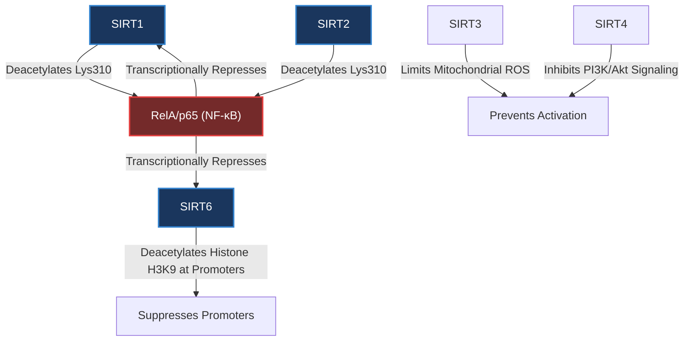

# NF-κB (Nuclear Factor Kappa B)

**NF-κB** (Nuclear Factor kappa-light-chain-enhancer of activated B cells) is a highly conserved pleiotropic transcription factor family that serves as the central orchestrator of inflammatory signaling, immune responses, cell survival, and cellular stress responses. In mammals, the most prevalent and transcriptionally active form of NF-κB is the **RelA/p50** heterodimer, where **RelA** (also known as **p65**) contains the transactivation domain required for gene transcription.

Under basal conditions, NF-κB is sequestered in the cytoplasm in an inactive complex with its inhibitory partner **IκB** (Inhibitor of NF-κB). Upon stimulation by pro-inflammatory signals (e.g., TNF-α, IL-1β, lipopolysaccharide, or reactive oxygen species), IκB is phosphorylated, ubiquitinated, and degraded, permitting the rapid translocation of active NF-κB to the nucleus to bind the promoters of its target genes.

---

## Regulation by Sirtuins

Sirtuins function as critical homeostatic brakes on the NF-κB pathway, suppressing chronic inflammatory signaling through diverse epigenetic and post-translational mechanisms.

### 1. SIRT1-Mediated Deacetylation
SIRT1 directly interacts with and deacetylates the **RelA/p65** subunit at **Lysine 310 (Lys³¹⁰)**. 
- **Functional Impact**: Acetylation of Lys³¹⁰ is essential for the full transactivation potential of NF-κB. SIRT1-mediated deacetylation of Lys³¹⁰ strongly suppresses NF-κB-dependent transcription of pro-inflammatory cytokines (such as TNF-α, IL-1β, IL-6, and metalloproteinases).
- **Apoptosis Crosstalk**: By repressing NF-κB-mediated survival genes, SIRT1 deacetylation sensitizes cells (particularly cancer cells) to TNF-α-induced apoptosis.
- **Inflammatory Feedback**: Exposure to environmental stressors (e.g., cigarette smoke in COPD, obesity-induced lipids) disrupts the physical association between SIRT1 and RelA, prompting hyperacetylation and hyperactivation of pro-inflammatory genes.

### 2. SIRT2-Mediated Deacetylation
Like SIRT1, cytoplasmic **SIRT2** is capable of deacetylating the RelA/p65 subunit in the cytoplasm or upon nuclear-cytoplasmic shuttling.
- **Microglial Activation**: Loss or inhibition of SIRT2 triggers hyperacetylation of NF-κB, accelerating microglial activation and neuroinflammation.
- **Systemic Inflammation**: Active SIRT2 deacetylates p65 to reduce circulating cytokine expression, exerting a protective role in rheumatoid arthritis and sepsis models.

### 3. SIRT6-Mediated Chromatin Silencing
Instead of directly targeting the transcription factor, **SIRT6** acts as a localized epigenetic repressor on chromatin.
- **H3K9 Deacetylation**: SIRT6 physically associates with the promoters of NF-κB target genes (such as *IL6* and *TNF*). There, it deacetylates Histone H3 at Lysine 9 (**H3K9ac**), inducing a compact chromatin state that physically blocks NF-κB transactivation.
- **Cardiomyocyte Protection**: SIRT6 downregulates NF-κB-dependent hypertrophy genes in the heart by reducing p300-mediated acetylation of p65, preventing pathological cardiac enlargement.

### 4. SIRT3 and SIRT4 Indirect Modulation
- **SIRT3**: Mitochondrial SIRT3 suppresses NF-κB activation indirectly by deacetylating and activating mitochondrial antioxidants (like **MnSOD/SOD2**), reducing mitochondrial reactive oxygen species (ROS) that would otherwise stimulate the IκB kinase (IKK) complex.
- **SIRT4**: Suppresses the upstream **PI3K/Akt** signaling pathway to prevent NF-κB activation and alleviate oxidized LDL-induced endothelial cell injury in atherosclerosis.

---

## Physiological Implications and Aging

### 1. Inflammaging
A hallmark of mammalian aging is **inflammaging**—a chronic, sterile, low-grade inflammatory state. This state is heavily driven by a progressive decline in sirtuin expression and activity, which removes the physiological "brakes" on NF-κB, resulting in hyperactivation of the inflammatory cascade.

### 2. Cellular Senescence
NF-κB is a master regulator of the **Senescence-Associated Secretory Phenotype (SASP)**. Sirtuin-mediated suppression of NF-κB transcription helps to repress the expression of SASP cytokines, thereby mitigating the spread of secondary senescence to neighboring cells.

### 3. Pathological Conditions
- **COPD/Emphysema**: Chronic cigarette smoke exposure decreases lung SIRT1 levels, permitting unrestrained NF-κB-mediated lung inflammation.
- **Atherosclerosis**: Macrophage foam cell formation is driven by NF-κB. SIRT1 activation inhibits *Lox-1*-mediated foam cell formation and plaque progression by suppressing NF-κB.
- **Cancer**: NF-κB hyperactivation promotes tumor cell survival and chemoresistance. Sirtuin-mediated inhibition of NF-κB represents a promising therapeutic angle to sensitize cancer cells to apoptosis.

---

# 

## Documents

List of documents that mention this entity

  - [[_document_ - TFEB AND TFE3, LINKING LYSOSOMES TO CELLULAR ADAPTATION TO STRESS|TFEB AND TFE3, LINKING LYSOSOMES TO CELLULAR ADAPTATION TO STRESS]]
    - These include transcription factors that promote Autophagy activation (E2F1, GATA1, and members of the FOXO family), repression (GATA4), and those that have a dual inhibitory/activating function (TP53 and NFKB).

  - [[_document_ - sirtuins (overview, CD38 KO risks, cancer therapies)|sirtuins (overview, CD38 KO risks, cancer therapies)]]
    - Deacetylates histones (e.g., H3K9, H3K26) and many non-histone proteins (p53, FOXO, NFKB, PGC1-α, etc.).

  - [[_document_ - sirtuins (resveratrol), gemini|sirtuins (resveratrol), gemini]]
    - NF-κB (Anti-Inflammatory Effects) - Mechanism: SIRT1 deacetylates the p65 subunit of NFKB (Nuclear Factor kappa B). Result: Deacetylation inhibits NF-κB's transcriptional activity, preventing it from binding to DNA.

  - [[_document_ - sirtuins Michan_S_Sinclair_D_Sirtuins_in_mammals_insights_i|sirtuins Michan_S_Sinclair_D_Sirtuins_in_mammals_insights_i]]
    - For example, SIRT1 deacetylates RelA/p65, the most prevalent form of NFKB (nuclear factor _κ_ B). Deacetylation inhibits the transactivation potential of RelA/p65, which sensitizes human cells to apoptosis in response to TNFα (tumour necrosis factor _α_ ) .

  - [[_document_ - sirtuins in health and disease s41392-022-01257-8|sirtuins in health and disease s41392-022-01257-8]]
    - For instance, increased SIRT1 protein expression can reduce acetylation of the NFKB p65 subunit, which results in the suppression of TNFα-induced NFKB transcriptional activation and reduction of TNFα secretion in a SIRT1-dependent manner.

  - [[_document_ - The role of the dynamic epigenetic landscape in senescence_orchestrating SASP expression]]
    - Review identifies NF-κB as the master regulator of SASP, with cytoplasmic chromatin fragment/cGAS–STING signalling and the H3K27ac–AP-1–BRD4 axis converging on NF-κB to drive SASP in senescent cells.

## Connections

- **[[SIRT1]]** — Direct physical interactor and deacetylase of RelA/p65 Lys³¹⁰.
- **[[SIRT2]]** — Cytoplasmic deacetylase regulating RelA/p65 acetylation and microglial activation.
- **[[SIRT3]]** — Indirect regulator via mitochondrial ROS control.
- **[[SIRT6]]** — Chromatin-associated repressor deacetylating H3K9ac at NF-κB target promoters.
- **[[Inflammation]]** — NF-κB is the master transcriptional driver of inflammatory pathology.
- **[[Apoptosis]]** — NF-κB transcriptional suppression by sirtuins sensitizes cells to TNF-α-induced apoptosis.
- **[[SASP]]** — NF-κB is the master transcription factor driving SASP expression.
- **[[Epigenetic Alterations]]** — the epigenetic landscape converges on NF-κB to orchestrate SASP.
- **[[Cytoplasmic Chromatin Fragments]]** — CCF activates cGAS–STING–NF-κB to induce SASP.
- **[[cGAS-STING Pathway]]** — upstream of NF-κB SASP activation in senescence.
- **[[AP-1]]** — pioneer factor that opens enhancers for NF-κB-regulated SASP genes.
- **[[BRD4]]** — H3K27ac reader at senescence-activated SASP enhancers feeding NF-κB.
- **[[KDM4]]** — demethylates H3K9 to permit NF-κB access to SASP loci.
- **[[EZH2]]** — deposits H3K27me3; its inhibition derepresses NF-κB SASP genes.
- **[[LINE-1]]** — retrotransposon cDNA activates cGAS–STING–NF-κB SASP.
- **[[IL-6]]** / **[[IL-8]]** / **[[IL-1α]]** — NF-κB-driven SASP cytokines.

- New links added: [[SIRT1]], [[SIRT2]], [[SIRT3]], [[SIRT6]], [[Inflammation]], [[Apoptosis]], [[SASP]], [[Epigenetic Alterations]], [[Cytoplasmic Chromatin Fragments]], [[cGAS-STING Pathway]], [[AP-1]], [[BRD4]], [[KDM4]], [[EZH2]], [[LINE-1]], [[IL-6]], [[IL-8]], [[IL-1α]]
- Suggested new entity notes to create: [[TNFα]], [[MnSOD]], [[IκB]], [[RelA]]
  - Strong connections to strengthen: SIRT1 ↔ [[NFKB]], SIRT6 ↔ [[NFKB]], [[Inflammation]] ↔ [[NFKB]]

## Linking Summary
- New links added: [[Apoptosis]], [[Inflammation]], [[IκB]], [[MnSOD]], [[NFKB]], [[RelA]], [[SIRT1]], [[SIRT2]], [[SIRT3]], [[SIRT6]], [[TNFα]], [[SASP]], [[Epigenetic Alterations]], [[Cytoplasmic Chromatin Fragments]], [[cGAS-STING Pathway]], [[AP-1]], [[BRD4]], [[KDM4]], [[EZH2]], [[LINE-1]], [[IL-6]], [[IL-8]], [[IL-1α]]
- Suggested new entity notes to create: [[IκB]], [[RelA]]
  - Strong connections to strengthen: NF-κB (Nuclear Factor Kappa B) ↔ [[Inflammation]], NF-κB (Nuclear Factor Kappa B) ↔ [[Apoptosis]], NF-κB (Nuclear Factor Kappa B) ↔ SIRT1
