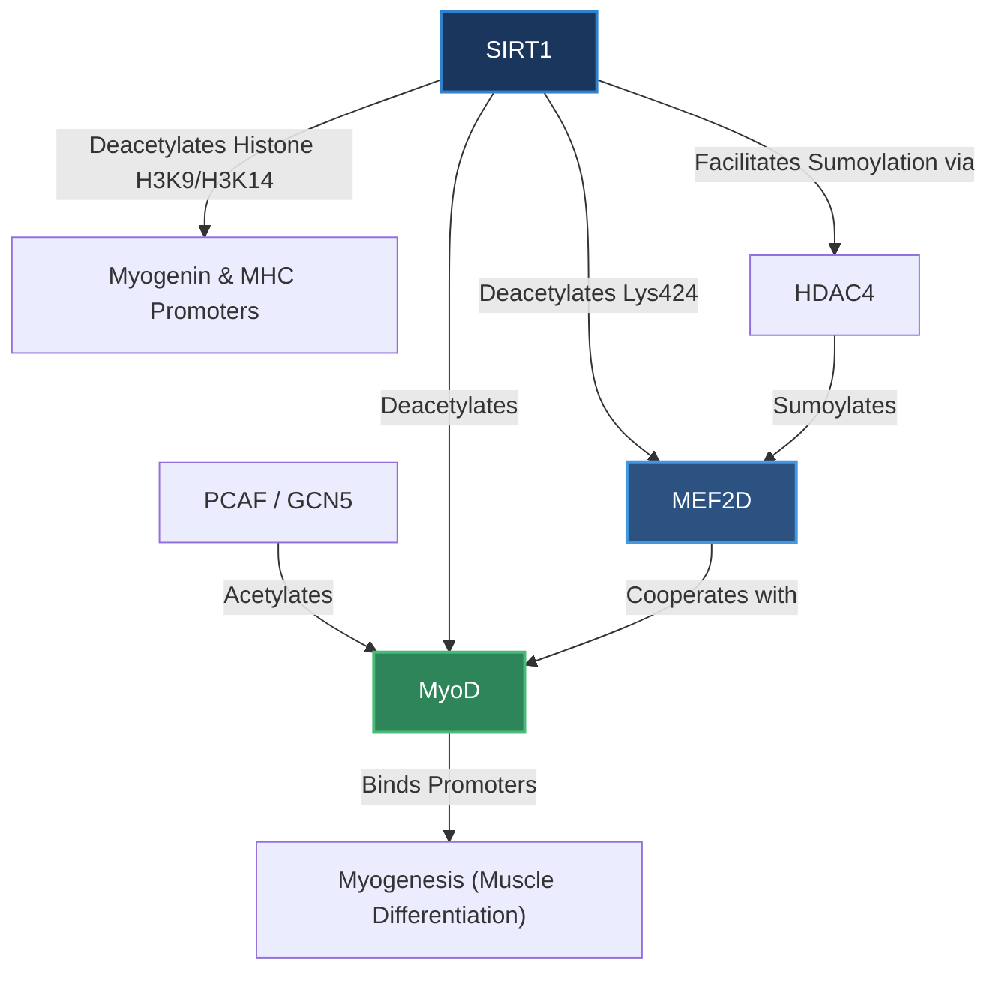

# MyoD (Myogenic Differentiation Factor 1)

**MyoD** (Myogenic Differentiation 1, also known as MYOD1) is a pioneer basic helix-loop-helix (bHLH) transcription factor that serves as a master regulator of skeletal muscle development (**myogenesis**). MyoD is essential for committing multipotent mesodermal cells to the myogenic lineage and for regulating the subsequent transcriptional program that drives myoblast proliferation and differentiation into mature multinucleated myofibers.

---

## Role in Myogenesis Regulation by SIRT1

During muscle development, MyoD binds to conserved E-box elements in the promoters of muscle-specific genes (such as *myogenin* and *myosin heavy chain*). This transcriptional activation is highly dependent on acetylation: positive histone acetyltransferases such as **PCAF** (p300/CBP-associated factor) and **GCN5** acetylate MyoD, enhancing its DNA-binding capacity and recruitment of transcriptional machinery.

However, **SIRT1** acts as a powerful epigenetic brake on this myogenic differentiation process through a multi-pronged molecular mechanism:

### 1. Direct Deacetylation of the MyoD Complex
SIRT1 physically interacts with PCAF and GCN5, forming a multi-protein regulatory complex. Once recruited to muscle gene promoters, SIRT1 deacetylates:
- **MyoD** itself, which reduces its transcriptional transactivation potential.
- **PCAF** and other transcription factors in the complex.
- **Histone H3 (Lys⁹ and Lys¹⁴)** at the promoters of the *myogenin* and *myosin heavy chain* genes, inducing a closed, transcriptionally silent chromatin structure.
These coordinated deacetylation events collectively suppress the expression of myogenic target genes, thereby **retarding muscle differentiation**.

### 2. Cooperative Repression via MEF2D and HDAC4
MyoD does not act alone; it relies on cooperation with the **MEF2 (MADS-box transcription enhancer factor 2)** family of transcription factors (particularly **[[MEF2D]]**) to synergistically activate muscle-specific genes.
- **SIRT1** deacetylates Lysine 424 (**Lys⁴²⁴**) on MEF2D.
- Acetylation of Lys⁴²⁴ normally activates MEF2D. Deacetylation by SIRT1, however, facilitates **HDAC4**-mediated **sumoylation** of MEF2D.
- HDAC4, which possesses SUMO E3 ligase activity, acts in concert with SIRT1 to sumoylate MEF2D. This modification locks MEF2D into an inactive, transcription-repressing state, adding a second layer of epigenetic silencing to the myogenic program.

---

## Physiological Context

The SIRT1-MyoD-MEF2D axis ensures that muscle differentiation only occurs under appropriate metabolic and environmental conditions. During periods of calorie restriction or high metabolic stress, elevated nuclear NAD⁺ levels activate SIRT1, keeping MyoD/MEF2D-driven differentiation in abeyance to conserve cellular energy and prevent premature lineage commitment.

---

## Connections

- **[[SIRT1]]** — Binds to the MyoD/PCAF complex; deacetylates MyoD and local histones to repress differentiation.
- **[[MEF2D]]** — Myogenic transcription factor that cooperates with MyoD; deacetylated by SIRT1 to promote sumoylation.
- **[[notes/_link/Caloric Restriction]]** — Promotes SIRT1 activity, which inhibits muscle differentiation through the MyoD-SIRT1 axis.

### Linking Summary

- New links added: [[SIRT1]], [[MEF2D]], [[notes/_link/Caloric Restriction]]
- Suggested new entity notes to create: [[PCAF]], [[GCN5]], [[HDAC4]], [[Myogenin]]
- Strong connections to strengthen: [[SIRT1]] ↔ [[MyoD]], [[MEF2D]] ↔ [[MyoD]]
