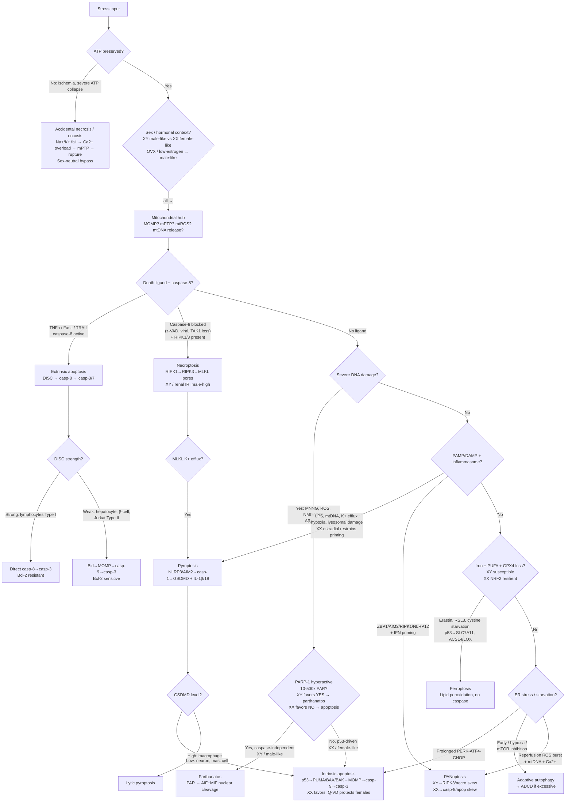
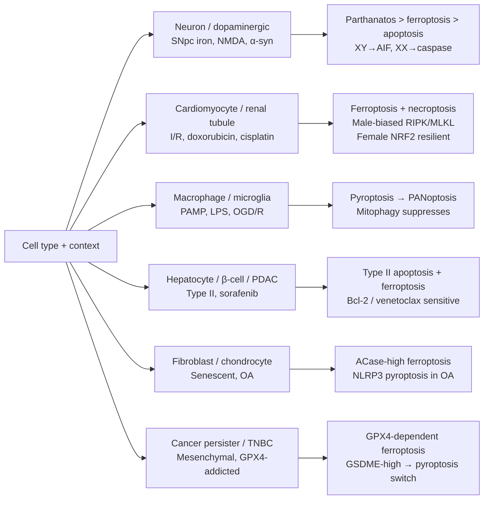
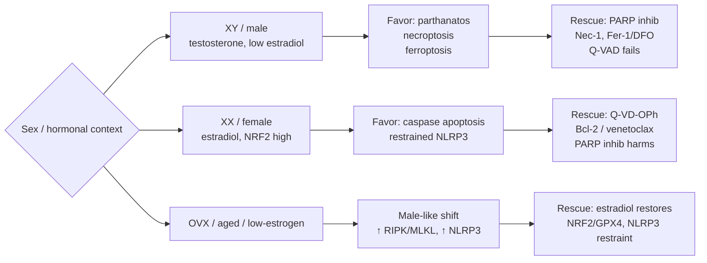

# Cell Death Decision Tree

Source synthesis: `src/notes/cell-death/`, `src/notes/_link/` stress notes, PANoptosis reviews Jul 2026.
Generated: 11_Sep_2026 08:00 AM PDT.

## Master flowchart — stress to modality

## Cell-type selector — who dies how

## Sex preference axis — integrated at SEX node, detail here

Apply after modality + cell-type are set. Sex shifts executor choice, not stress identity.

| Modality | Male bias | Female bias | Evidence anchor |
|---|---|---|---|
| [[Parthanatos]] | Strong XY — stroke/MI, NMDA, MPTP | Weak | PARP-1/AIF-KO protects males only; PARP inhib harms females |
| [[Apoptosis]] | Weak | Strong XX — cyto c/casp-3 | Q-VD-OPh protects females only; cell-autonomous XX→caspase |
| [[Necroptosis]] | Renal IRI, cardiac p-MLKL male-high | OVX narrows gap | Male RIPK1/RIPK3/p-MLKL; cisplatin AKI SIRT2 male |
| [[Ferroptosis]] | Tubule Gpx4-KO injures males | NRF2 resilient | Female NRF2/GPX4 shield; check kidney/heart/brain |
| [[Pyroptosis]] | High IL-1β output once primed | Estradiol restrains priming; trauma GSDMD score female-high | Estradiol→NLRP3 restraint; context-dependent readout |
| [[Necrosis]] | Neutral | Neutral | Dimorphism is in regulated executors, not oncosis itself |
| [[PANoptosis]] | ZBP1-RIPK3 skew to necro arm | Casp-8 skew to apoptotic arm | Same stimulus, different flux; validate per cell |

Rule: if male + neuronal/renal/IRI → test PARP/AIF + RIPK/MLKL + Fer-1 in parallel. If female + same → test caspase/Bcl-2 first, PARP inhib last.

## Decision table

| If you see | Favor | Rescue test |
|---|---|---|
| Caspase-3, cyto c, MOMP, no swelling | [[Apoptosis]] | z-VAD / Bcl-2 (Type II only) / venetoclax |
| p-MLKL, RIPK3, DAMPs, swelling | [[Necroptosis]] | Necrostatin-1, RIPK3/MLKL KO |
| IL-1β/IL-18, GSDMD pores, ASC specks | [[Pyroptosis]] | NLRP3 block (MCC950), casp-1 inhib |
| Lipid-ROS, iron, shrunken mitochondria, no caspase | [[Ferroptosis]] | Fer-1, liproxstatin-1, DFO, GPX4 rescue |
| PAR surge, AIF nuclear, ~50-kb fragments, NAD+/ATP fall | [[Parthanatos]] | PARP inhib (males), PARG, AIF block |
| All three arms together, single block fails | [[PANoptosis]] | Combined / upstream ZBP1/TAK1/RIPK1 |
| ATP absent, oncosis, calpains, cathepsins | [[Necrosis]] | Restore ATP / Ca2+ chelation (early only) |
| LC3/ATG, mTOR off, starvation/hypoxia | [[Autophagic Cell Death]] | Chloroquine / mTOR reactivation |

## Cell-type quick rules

* **Lymphocyte vs hepatocyte/β-cell:** use Type I vs Type II split — Bcl-2 protects only Type II.
* **Neuron:** default parthanatos/ferroptosis suspect; check sex (XY→PARP/AIF, XX→caspase) and GSDMD (low→apoptosis fallback).
* **Kidney/heart IRI:** test ferroptosis first (Fer-1), then necroptosis; expect male bias.
* **Macrophage:** default pyroptosis/PANoptosis; IFN priming + TNF-α/IFN-γ synergy is the gate.
* **Senescent fibroblast/chondrocyte:** test ACase/ferroptosis and NLRP3 in parallel.
* **Mesenchymal cancer:** test GPX4 addiction; GSDME-high → chemo triggers pyroptosis.

## Stress entry points

* **[[Endoplasmic Reticulum Stress]] / [[Integrated Stress Response]]** → CHOP duration decides autophagy vs apoptosis.
* **[[Reactive Oxygen Species]] / [[Hypoxia]] / [[Ischemia]]** → ROS→RIPK1 vs HIF-autophagy vs ATP-necrosis.
* **[[Ischemia-reperfusion Injury]]** → assume mixed death; validate PANoptosome (ASC/casp-8/RIPK3 colocalization), not single markers.
* **[[DNA Damage]] / [[Genotoxic Stress]]** → PARP hyperactivation threshold decides parthanatos vs p53 apoptosis.
* **[[Ca2+ overload]] / [[Excitotoxicity]]** → calpain/mPTP necrosis + NMDA-parthanatos feed-forward.

## Documents

* [[Regulated Cell Death]]
* [[Apoptosis]] / [[Necroptosis]] / [[Pyroptosis]] / [[Ferroptosis]] / [[Parthanatos]] / [[PANoptosis]] / [[Necrosis]] / [[Autophagic Cell Death]]
* [[Type I vs Type II Cells]]

## Connections

* [[ZBP1]] / [[RIPK1]] / [[RIPK3]] / [[MLKL]] — necroptosis/PANoptosome core
* [[NLRP3]] / [[Caspase-1]] / [[Gasdermin D]] / [[Gasdermin E]] — pyroptotic arm
* [[Caspase-8]] / [[Caspase-8-c-FLIP Rheostat]] / [[TAK1]] — apoptosis/necroptosis switch
* [[PARP1]] / [[Apoptosis-Inducing Factor]] — parthanatos axis
* [[GPX4]] / [[System Xc-]] / [[SLC7A11]] / [[ACSL4]] — ferroptosis axis
* [[Mitochondrial outer membrane permeabilization]] / [[Mitochondrial Permeability Transition Pore]] / [[Calcium Signaling]]

## Linking Summary

* Decision logic: ATP → caspase-8 → DNA/PARP → inflammasome/PANoptosome → iron/GPX4 → ER/CHOP.
* Cell-type overlay determines threshold, not pathway identity; sex determines executor (caspase vs PARP/AIF).
