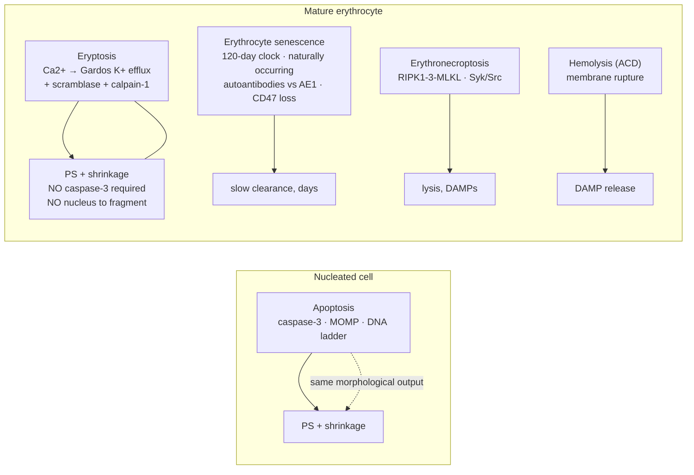

# Eryptosis 2025 — summary / outline

> [!info] Source
>
> [[_document_ - Current understanding of eryptosis mechanisms, physiological functions, role in disease, pharmacological applications, and nomenclature recommendations]] — Tkachenko A, Alfhili MA, Alsughayyir J, et al. *Current understanding of eryptosis…* **Cell Death Dis 16, 467 (2025)**. doi:[10.1038/s41419-025-07784-w](https://doi.org/10.1038/s41419-025-07784-w), PMC12216432, PMID 40592821. Consensus review by the Consortium for Erythrocyte Cell Death Research (>600 PubMed hits on "eryptosis" by the end of 2024).
> Companion vault note: [[Eryptosis]] (thin — needs enrichment from this document).

---

## Core claim in one paragraph

Mature erythrocytes are anucleate, organelle-free, haemoglobin-filled cells: they have no mitochondria, no ER, no Golgi, no ribosomes, and effectively no transcriptome (low-level translation is reported but negligible). Enucleation plus autophagy-dependent organelle clearance during erythropoiesis therefore *removes most of the classical death machinery* — cytochrome c, APAF-1, caspases-2/-6/-7/-9, the intrinsic apoptosome, PARP-1/AIF parthanatosis, NLRP3/inflammasome pyroptosis, autophagy machinery. A small set of erythroid proteins persists: Fas/CD95, FasL, FADD, caspase-3, caspase-8, RIPK1/RIPK3/MLKL, calpain-1, the Gardos channel (KCNN4), the anion exchanger AE1/band 3, and the plasma-membrane ion-transport and phospholipid-asymmetry apparatus in full. Eryptosis is the regulated death program that executes on that complement. Its master regulator is **cytosolic Ca²⁺**, and its executor set is **Gardos-mediated K⁺/water efflux, scramblase activation with flippase inhibition, and calpain-1 cytoskeleton proteolysis**. Morphologically it is apoptotic (shrinkage, blebbing, PS externalisation) and, on current evidence, immunologically silent — but mechanistically it is a genuinely distinct program, and the review's core contribution is a *nomenclature* that makes the distinctions explicit: cation-channel-driven, ROS-mediated, lipid-driven, extrinsic Fas-mediated, caspase-dependent, and enzyme-deficiency-dependent eryptosis, plus "iron-overload-driven cell death" as a deliberate non-ferroptosis label.

---

## Figures from the source document (BioRender, reusable)

Six figures — the core figure set for any eryptosis teaching page. Currently hot-linked from PMC; re-fetch and re-host under `src/images/` via the `image-ingest` skill.

**Fig. 1 — The available death repertoire, nucleated cell vs mature erythrocyte.** Accidental and regulated cell death modalities in nucleated cells (a) and mature erythrocytes (b). Lack of organelles in mature erythrocytes restricts the diversity of the cell death machinery. ACDC autophagy-dependent cell death; PARP poly(ADP-ribose) polymerase; ROS reactive oxygen species. *This is the most direct "how eryptosis differs" figure — panel b shows that a mature RBC retains only two RCD routes.*

**Fig. 2 — Integrated signalling map of eryptosis.** cGKI cGMP-dependent protein kinase I; CK1α casein kinase 1α; FADD Fas-associated death domain; p38 MAPK p38 mitogen-activated protein kinase; PGE₂ prostaglandin E₂; PKC protein kinase C; PS phosphatidylserine; RNS reactive nitrogen species; ROS reactive oxygen species; SM acid and neutral sphingomyelin; SMases acid and neutral sphingomyelinases. *All pathways converge on Ca²⁺; note the NO → cGMP → cGKI inhibitory arm and the energy-sensing kinases.*

**Fig. 3 — Eryptosis as a defence system, contrasted with hemolysis.** Eryptosis removes damaged cells — including *P. falciparum*-infected erythrocytes — before they lyse and release damage-associated molecular patterns (DAMPs). *The physiological-function figure; pairs directly with the necrosis row of the comparison table.*

**Fig. 4 — Disease map.** Accelerated eryptosis in disease: premature red-cell destruction and anaemia, procoagulant activity, and eryptotic-cell adhesion to endothelium. *Clinical figure for the disease section.*

**Fig. 5 — Long COVID: fibrin amyloid microclots on erythrocytes.** Scanning electron microscopy shows erythrocytes from Long COVID patients are covered by fibrin amyloid microclots (below). *Illustrates the proposed microclot → oxidative stress → eryptosis → microcirculatory-failure chain.*

**Fig. 6 — Nanomaterial-induced eryptosis, internalised vs non-internalised.** Eryptosis can be induced by both internalized and non-internalized nanomaterials; induction may be mediated by caspase-3 and calpain. CAT catalase; CTAB cetyltrimethylammonium bromide; D-PAA dextran-polyacrylamide; NPs nanoparticles; PLGA poly(lactic-co-glycolic acid); PS phosphatidylserine; PVP polyvinylpyrrolidone; ROS reactive oxygen species; SOD superoxide dismutase. *Non-internalised particles act through PIEZO1, the mechanosensitive channel.*

**Graphical abstract** — the history from 2001 to the present: caspases in mature RBCs, Ca²⁺-ionophore-triggered apoptosis-like death, and the naming of "eryptosis".

### Figure index

| Fig | Content | Use on the comparison page |
| --- | --- | --- |
| Fig 1 | ACD (accidental cell death) + RCD (regulated cell death) map; reduced set of available pathways in mature erythrocytes | Core "how it differs" figure |
| Fig 2 | Full eryptosis signalling network | Primary mechanism diagram; mirror as `eryptosis.html` static fallback |
| Fig 3 | Defence system vs hemolysis/DAMP release; Plasmodium clearance | Physiology/immune figure — pairs with the necrosis row |
| Fig 4 | Disease map — anaemia, clotting, endothelial adhesion | Clinical figure |
| Fig 5 | SEM: Long-COVID RBCs coated in fibrin amyloid microclots | Illustrates the microclot claims |
| Fig 6 | Nanomaterial-induced eryptosis, internalised vs not | Nanotoxicology / hemocompatibility application |

---

## Mechanism — Ca²⁺ as the common effector

All reported triggers converge on cytosolic Ca²⁺. Baseline cytosolic Ca²⁺ is low-nM against low-mM extracellular, a gradient held only by low resting permeability plus high-capacity extrusion through the plasma-membrane Ca²⁺-ATPase and the Na⁺/Ca²⁺ exchanger. Because there is no ER or mitochondrial store, **all** Ca²⁺ must come from outside through plasma-membrane channels:

- **TRPC family.** TRPC6 in human RBCs; TRPC4/5 in mouse RBCs (a species difference that limits mouse KO studies); TRPC3 in erythroid progenitors (erythropoietin-driven).
- **Ionotropic glutamate receptors.** NMDA receptors contribute to Ca²⁺ homeostasis; AMPA antagonism blunts the Ca²⁺ entry triggered by Cl⁻ removal with isosmotic gluconate replacement.
- **Mechanosensitive PIEZO1** — shear stress.
- **Cav2.1** — pharmacological evidence only.
- Channels are mostly closed at rest and opened by ROS, hyperosmolarity, and Cl⁻ depletion (the last via PGE₂ release).

Elevated Ca²⁺ then executes: opens the **Gardos channel** (KCa3.1/KCNN4) → K⁺ efflux → hyperpolarisation → Cl⁻ exit → water follows → shrinkage; inhibits **flippase** and activates **scramblase** → PS externalisation; activates **calpain-1** → cytoskeleton (and AE1) proteolysis → blebbing and microvesiculation. Charybdotoxin and clotrimazole block the shrinkage; calpain-1 *knockout mice have unaltered erythrocyte lifespan*, which is the key caveat on calpain's necessity. A rare variant shows **swelling** rather than shrinkage, with spiculation and loss of the biconcave discocyte shape — the morphometric approach of Jacob et al. scores shrinkage, irregularity (blebbing), granularity, and central-halo loss.

> [!tip] Nomenclature recommended by the review
> Confirming eryptosis requires **at least PS externalisation + elevated intracellular Ca²⁺**. Subtype labels: *cation channel-driven*, *ROS-mediated*, *lipid (ceramide)-driven*, *extrinsic Fas-mediated*, *caspase-dependent*, *RBC enzyme deficiency-dependent*, *iron-overload-driven cell death*. Use "erythronecroptosis" for RIPK1/3/MLKL lytic death. Do **not** write "erythroptosis" or "apoptosis of RBCs".

---

## What the 2025 review adds to the 2001–2010 picture

The 2001–2010 literature (Berg/Bratosin caspases; Lang's "suicidal erythrocyte death"; Gardos; ionomycin; hyperosmotic shock) described eryptosis as *Ca²⁺-triggered, largely caspase-independent apoptosis-like death*. The 2025 review adds six findings.

**Caspase-8 as the fate switch.** This is the review's most substantial conceptual addition. In nucleated cells caspase-8 is the switch between apoptosis, necroptosis and pyroptosis; the same architecture is now demonstrated in mature RBCs. Fas/FasL → FADD → caspase-8 → caspase-3 drives *extrinsic* eryptosis (Mandal 2005; a 2022 cigarette-smoke-extract study in which p38 MAPK initiates DISC assembly via neutral-SMase-derived ceramide), and LaRocca 2014 showed the RIPK1/FADD/caspase-8 complex also forms the necroptosome, with active caspase-8 preventing necroptosis. Eryptosis and erythronecroptosis are therefore **mutually exclusive**, exactly as apoptosis and necroptosis are in nucleated cells. This reframes the mature erythrocyte from a passively degenerating cell to one in which signalling input determines which RCD pathway executes.

**Erythronecroptosis as the second program.** Bacterial pore-forming toxins (human-specific, via CD59 ligation plus pore formation) drive RIPK1-dependent, Syk/Src-dependent, MLKL-dependent lytic death with loss of membrane integrity. Note that mature RBCs *lack* TNFR1/2 and TRAIL-R1/2 — the receptors that license canonical necroptosis — which is what makes the erythrocyte variant cell-specific. Hemolysis is the ACD counterpart of this regulated program. The comparison page currently has no row for either.

**Iron: a nomenclature problem.** RBCs are iron-loaded and contain GPX4, and erythroid precursors demonstrably use ferroptosis for differentiation, so ferroptosis in mature RBCs is a plausible hypothesis. The review's assessment: not confirmed, and difficult to test — ferroptosis is regulated at transcriptional/epigenetic levels a mature RBC cannot reach. Hemochromatosis data show PS exposure and calpain activation (i.e. eryptosis-like), so the authors propose the explicitly non-committal label *iron-overload-driven cell death*.

**Eryptosis as an assay endpoint, not just a mechanism.** Hemolysis is accidental, non-specific, and reports nothing about which pathway executed. Eryptosis precedes hemolysis, so >110 compounds (metals, oxides, drugs, kinase inhibitors, uremic toxins, alkaloids) score positive for eryptosis at concentrations *below* their hemolytic threshold. That makes annexin-V/PS + Ca²⁺ + forward scatter (FSC) a **more sensitive, more reproducible, mechanistically informative hemocompatibility readout** for biomaterials and nanomedicine (ISO 10993-4 context, Malta Initiative / NanoHarmony, RiskGONE, NANORIGO, Gov4Nano). This is the most directly applicable recent development and it is *not* on the comparison page at all.

**Therapeutic duality and the redox-pharmacology framing.** Antieryptotic: erythropoietin, N-acetyl-L-cysteine, nitric-oxide donors (nitroprusside, dibutyryl-cGMP), cGKI, AMPK, atorvastatin, organosulfur compounds, hydroxytyrosol, dietary plant sterols. Proeryptotic as antimalarial: β-cryptoxanthin, dimethyl fumarate (via G6PD inhibition → GSH depletion), lead, paclitaxel, cyclosporine, PGE₂, curcumin, amphotericin B, chlorpromazine. The review also proposes a **"5R" precision-redox principle** (Right species, Right place, Right time, Right level, Right target) extending Meng et al. 2021, motivated directly by the finding that UV-activated nanoparticles raise ROS in leukocytes without touching erythrocytes.

**Kinase effects largely the reverse of expectation.** Most kinases *promote* eryptosis — PKC, CK1α, JAK3, p38 MAPK, CDK4 — while AMPK, cGKI, PAK2, MSK1/2, PDK1 restrain it. Several of these are canonically *anti*-apoptotic in nucleated cells (CK1α, PKC, JAK3), so the review's explanation is that with only a handful of retained substrates, the sign of a kinase's effect is a property of the cell type, not the kinase. This distinction is worth carrying into the comparison table.

---

## How eryptosis differs from other cell death programs

| Axis | Eryptosis | Comparator | Difference |
| --- | --- | --- | --- |
| Master regulator | **Ca²⁺ influx** from extracellular space | Apoptosis (Ca²⁺ → MOMP) | No mitochondria: Ca²⁺ is an *initiating* signal, not a MOMP amplifier. Evolutionary argument — Ca²⁺ signalling occurs in prokaryotes and therefore predates the intrinsic apoptotic apparatus, which cannot predate the endosymbiotic acquisition of mitochondria at eukaryogenesis. The review offers this as an assumption, not a demonstration: it attributes the erythrocyte's Ca²⁺ dependence to evolutionary precedence without comparative data. |
| Caspase dependence | Non-essential for most triggers; **required** for Fas/DISC-driven extrinsic eryptosis (caspase-8 → caspase-3) | Apoptosis (defined by caspase-3) | Caspases are retained from erythropoiesis, where they are non-apoptotic and needed for terminal differentiation. Their erythrocyte role is a switch function, not an executor function. |
| Regulation level | None — no epigenetic, transcriptional or translational control possible | All other programs on the page | Only retained proteins can be tuned: post-translational phosphorylation, ion fluxes, channel gating. Eryptosis is the only "post-translational-only" death program on the page. |
| Kinase polarity | PKC, CK1α, JAK3, p38, CDK4 **pro**-death (canonically anti-apoptotic elsewhere) | — | Sign is cell-type-determined by the remaining substrate set. |
| Membrane fate | **Intact**; PS is immunosuppressive/anti-inflammatory | Apoptosis intact; necroptosis/pyroptosis/necrosis lytic | Apoptosis and necrosis bracket eryptosis as the non-lytic/lytic pair in the table. |
| Immunogenic consequences | PS itself is immunosuppressive; efferocytosis reprograms macrophages toward HO-1 up, proinflammatory cytokines down; *no* evidence of DAMP release | Necrosis/necroptosis: DAMP-driven inflammation | Caveat the review states explicitly: extracellular vesicles (EVs) are generated in eryptosis (oxidative stress, Ca²⁺ overload, PS asymmetry) and EV-associated DAMPs are found in stored red cell concentrates — so the "silent" label is an assumption, not a demonstrated finding. |
| Clearance latency | **Minutes** after eryptosis induction | Senescence: **days** | This is the clearest operational discriminator, and the one the comparison page should use. |
| Lipid behaviour | eryptotic RBCs preserve relatively high membrane lipid order | Apoptotic nucleated cells: sharp lipid-order fall via cholesterol/phospholipid exchange between organelles (Pyrshev 2018) | No internal membranes to exchange with — a second consequence of organelle loss. |
| ROS sources | Hb oxidation (Fenton), NADPH oxidase, xanthine oxidoreductase | ETC + peroxisomes | In ROS-driven eryptosis, ROS acts upstream by modulating Ca²⁺ influx only; there is no multi-branch ROS→execution network. |
| Platelet contrast | RBC has no Fas; **platelet** intrinsic apoptosis is mitochondrial apoptosome, caspase-9/3, Bcl-XL/Bak/Bax, Fas-negative | — | The strongest evidence for what is cell-type-specific in eryptosis: it tracks *mitochondrial clearance*, not enucleation. |

**Eryptosis vs senescence** requires separate treatment because the two share morphology (Ca²⁺ up, Gardos activation, PS exposure, ROS). The review treats them as distinct and proposes the operational rule: *a senescent cell that exposes PS should be called eryptotic.* Defining senescence in a cell that cannot proliferate and has no senescence-associated secretory phenotype (SASP) is difficult.

**Physiology.** Eryptosis is a host-defence program that shortens the lifespan of damaged, senescent or defective cells before they lyse. Hemolysis releases heme, Hb, methemoglobin, ATP, HSP70, IL-33 → TLR4/NF-κB endothelial activation, NADPH-oxidase and heme-iron driven NETs, macrophage TNF-α, MyD88/TRIF microglia activation, complement recruitment, NO scavenging, renal filtering injury. None of these occur in eryptosis. It also clears *Plasmodium*-infected cells (twice the free-radical output of uninfected cells; infected cells open non-selective cation channels — NSCCs — for Na⁺/Ca²⁺), and G6PD deficiency, sickle trait, β-thalassemia, GLUT1/AE1 defects all confer partial malarial protection through enhanced eryptosis — a host-defence trade-off. Clearance is PS-dependent efferocytosis by Kupffer cells (stabilin-1/2, integrin αvβ5 in hepatic sinusoids — liver, not spleen, is the primary pathological clearance site; reported clearance of ~80% of RBC-derived vesicles within 5 min; primary citation not traced), plus a separate, slower immune route: germline-encoded naturally occurring autoantibodies (NOAbs), mostly IgG directed against AE1/band 3, and a lysis route via extracellular histones.

---

## Disease, pollutants, and pharmacology — summary

- **Renal.** Chronic kidney disease (CKD) and end-stage renal disease (ESRD): oxidative stress, inflammation, energy depletion and uremic toxins (indoxyl sulfate via OAT2/NADPH oxidase, GSH-independent, with ceramide; acrolein; indole-3-acetic acid; urea; p-cresol; vanadate; IL-6; IL-1β; CRP) drive eryptosis into a vicious circle with renal anaemia. Higher in G4/G5 than G1–G3. In peritoneal dialysis (PD), eryptosis is ~3× higher on day 1 of peritonitis and tracks pWBC/pNGAL/IL-6/IL-1β in effluent; residual diuresis and residual glomerular filtration rate (rGFR) are protective. Parathyroid hormone (PTH) independently predicts eryptosis degree in haemodialysis (HD).
- **Hepatic.** The liver is the main clearance and iron-recycling organ for erythrocytes. Bilirubin and bile acids trigger eryptosis; albumin is protective; more RBC loss → more bilirubin → more ceramide, SMase activation and Ca²⁺ influx → a self-reinforcing cycle. Highest in hepatitis-B acute-on-chronic liver failure.
- **Haematologic/autoimmune.** Sickle cell anaemia, thalassemia, G6PD deficiency, hereditary spherocytosis; AIHA is driven preferentially by **cold IgM/IgA** (C5-dependent; C8 helps, C9 not) rather than warm IgG; SLE; antiphospholipid syndrome (autoantibodies from APS patients, not asymptomatic carriers, induce eryptosis in donor RBCs).
- **Metabolic/cardiovascular.** Hypertension (oxidative-dominant, antioxidant enzymes suppressed in untreated patients); T1DM/T2DM via methylglyoxal and β2-microglobulin; metabolic syndrome.
- **Neuro.** Parkinson's and Alzheimer's — calpain/ceramide dysregulation, amyloid-β disrupting RBC phospholipids.
- **Infectious/inflammatory.** Sepsis (septic plasma cytotoxic effect peaks at 15 min; correlates with endotoxin activity, mortality); acute COVID-19 and **Long COVID**, where fibrin amyloid microclots coat erythrocytes and oxidative stress drives eryptosis → poor microcirculation → ischaemia-reperfusion injury.
- **Cancer.** Lung cancer: anaemia from increased RBC turnover, not diminished erythropoiesis — and elevated EPO also *raises* eryptosis susceptibility. Topotecan, cisplatin, tamoxifen, afatinib, lopinavir, clofazimine all proeryptotic. Caveat noted: inhibiting eryptosis in patients receiving chemotherapy might blunt tumour-cell apoptosis.
- **Pollutants/toxicology.** Occupational lead (reported 2.82% vs 0.1% PS-positive erythrocytes in exposed workers; primary citation not traced; PLA₂ > SMase as the mediator — the PLA₂/PGE₂ route), aluminium, nickel (p38 MAPK), Cr(VI), rotenone, DEET, bromfenvinphos. Substitutes can be ranked: BPS ≈ BPA (no improvement), TBBPS < TBBPA (an improvement), OPFRs ≪ BFRs, phthalate metabolites ≪ parent compounds. Smoking: one 2024 cohort (n = 2023: 418 smokers, 1000 non-smokers, 605 ex-smokers; primary citation not traced), eryptosis tracks cigarettes/day (CRP and GSH correlated).
- **Nanotoxicology.** Both internalised (Ag-NP, Si-NP, Fe₃O₄, TiO₂, GdVO₄:Eu) and non-internalised (pristine SiO₂, LaVO₄:Eu — via PIEZO1) particles trigger Ca²⁺-dependent eryptosis; smaller CeO₂ is more potent; coatings improve hemocompatibility.

---

## Review points for `web/public/pages/en-US/cell-death-comparison.html`

Corrections to the existing eryptosis row, then additions.

**1. Regulated column.** Currently "yes — caspase-independent". Reword to: *regulated, non-lytic; caspase-3 dispensable for most triggers but required for extrinsic Fas/DISC eryptosis (caspase-8 → caspase-3)*. That nuance is the review's central point.

**2. Morphology — "clearance by splenic macrophages" is incorrect for the pathological case.** Pathological PS-exposed RBCs are cleared **PS-dependently in the hepatic sinusoid by Kupffer cells** via stabilin-1/2; spleen is the slow route for senescent cells. Also add: spiculation/loss of the biconcave discocyte shape, microvesiculation, and the rare swelling variant.

**3. Detection is under-specified relative to the review's own standard.** The review's rule is *PS externalisation **and** intracellular Ca²⁺ elevation*, minimum. Add aminophospholipid-translocase activity (NBD-PS probe), calpain-1 activity (CMAC), Scramblase/Gardos readouts, and note that there is **no single accepted eryptosis marker** — the page's existing list mixes primary and auxiliary markers without distinguishing them.

**4. Core machinery cell is missing the actual executors.** It currently reads "Ca²⁺ influx → calpain + scramblase activation → PS exposure", which stops one step early. The morphology is produced by **Gardos channel K⁺ efflux + water loss**; the membrane remodelling by **flippase inhibition + scramblase activation**; AE1/band 3 is degraded by caspase-3 and calpain. Add the channel inventory (TRPC6 human / TRPC4-5 mouse, PIEZO1, NMDA/AMPA, Cav2.1) and note Cl⁻ depletion → PGE₂ release.

**5. "Blocked by" lists inhibitors only.** Add **antieryptotic** agents: NO donors (nitroprusside, dibutyryl-cGMP) acting through soluble guanylate cyclase → cGMP → cGKI; cGKI and AMPK as the two best-validated genetic restraints (cGKI-/- and AMPKα-/- mice: enhanced eryptosis, anaemia, splenomegaly); N-acetyl-L-cysteine; erythropoietin; charybdotoxin/clotrimazole (Gardos); PKC, p38 MAPK and CK1α inhibitors. Add **proeryptotic** (also worth a column or a note): G6PD/PPP inhibitors, ceramide/SMase activation, Rac1 activation.

**6. "Most vulnerable / resistant" should be sharpened.** Add that the restriction is *mature* erythrocytes only — erythroid precursors execute full intrinsic/extrinsic apoptosis, RIPK1-dependent necroptosis and ferroptosis. Add the platelet contrast (mitochondrial apoptosome, caspase-9/3, Bcl-XL/Bak/Bax, Fas-negative) as the strongest evidence that eryptosis is defined by mitochondrial loss rather than by anucleation.

**7. Share-of-deaths cell is unsupported.** "~1–3% of non-apoptotic* (RBC-denominator)" — the review explicitly offers no census. Replace with "no census exists; denominator is RBCs only", matching the qualification already applied to the NETosis row.

**8. Energy cell — flag the paradox.** ATP depletion both *causes* eryptosis (via PKCα translocation and channel phosphorylation) and *opposes* it (loss of Ca²⁺-ATPase extrusion). One clause suffices.

**9. Crosstalk cell lacks detail.** Should read: caspase-8 is the switch; eryptosis ⊥ erythronecroptosis; shared Fas/FasL, ROS and ceramide nodes; PS exposure mimics apoptosis without caspases; eryptosis shares ROS/lipid-peroxidation *triggers* with ferroptosis but has no GPX4/iron executor, and no transcriptional regulation is possible at all.

**10. Biggest structural gap: no row for erythronecroptosis.** It is the regulated counterpart of hemolysis and the complement of eryptosis, and the mutual-exclusivity finding is only interpretable when both are present. Add an 11th row (RIPK1/RIPK3/MLKL, Syk/Src-dependent, lytic, DAMP-releasing, blocked by Nec-1/GSK'872/NSA and *not* by z-VAD) and revise the necroptosis row's "↓/n-a RBCs (no RIPK3/MLKL)" claim, which the review contradicts. Add a 12th row or an explicit note for **hemolysis as the RBC accidental cell death (ACD)** to close the ACD/RCD distinction that Fig. 1b of the review is built around.

**11. Immune cell needs the efferocytosis detail.** "silent" → "PS is immunosuppressive; efferocytosis reprograms macrophages (HO-1 up, IL-1β/TNF-α down); *no* DAMP release demonstrated, but eryptosis generates EVs whose DAMPs appear in stored concentrates."

**12. Immune-perturbation arrow.** eryptosis is bidirectional with immunity, unlike the other rows: it both consumes infected or stressed cells and *is* the macrophage signal. A two-way note would be new content for the table.

**13. Clinical/burden column is missing entirely.** The page has "notes". Eryptosis is measurable in CKD/ESRD/PD, sepsis, AIHA, SLE, APS, lung cancer, Parkinson's, and is a plausible prognostic biomarker (CSF eryptosis parameters for cerebral vasospasm/DCI; PD severity; sepsis endotoxin activity). A footnote row is the more practical option than leaving the page purely mechanistic.

**14. Nanotoxicology / hemocompatibility application is missing.** Eryptosis as the more sensitive, mechanistically informative replacement for hemolysis assays in ISO 10993-4 and nanomaterial safety. This is the most straightforward *addition* for a reference page.

**15. Terminology footnote.** Add the review's subtype prefixes and the explicit "not erythroptosis, not RBC apoptosis" note, plus the naming caveat that the NCCD advises against the term "eryptosis" itself because the life/death status of a mature RBC is disputable — the review's answer is that the eryptosis/erythronecroptosis dichotomy supports classifying a mature erythrocyte as a living cell.

**16. Animation card (`PROGRAMS.eryptosis`).** Currently discocyte → spherocyte with Ca²⁺ and a PS tint. Four upgrades: (a) show K⁺/water leaving via a Gardos channel icon during shrinkage; (b) show calpain-driven blebbing and microvesicle pinching, not just wobble; (c) add a final phase where a macrophage engulfs the PS+ remnant with no rupture — clearance without rupture is the point of the physiology; (d) add the kinetic discriminator in the bioNote: *minutes to clear vs days for senescent cells*, which is the one figure a reader should retain. Also the `bioNote` currently says "≈ hours"; the review's point is that onset is hours but clearance is minutes.

**17. `share of deaths` denominator caveat, applied globally.** The review makes the general point that eryptosis/erythronecroptosis are cell-type-restricted and should never be compared against whole-body shares. That footnote already exists for NETosis; extend it to erythronecroptosis.

**18. Nomenclature task-output → note enrichment.** [[Eryptosis]] (in `_link/`, unprotected) is thin and needs content from this document: the caspase-8 switch, erythronecroptosis crosslink, the 5R principle, the disease map, the nomenclature block, and `Documents`/`Connections` entries. New entity notes to create: `Erythrocyte`, `Erythrocyte Senescence`, `Erythronecroptosis`, `Scramblase`, `Gardos Channel`, `AE1`, `Phosphatidylserine` (exists), `Efferocytosis`, `Annexin V`, `Calpain`, `Hemolysis`. If erythronecroptosis gets a web page it deserves a topic-home note under `cell-death/`, since it is an executor/complex-level RCD rather than a shared entity.

---

## Open questions left by the review

1. **What sets the eryptotic threshold?** The Bcl-2/MOMP checkpoint has no analogue in RBCs — is there a critical Ca²⁺ elevation above which death becomes irreversible? No answer yet.
2. **How does ROS determine whether the cell undergoes eryptosis, erythronecroptosis or senescence?** All three involve ROS, from different sources. Unresolved.
3. **Which kinases sit downstream of which channel?** AMPK→PAK2 is the only traced chain; PDK1, MSK1/2, cGKI have no mapped effectors.
4. **Is ferroptosis real in mature RBCs, or is it something else?** Hemochromatosis data show an eryptosis-like phenotype.
5. **Are EVs from eryptotic cells immunogenic in vivo?** This is the least-supported element of the "silent" claim.
6. **In vivo drug data.** The evidence base is overwhelmingly *in vitro*. There is no human trial of an antieryptotic; EPO is the closest clinical candidate, and its effect is bidirectional (short-term protective, chronic exposure *raises* eryptosis susceptibility).
7. **Iron overload: which label?** "Ferroptosis" or "iron-overload-driven cell death" — undecided, and it affects how the literature is indexed.

---

## Suggested follow-on tasks

- [ ] Enrich [[Eryptosis]] from this document and add the 18 comparison-page corrections as a tracked task.
- [ ] Ingest Figs 1–6 into `src/images/` via `image-ingest`, and mirror Fig. 1b / Fig. 2 into `web/public/pages/en-US/eryptosis.html` as static fallback next to the three.js cell.
- [ ] Create `Erythrocyte.md` and `Erythronecroptosis.md`; decide topic-home vs `_link/`.
- [ ] Decide whether the comparison page grows to 11–12 rows (adds erythronecroptosis + hemolysis) or takes a "RBC death" footnote block — the latter is cheaper and keeps the 13-column table readable on mobile.
