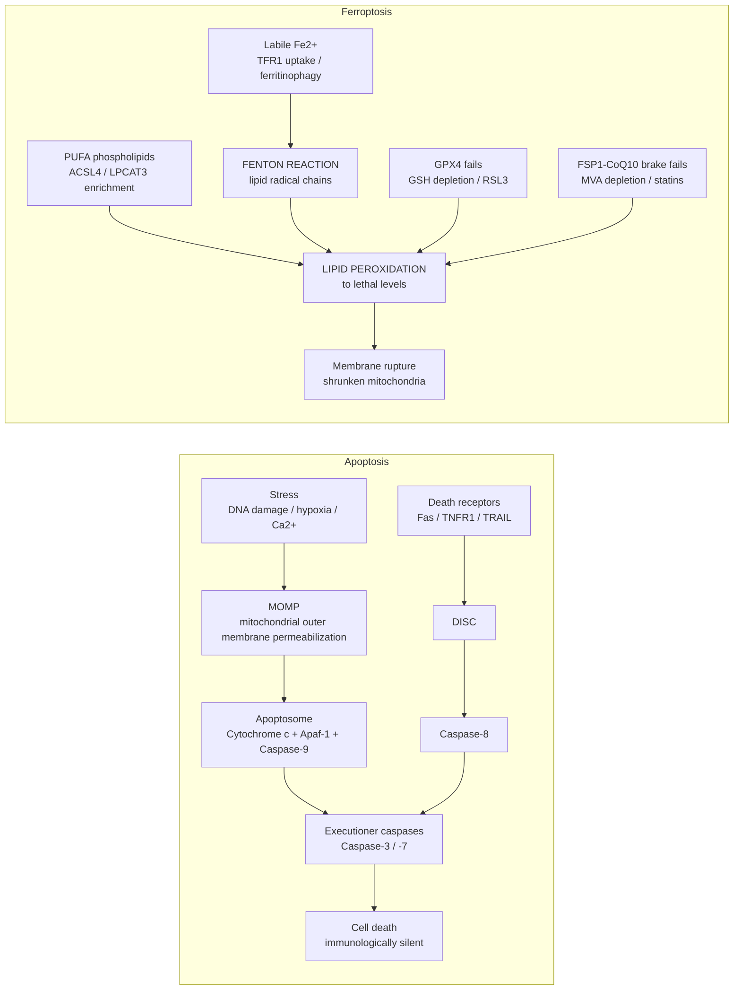

# Comparative Review — Ferroptosis & Cancer vs. Apoptosis & Cancer

> [!info]
> **Source Context**
> Primary sources from this wiki: [[Ferroptosis]], [[Apoptosis]], [[Cancer]],
> [[_document_ - Apoptosis in cancer from pathogenesis to treatment|Apoptosis in cancer: from pathogenesis to treatment]] (Wong, 2011),
> [[_document_ - Evading apoptosis in cancer|Evading apoptosis in cancer]] (Fernald & Kurokawa, 2013),
> [[_document_ - Ferroptosis past present and future|Ferroptosis: past, present and future]] (Li et al., 2020), [[MUC1]].

---

## Summary

[[Apoptosis]] and [[Ferroptosis]] are both forms of **regulated cell death**, but they sit at opposite ends of the mechanistic spectrum — and cancers have learned to defeat each in different ways. Because their execution machinery barely overlaps, a tumor that has locked down its apoptotic machinery can remain fully vulnerable to ferroptosis — and vice versa.

> [!important]
> ==Non-redundancy is the central therapeutic argument==: apoptosis-targeted and ferroptosis-targeted strategies kill through machinery that barely overlaps, so resistance to one does _not_ confer resistance to the other.

---

## At a Glance

| Dimension                   | [[Apoptosis]] & Cancer                                       | [[Ferroptosis]] & Cancer                                               |
| --------------------------- | ------------------------------------------------------------ | ---------------------------------------------------------------------- |
| **Core executor**           | Caspase cascade ([[Caspase-3]], -8, -9)                      | Iron-catalyzed [[Lipid Peroxidation]] ([[Fenton Reaction]])            |
| **Key gatekeeper**          | [[Bcl-2 family]] balance at [[Mitochondria]] ([[MOMP]])      | [[GPX4]]/GSH + [[FSP1]]–CoQ10 antioxidant shields                      |
| **Classic tumor escape**    | Bcl-2 amplification, p53 mutation (~50%), IAPs, caspase loss | xCT/[[SLC7A11]] & MUC1-C upregulation, GPX4 dependence, CoQ10/MVA flux |
| **p53 relationship**        | Loss of p53 removes apoptotic brake                          | p53 actively _drives_ ferroptosis (SLC7A11↓, SAT1↑)                    |
| **Morphology**              | Chromatin condensation, blebbing, apoptotic bodies           | Shrunken mitochondria, intact nucleus, membrane rupture                |
| **Immunological character** | Silent (PS flip → phagocytosis)                              | Immunogenic potential (DAMP release)\*                                 |
| **Clinical maturity**       | Approved drugs (BH3 mimetics); trials since ~2005            | No approved inducers; repurposed drugs only                            |
| **Best-fit tumor context**  | Bcl-2-addicted hematologic malignancies (CLL/lymphoma)       | Therapy-resistant, EMT/persister, high-iron/lipid states               |

---

## Framing: Two Cell Death Programs, Two Different Battles

- **[[Apoptosis]]** is the ancient, genetically hardwired "==suicide program==" — caspase-driven, immunologically silent, and dependent on mitochondrial permeabilization or death-receptor signaling.
- **[[Ferroptosis]]** is a recently defined (2012), non-apoptotic death driven by **iron-dependent [[Lipid Peroxidation]]** of membrane phospholipids — ==oxidatively violent, metabolically contingent==, and immunologically distinct.

---

## Apoptosis & Cancer

### How the pathway works

Caspases are both initiators and executioners, activated via three routes (per [[Apoptosis]] and Wong 2011):

- **Intrinsic (mitochondrial) pathway** — stress ([[DNA Damage]], hypoxia, high cytosolic Ca²⁺) increases mitochondrial permeability; [[Cytochrome c]] release builds the [[Apoptosome]] ([[Apaf-1]] + [[Caspase-9]]) → [[Caspase-3]]. Governed by the **[[Bcl-2 family]] balance**: pro-apoptotic ([[Bax]], [[BAK]], BH3-only proteins like [[Bid]], [[Bim]], [[Puma]], [[Noxa]]) vs. anti-apoptotic ([[Bcl-2]], [[Bcl-xL]], [[Mcl-1]], [[Bcl-w]]).
- **Extrinsic (death receptor) pathway** — [[Fas]]/[[TNFR1]]/[[TRAIL]] receptors → [[DISC]] → [[Caspase-8]].
- **ER pathway** — [[Caspase-12]]-dependent, less well characterized.

### How cancer defeats it

Evasion of apoptosis is an explicit **hallmark of cancer** ([[Hallmarks of Cancer]]; [[Cancer]]). Documented escape routes:

| Escape route                      | Mechanism                                                                                   | Evidence from wiki documents                                                                                                                                  |
| --------------------------------- | ------------------------------------------------------------------------------------------- | ------------------------------------------------------------------------------------------------------------------------------------------------------------- |
| Disrupted Bcl-2 balance           | Anti-apoptotic amplification vs. pro-apoptotic deletion                                     | t(14;18) BCL2 translocation (follicular lymphoma); bax frameshift mutations in microsatellite-unstable [[Colorectal Cancer]]; elevated Bcl-2/Bax ratio in CLL |
| p53 loss                          | Removes transcription of [[Bax]], [[Puma]], [[Noxa]], [[Apaf-1]]; raises [[MOMP]] threshold | Defective in >50% of human cancers; also suppressed post-translationally by [[SIRT1]] deacetylation                                                           |
| IAP overexpression                | Direct caspase inhibition                                                                   | [[XIAP]] + [[Survivin]] in NSCLC; Livin in melanoma; Apollon driving [[Cisplatin]] resistance in gliomas                                                      |
| Reduced caspase function          | Initiator/effector caspase loss                                                             | Caspase-3 loss in breast/ovarian/cervical tumors; caspase-9 downregulation in stage II colorectal cancer                                                      |
| Impaired death receptor signaling | Receptor downregulation, decoy receptors                                                    | CD95 loss in treatment-resistant leukemia/melanoma; Fas/DR4/DR5 dysregulation across cervical carcinogenesis                                                  |
| Post-translational sabotage       | Phosphorylation switches flip effectors off                                                 | Src→[[Caspase-8]] Tyr380; PAK2→[[Caspase-7]] (breast chemoresistance); ERK2→[[BAX]]; Akt→[[XIAP]] Ser87 stabilization                                         |

> [!note]
> Cancer cells modulate the apoptotic network **transcriptionally, translationally, and post-translationally** simultaneously — miR-15/16 loss lifts BCL-2 translation while [[Akt]]/[[ERK]] suppress [[FOXO Transcription Factors|FOXO]]-driven [[Bim]] expression. These mechanisms are ==not mutually exclusive==.

### Therapeutic exploitation

The apoptotic axis is the most clinically mature cell-death target:

- [[BH3 mimetics]] — [[ABT-737]], [[ABT-263]]/navitoclax
- Antisense/oligo approaches — [[Oblimersen sodium]], XIAP/Survivin siRNA
- MDM2-p53 disruptors — [[Nutlins]], [[MI-219]]
- Smac mimetics — [[SM-164]]
- p53 gene therapy and vaccines

> [!warning]
> Wong 2011 caveat: most agents are ==multi-target==, raising toxicity and resistance concerns — normal cells also rely on apoptosis, so therapeutic window is narrow.

---

## Ferroptosis & Cancer

### How the pathway works

Death occurs when antioxidant defenses fail against iron-driven lipid peroxidation of PUFA-phospholipids (per [[Ferroptosis]]):

- **GPX4/GSH axis** — [[System Xc⁻]] ([[SLC7A11]]) imports cystine → [[Glutathione]] → [[GPX4]] repairs phospholipid hydroperoxides. Blocked by [[Erastin]] (Xc⁻) or [[RSL3]] (direct GPX4 inhibition).
- **FSP1–CoQ10–NAD(P)H parallel axis** — myristoylated [[FSP1]] regenerates ubiquinol at the plasma membrane as a GPX4-independent radical trap; converges with the [[Mevalonate pathway]] (statins/FIN56 deplete ubiquinone).
- **Iron supply** — [[Transferrin receptor 1]] uptake, [[Ferritin]] storage, [[NCOA4]]-mediated ferritinophagy, [[HO-1]] heme degradation feed redox-active Fe²⁺ for the [[Fenton Reaction]].
- **Lipid substrate** — [[ACSL4]] and [[LPCAT3]] enrich membranes with oxidizable PUFAs; [[ALOX15]] amplifies peroxidation downstream of the p53–SAT1 axis.

> [!tip]
> The GPX4–GSH and FSP1–CoQ10 shields are ==synergistic redundancy==: losing either axis alone is tolerable, ==combined inhibition is strongly lethal== — the core rationale for combination ferroptosis therapy.

### Why cancer cells are vulnerable — and how they defend

- **Vulnerability:** mesenchymal and drug-tolerant **persister** states are highly GPX4-dependent — ==exactly the states that survive apoptosis-targeted therapy==. Therapy-resistant contexts flagged in the wiki include [[Breast Cancer]], [[Renal Cell Carcinoma]], [[Melanoma]], and [[leukemia]].
- **Defense:** tumors maintain the same antioxidant shield. In triple-negative [[Breast Cancer]], the [[MUC1|MUC1-C]]/xCT([[SLC7A11]])/CD44v complex sustains GSH and suppresses ferroptosis — inhibiting it kills TNBC cells or reduces self-renewal.

> [!important]
> **p53 polarity flips between the two death programs.** In apoptosis, p53 loss removes the pro-apoptotic brake (helps tumors). In ferroptosis, p53 actively ==promotes== cell death by repressing [[SLC7A11]] and transactivating [[SAT1]] → [[ALOX15]]. Same tumor suppressor, opposite net effect on each program.

Drug sensitizers already documented in the wiki:

| Agent           | Tumor context                               | Mechanistic hook                                               |
| --------------- | ------------------------------------------- | -------------------------------------------------------------- |
| [[Sorafenib]]   | HCC                                         | Ferroptosis induction enabled by Rb loss                       |
| [[Artesunate]]  | Pancreatic / ovarian / head-and-neck models | Iron-dependent induction (antimalarial repurpose)              |
| [[Mitotane]]    | Adrenocortical carcinoma                    | Exquisitely sensitive ACCs                                     |
| SIRT6 silencing | [[Gastric Cancer]]                          | Overcomes VEGF resistance via ferroptosis                      |
| Statins / FIN56 | Broad (preclinical)                         | Collapse FSP1–CoQ10 brake via MVA-pathway ubiquinone depletion |

### Therapeutic status

> [!warning]
> No ferroptosis-inducing drug is yet approved; agents like erastin/RSL3 analogues remain preclinical or repurposed (sorafenib, artesunate, statins). Biomarkers — [[Malondialdehyde]], [[4-Hydroxynonenal]], C11-BODIPY oxidation, shrunken mitochondria on EM — are ==research-grade, not clinical==.

---

## Head-to-Head Comparison

See the **At a Glance** table above; the decisive rows are the gatekeeper logic and the p53 polarity:

- Apoptosis guards its threshold at **[[MOMP]]** using a protein-balance dial ([[Bcl-2 family]] ratios); tumors win by shifting the dial or deleting [[p53]].
- Ferroptosis has ==no single threshold== — it is a running battle between iron-driven lipid radical generation and two redundant antioxidant brakes; tumors win by feeding the brakes ([[System Xc⁻]], GSH, CoQ10 flux).

---

## Synthesis: Why They Complement Rather Than Compete

- **Non-overlapping machinery = orthogonal kill switch.** A tumor can amplify [[Bcl-2]] and lose [[p53]] yet still die if [[GPX4]] and [[FSP1]] are simultaneously collapsed.
- **Resistance to one sensitizes to the other.** Drug-tolerant persisters that evade apoptosis become exquisitely ferroptosis-vulnerable due to their GPX4 dependence — making ferroptosis induction a rational ==second wave== after apoptosis-directed therapy fails.
- **Shared upstream nodes offer combination logic.** [[p53]] restoration re-arms both programs (BAX/PUMA for apoptosis; SLC7A11 repression for ferroptosis); [[Mevalonate pathway]] inhibition (statins) hits both prenylation survival signaling and the FSP1-CoQ10 brake.
- **Different safety profiles.** Apoptosis-targeting risks myelosuppression in normally apoptosing tissues; ferroptosis induction risks damage to iron-rich, high-PUFA organs (kidney, heart, brain) where ferroptosis drives pathology ([[Ischemia-reperfusion Injury]], neurodegeneration).

---

## Open Questions Worth Tracking in This Wiki

- Whether endogenous catecholamine-derived inducers (the [[Adrenochrome]] hypothesis) operate in vivo.
- Whether senescence-associated [[Acid ceramidase]] upregulation creates exploitable ferroptotic windows in the [[Tumor Microenvironment]].
- Whether SASP-mediated transmission of ferroptotic sensitivity ([[IL-6]], [[IL-8]]) can be therapeutically amplified.

---

## Wiki Cross-References

`[[Ferroptosis]]` · `[[Apoptosis]]` · `[[Cancer]]` · `[[Hallmarks of Cancer]]` · `[[GPX4]]` · `[[FSP1]]` · `[[SLC7A11]]` · `[[p53]]` · `[[Bcl-2 family]]` · `[[MUC1]]` · `[[Lipid Peroxidation]]` · `[[Mevalonate pathway]]` · `[[Multidrug Resistance]]`

---

_Footnote:_ \* Immunological character of ferroptosis (DAMP release, immunogenic potential) is general knowledge supplementing what the wiki notes currently cover. All mechanism details are drawn from the wiki sources listed at top.
