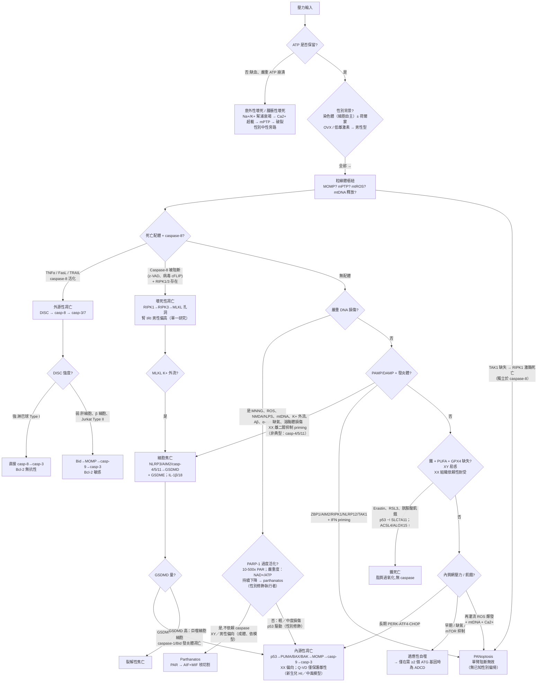
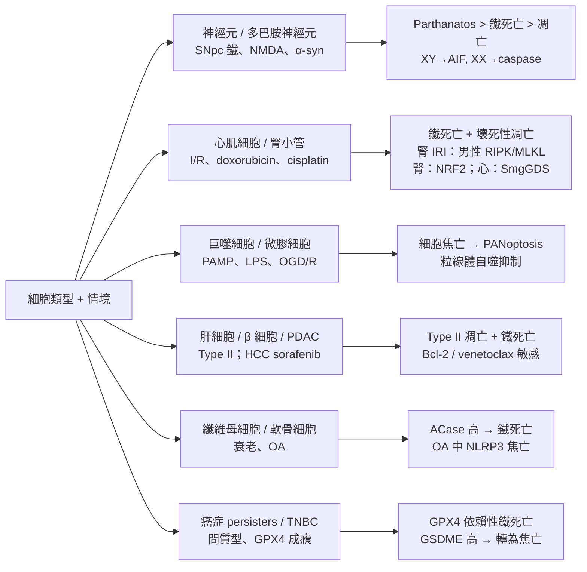
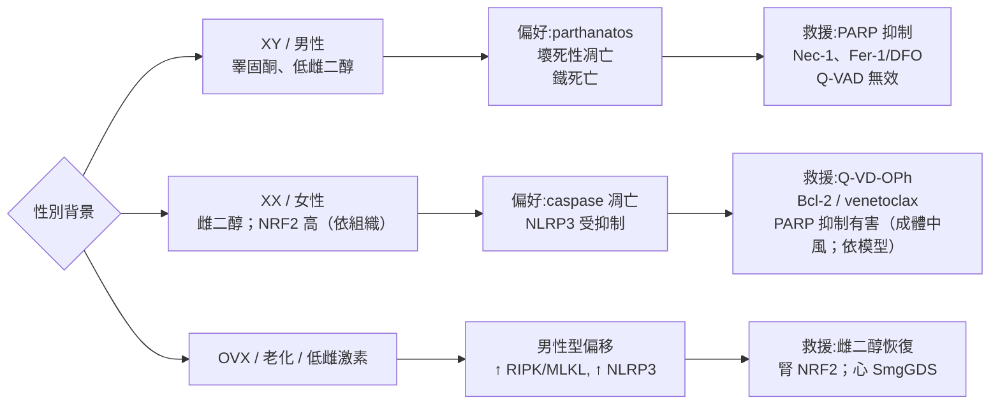

# 細胞死亡決策樹 — 壓力與細胞類型

資料綜合：`src/notes/cell-death/`、`src/notes/_link/` 壓力筆記、PANoptosis 綜述（2026 年 7 月）。
產生：11_Sep_2026 08:00 AM PDT。

> [!warning] 證據警示
> 性別分層軸在成體中風與新生兒缺氧缺血神經元模型（McCullough 2005；Liu 2009/2011；Du 2004）以及腎 IRI（Tran 2025，單一研究）中最強。它**並非**普遍二元。心臟與腦的壞死性凋亡性別偏倚**尚未證實**，PANoptosis 亦無性別偏倚報告。每項「雄性／雌性救援」規則都必須在對應模型中驗證。

## 主流程圖 — 壓力到死亡模式

## 細胞類型選擇器 — 誰會怎麼死

## 性別偏好軸 — 整合於 SEX 節點，細節在此

在模式＋細胞類型確定後套用。性別改變執行者選擇，不改變壓力本身。

OVX＝卵巢切除（ovariectomy），停經／雌激素耗竭的動物模式。OVX 後失去雌二醇保護，轉為男性型：NLRP3 抑制解除、腎 NRF2 與心臟 SmgGDS 保護下降、RIPK／MLKL 與 PARP／AIF 易感性上升。

| 模式 | 男性偏倚 | 女性偏倚 | 證據錨點 |
|---|---|---|---|
| [[Parthanatos]] | 強 XY — 成體中風／心肌梗塞、NMDA、MPTP | 弱 | PARP-1／AIF-KO 僅保護成體雄性；依模型；無 MIF／PAAN 性別宣稱 |
| [[Apoptosis\|細胞凋亡]] | 弱 | 強 XX — cyto c／casp-3 | Q-VD-OPh 僅保護雌性（新生兒 HI／中風）；細胞自主 XX→caspase |
| [[Necroptosis\|壞死性凋亡]] | 腎 IRI（單一研究）：男性 ↑RIPK1／RIPK3／p-MLKL | OVX 縮小差距 | Tran 2025；心／腦未證實；SIRT3（非 SIRT2）腎 IRI |
| [[Ferroptosis\|鐵死亡]] | 腎小管 Gpx4-KO 傷雄性 | 腎 NRF2 耐受；心雌二醇／SmgGDS | 腎 NRF2（Ide 2022）；心 SmgGDS；無已證實的基礎 GPX4 性別差異 |
| [[Pyroptosis\|細胞焦亡]] | priming 後 IL-1β 較高（依模型） | 雌二醇抑制 NLRP3 priming；創傷 GSDMD 評分女性高 | ERβ／雌二醇抑制穩健；男性 LPS 休克偏倚並非普遍 |
| [[Necrosis\|壞死]] | 中性 | 中性 | 差異在受調控執行者，不在腫脹性壞死本身 |
| [[PANoptosis]] | 無已知性別偏倚 | — | vault 未報告；性別僅列為開放實驗變項 |

原則：男性＋神經／腎／IRI → 並行測試 PARP／AIF＋RIPK／MLKL＋Fer-1。女性＋相同情境 → 先測 caspase／Bcl-2，PARP 抑制放最後。

## 決策表

| 若看到 | 偏向 | 救援測試 |
|---|---|---|
| Caspase-3、cyto c、MOMP、無腫脹 | [[Apoptosis\|細胞凋亡]] | z-VAD／Bcl-2（僅 Type II）／venetoclax |
| p-MLKL、RIPK3、DAMPs、腫脹 | [[Necroptosis\|壞死性凋亡]] | Necrostatin-1、RIPK3／MLKL KO |
| IL-1β／IL-18、GSDMD 孔洞、ASC specks | [[Pyroptosis\|細胞焦亡]] | NLRP3 阻斷（MCC950）、casp-1 抑制 |
| Lipid-ROS、鐵、粒線體皺縮、無 caspase | [[Ferroptosis\|鐵死亡]] | Fer-1、liproxstatin-1、DFO、GPX4 救援 |
| PAR 暴增、AIF 核轉位、約 50-kb 片段、NAD+／ATP 下降 | [[Parthanatos]] | PARP 抑制（雄性）、PARG；無直接 AIF 抑制劑（實驗性） |
| 三臂並存，單臂阻斷無效 | [[PANoptosis]] | 合併／上游 ZBP1／TAK1／RIPK1 |
| ATP 缺失、腫脹、calpains、cathepsins | [[Necrosis\|壞死]] | 恢復 ATP／早期 Ca2+ 螯合 |
| LC3／ATG 通量、mTOR 關閉、飢餓／缺氧 | [[Autophagic Cell Death\|自噬性細胞死亡]] | 需 ≥2 個 ATG 基因（ADCD vs AMCD）；chloroquine 非特異 |

## 細胞類型速查

* **淋巴球 vs 肝細胞／β 細胞：** 用 Type I vs Type II 區分 — Bcl-2 僅保護 Type II。
* **神經元：** 預設懷疑 parthanatos／鐵死亡；看性別（XY→PARP／AIF，XX→caspase）與 GSDMD（低→退回凋亡）。
* **腎／心 IRI：** 先測鐵死亡（Fer-1），再測壞死性凋亡；男性偏倚在腎已確立（單一研究），心臟則無。
* **巨噬細胞：** 預設焦亡／PANoptosis；IFN priming＋TNF-α／IFN-γ 協同為閘門。
* **衰老纖維母細胞／軟骨細胞：** 並行測 ACase／鐵死亡與 NLRP3。
* **間質型癌症：** 測 GPX4 成癮；GSDME 高 → 化療觸發焦亡。

## 壓力進入點

* **[[Endoplasmic Reticulum Stress\|內質網壓力]]／[[Integrated Stress Response\|整合壓力反應]]** → 適應性 UPR → 自噬／存活；持續 PERK-ATF4-CHOP → 凋亡。
* **[[Reactive Oxygen Species\|活性氧]]／[[Hypoxia\|缺氧]]／[[Ischemia\|缺血]]** → ROS→RIPK1 vs HIF-自噬 vs ATP-壞死。
* **[[Ischemia-reperfusion Injury\|缺血再灌流損傷]]** → 視為混合死亡；驗證 PANoptosome（ASC／casp-8／RIPK3 共定位），勿只看單一標記。
* **[[DNA Damage\|DNA 損傷]]／[[Genotoxic Stress\|基因毒壓力]]** → PARP 過度活化閾值決定 parthanatos vs p53 凋亡。
* **[[Ca2+ overload\|鈣超載]]／[[Excitotoxicity\|興奮毒性]]** → calpain／mPTP 壞死＋NMDA-parthanatos 前饋。

## 文件

* [[Regulated Cell Death\|調節性細胞死亡]]
* [[Apoptosis\|細胞凋亡]]／[[Necroptosis\|壞死性凋亡]]／[[Pyroptosis\|細胞焦亡]]／[[Ferroptosis\|鐵死亡]]／[[Parthanatos]]／[[PANoptosis]]／[[Necrosis\|壞死]]／[[Autophagic Cell Death\|自噬性細胞死亡]]
* [[Type I vs Type II Cells]]

## 連結

* [[ZBP1]]／[[RIPK1]]／[[RIPK3]]／[[MLKL]] — 壞死性凋亡／PANoptosome 核心
* [[NLRP3]]／[[Caspase-1]]／[[Gasdermin D]]／[[Gasdermin E]] — 焦亡臂
* [[Caspase-8]]／[[Caspase-8-c-FLIP Rheostat]]／[[TAK1]] — 凋亡／壞死性凋亡開關
* [[PARP1]]／[[Apoptosis-Inducing Factor\|AIF]] — parthanatos 軸
* [[GPX4]]／[[System Xc-]]／[[SLC7A11]]／[[ACSL4]] — 鐵死亡軸
* [[Mitochondrial outer membrane permeabilization\|MOMP]]／[[Mitochondrial Permeability Transition Pore\|mPTP]]／[[Calcium Signaling\|鈣訊號]]

## 連結摘要

* 決策邏輯：ATP → caspase-8 → DNA／PARP → 發炎體／PANoptosome → 鐵／GPX4 → ER／CHOP。
* 細胞類型疊加決定閾值，不決定路徑身份；性別決定執行者（caspase vs PARP／AIF），在成體中風／腎模型中成立，並非普遍。
