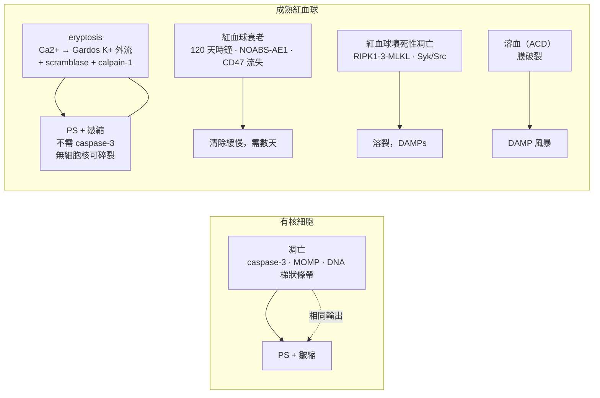

# 紅血球凋亡（eryptosis）2025 — 摘要／大綱

> [!info] 來源
>
> [[_document_ - Current understanding of eryptosis mechanisms, physiological functions, role in disease, pharmacological applications, and nomenclature recommendations]] — Tkachenko A、Alfhili MA、Alsughayyir J 等人。*Current understanding of eryptosis…* **Cell Death Dis 16, 467（2025）**。doi:[10.1038/s41419-025-07784-w](https://doi.org/10.1038/s41419-025-07784-w)，PMC12216432，PMID 40592821。由紅血球細胞死亡研究聯盟（Consortium for Erythrocyte Cell Death Research）撰寫的共識綜述（截至 2024 年底，PubMed 上「eryptosis」相關文獻逾 600 篇）。
> Vault 路徑：`src/notes/cell-death/_document_ - Current understanding of eryptosis…md`。對應的 vault 筆記：[[Eryptosis]]（位於 `src/notes/_link/`，內容精簡——需由本文檔充實）。

---

## 核心主張（單段版）

成熟紅血球是無核、無胞器、充滿血紅素的細胞：沒有粒線體、沒有內質網、沒有高基氏體、沒有核糖體，實質上也沒有轉錄組（雖有低度轉譯的報告，但可視為可忽略）。因此，紅血球生成過程中的去核加上自噬依賴的胞器清除，實際上*刪除了大部分古典死亡機器*——細胞色素 c、APAF-1、caspase-2/-6/-7/-9、內源性凋亡小體、PARP-1/AIF parthanatos、NLRP3／發炎小體焦亡、自噬機器。被*保留下來*的是紅血球系譜的殘餘：Fas/CD95、FasL、FADD、caspase-3、caspase-8、RIPK1/RIPK3/MLKL、calpain-1、Gardos 通道（KCNN4）、陰離子交換體 AE1／band 3，以及整套質膜離子轉運與磷脂不對稱裝置。**紅血球凋亡（eryptosis）就是運行在這份殘餘之上的受調控死亡程式。**其主控調節因子是**胞質 Ca²⁺**，執行器組合則是**Gardos 介導的 K⁺／水外流、 scramblase 活化搭配 flippase 抑制，以及 calpain-1 對細胞骨架的蛋白水解**。形態學上它屬於凋亡型（皺縮、出泡、PS 外翻），免疫學上則是沉默的——但機制上確實是一套獨立程式，而這篇綜述的核心貢獻是一套*命名法*，讓上述差異得以被實際使用：離子通道驅動型、ROS 介導型、脂質驅動型、外源性 Fas 介導型、caspase 依賴型，以及紅血球酵素缺乏依賴型 eryptosis，並加上刻意不去對應鐵死亡的「鐵負荷驅動型細胞死亡」標籤。

---

## 來源文獻的圖（BioRender，可重用）

六張圖——任何 eryptosis 教學頁面的骨架。目前先熱連結至 PMC；之後透過 `image-ingest` 技能重新抓取並改為託管於 `src/images/`。

**圖 1 — 可用的死亡 repertoire：有核細胞 vs 成熟紅血球。** 有核細胞（a）與成熟紅血球（b）中的意外性與受調控細胞死亡模式。成熟紅血球缺乏胞器，限制了細胞死亡機器的多樣性。ACDC 自噬依賴型細胞死亡；PARP 聚（ADP-核糖）聚合酶；ROS 活性氧。*這是說明「eryptosis 有何不同」的最佳單一圖——b panel 顯示成熟紅血球只剩兩條 RCD 路徑。*

**圖 2 — eryptosis 的主控訊號傳遞圖。** cGKI cGMP 依賴性蛋白激酶 I；CK1α 酪蛋白激酶 1α；FADD Fas 結合死亡區；p38 MAPK p38 絲胺酸／蘇胺酸活化激酶；PGE₂ 前列腺素 E₂；PKC 蛋白激酶 C；PS 磷脂醯絲胺酸；RNS 活性氮；ROS 活性氧；SM 酸性與中性鞘磷脂；SMases 酸性與中性鞘磷脂酶。*一切最終都收斂到 Ca²⁺；注意 NO → cGMP → cGKI 的抑制臂，以及能量感測激酶。*

**圖 3 — 作為防禦系統的 eryptosis，與溶血對比。** eryptosis 在受損細胞（包括*惡性瘧原蟲*感染紅血球）溶解並釋放損傷相關分子模式（DAMPs）之前先將其移除。*這是生理功能圖；可直接與比較表中的壞死列配對。*

**圖 4 — 疾病地圖。** 疾病中加速的 eryptosis：紅血球過早被破壞與貧血、促凝血活性，以及 eryptotic 細胞對內皮的黏附。*對應疾病地圖章節的臨床圖。*

**圖 5 — 長新冠：紅血球上的纖維蛋白類澱粉微血栓。** 掃描式電子顯微鏡顯示長新冠患者的紅血球被纖維蛋白類澱粉微血栓覆蓋（下圖）。*這是「微血栓 → 氧化壓力 → eryptosis → 微循環衰竭」鏈條的視覺錨點。*

**圖 6 — 奈米材料誘發的 eryptosis，被胞吞 vs 未被胞吞。** eryptosis 可由被胞吞與未被胞吞的奈米材料兩者誘發；誘導作用可能由 caspase-3 與 calpain 介導。CAT 過氧化氫酶；CTAB 十六烷基三甲基溴化銨；D-PAA 葡聚糖-聚丙烯醯胺；NPs 奈米顆粒；PLGA 聚（乳酸-乙醇酸）；PS 磷脂醯絲胺酸；PVP 聚乙烯吡咯烷酮；ROS 活性氧；SOD 超氧化物歧化酶。*未被胞吞的顆粒透過 PIEZO1 作用——機械敏感通道路徑。*

**圖形摘要** — 從 2001 年發現到當今的演進弧線：成熟紅血球中的 caspase、Ca²⁺ 離子載體觸發的類凋亡死亡，以及「eryptosis」的命名。

### 原始圖說對照表（供參考）

| 圖 | 內容 | 在比較頁面的用途 |
| --- | --- | --- |
| 圖 1 | ACD + RCD 地圖；可用機器的*萎縮* | 說明「有何不同」的核心圖 |
| 圖 2 | 完整的 eryptosis 訊號網絡 | 主控機制圖；可鏡射為 `eryptosis.html` 的靜態備援 |
| 圖 3 | 防禦系統 vs 溶血／DAMP 釋放；瘧疾清除 | 生理／免疫圖——與壞死列配對 |
| 圖 4 | 疾病地圖——貧血、凝血、內皮黏附 | 臨床圖 |
| 圖 5 | SEM：被纖維蛋白類澱粉微血栓覆蓋的長新冠紅血球 | 微血栓主張的視覺錨點 |
| 圖 6 | 奈米材料誘發的 eryptosis，胞吞與否 | 奈米毒理學／血液相容性應用 |

---

## 機制——以 Ca²⁺ 為主軸

一切最終都收斂到胞質 Ca²⁺。基線胞質 Ca²⁺ 為低 nM 濃度，細胞外則為低 mM 濃度；這道陡峭的梯度僅靠靜止時的低通透性加上透過質膜 Ca²⁺-ATPase 與 Na⁺/Ca²⁺ 交換器的高容量外排來維持。由於沒有內質網或粒線體儲存庫，**所有** Ca²⁺ 都必須由細胞外經質膜通道進入：

- **TRPC 家族。** 人類紅血球為 TRPC6；小鼠紅血球則為 TRPC4/5（此物種差異對小鼠 KO 研究很重要）；紅血球前驅細胞為 TRPC3（受 EPO 驅動）。
- **離子型態谷胺酸受體。** NMDA 受體參與 Ca²⁺ 恆定；AMPA 拮抗可抑制以等張葡萄糖酸鹽取代 Cl⁻ 所觸發的 Ca²⁺ 內流。
- **機械敏感 PIEZO1**——剪應力。
- **Cav2.1**——僅有藥理學證據。
- 通道在靜止時多為關閉，由 ROS、高張力與 Cl⁻ 耗竭開啟（最後者透過 PGE₂ 釋放）。

接著 Ca²⁺ 執行工作：開啟 **Gardos 通道**（KCa3.1/KCNN4）→ K⁺ 外流 → 超極化 → Cl⁻ 外流 → 水隨之流失 → 皺縮；抑制 **flippase** 並活化 **scramblase** → PS 外翻；活化 **calpain-1** → 細胞骨架（以及 AE1）蛋白水解 → 出泡與微囊泡化。Charybdotoxin 與 clotrimazole 可阻斷皺縮；calpain-1 *剔除小鼠的紅血球壽命並無改變*，這是對 calpain 必要性最誠實的但書。另需注意一種罕見的 eryptosis 變體：**膨脹**而非皺縮，並出現棘狀突起而失去雙凹圓盤狀（discocyte）形態——Jacob 等人的形態計量軟體會評分皺縮程度、不規則度（出泡）、顆粒度與中央暈消失。

> [!tip] 綜述建議採用的命名法
> 確認 eryptosis 至少需要 **PS 外翻 + 胞內 Ca²⁺ 升高**。亞型標籤：*離子通道驅動型*、*ROS 介導型*、*脂質（神經醯胺）驅動型*、*外源性 Fas 介導型*、*caspase 依賴型*、*紅血球酵素缺乏依賴型*、*鐵負荷驅動型細胞死亡*。RIPK1/3/MLKL 依賴的溶裂性死亡請使用「erythronecroptosis」。**請勿**寫成「erythroptosis」或「RBC 的 apoptosis」。

---

## 相較歷史圖景真正新增的內容

2001–2010 年的正典（Berg／Bratosin 的 caspase；Lang 的「suicidal erythrocyte death」；Gardos；ionomycin；高張衝擊）把 eryptosis 描述為*由 Ca²⁺ 觸發、多數情況下可忽略 caspase 的紅血球凋亡*。2025 年的綜述補上了五個層次。

**Caspase-8 作為命運開關。** 這是最大的概念進展。在有核細胞中 caspase-8 是凋亡、壞死性凋亡與焦亡之間的開關；如今在同一架構下也已在成熟紅血球中得到證實。Fas/FasL → FADD → caspase-8 → caspase-3 驅動*外源性* eryptosis（Mandal 2005；以及 2022 年香菸菸草萃取物的研究，其中 p38 MAPK 經由中性 SMase 產生的神經醯胺啟動 DISC 組裝），而 LaRocca 2014 顯示 RIPK1/FADD/caspase-8 複合物也會形成壞死小體（necrotosome），而活化的 caspase-8 可阻止壞死性凋亡。因此，eryptosis 與紅血球壞死性凋亡**互斥**，正如有核細胞中凋亡與壞死性凋亡互斥一樣。這把紅血球從「一袋會解體的血紅素」重新框定為「會讀取訊號並選擇死亡程式的細胞」。

**紅血球壞死性凋亡作為第二套程式。** 細菌成孔毒素（人類特異性，CD59 結合加上成孔）可驅動 RIPK1 依賴、Syk/Src 依賴、MLKL 依賴的溶裂性死亡，並伴隨膜完整性喪失。注意成熟紅血球*缺乏* TNFR1/2 與 TRAIL-R1/2——也就是授權典型壞死性凋亡的那些受體——而這正是紅血球變體具有細胞特異性的原因。溶血是*意外性*的鄰居；紅血球壞死性凋亡則是它的*受調控*對應物。比較頁面目前兩者都沒有列。

**鐵：命名紀律的一個案例。** 紅血球富含鐵並含有 GPX4，而紅血球前驅細胞確實利用鐵死亡來分化，因此成熟紅血球中的鐵死亡是一個顯而易見的假設。綜述的裁決：未獲證實，而且難以檢驗——鐵死亡受轉錄／表觀遺傳層級調控，而成熟紅血球無法觸及這些層級。血鐵沉積症的數據顯示 PS 外翻與 calpain 活化（也就是 eryptosis 樣態），因此作者提出刻意中性的標籤*鐵負荷驅動型細胞死亡*。

**eryptosis 作為檢驗終點，而不只是一種機制。** 溶血是意外性、非專一、對機制盲的。eryptosis 先於溶血發生，因此超過 110 種化合物（金屬、金屬氧化物、藥物、激酶抑制劑、尿毒症毒素、生物鹼）在*低於*其溶血閾值的濃度下即可測得 eryptosis 陽性。這使得 annexin-V/PS + Ca²⁺ + FSC 成為生物材料與奈米醫藥領域中**更靈敏、更可重現、機制訊息更豐富的血液相容性讀數**（ISO 10993-4 脈絡、Malta Initiative／NanoHarmony、RiskGONE、NANORIGO、Gov4Nano）。這是最直接可變現的近期進展，而比較頁面完全沒有提到。

**治療雙重性與氧化還原藥理學框架。** 抗 eryptosis：erythropoietin、N-acetyl-L-cysteine、一氧化氮供應者（nitroprusside、dibutyryl-cGMP）、cGKI、AMPK、atorvastatin、有機硫化合物、hydroxytyrosol、膳食植物固醇。促 eryptosis（作為抗瘧疾手段）：β-cryptoxanthin、dimethyl fumarate（經 G6PD 抑制 → GSH 耗竭）、lead、paclitaxel、cyclosporine、PGE₂、curcumin、amphotericin B、chlorpromazine。綜述還提出一套 **「5R」精準氧化還原原則**（Right species、Right place、Right time、Right level、Right target），延伸自 Meng 等人 2021，其直接動機是發現紫外光活化奈米顆粒會在白血球中提高 ROS，卻不影響紅血球。

**激酶清單顛倒。** 多數激酶*促進* eryptosis——PKC、CK1α、JAK3、p38 MAPK、CDK4——而 AMPK、cGKI、PAK2、MSK1/2、PDK1 則抑制它。其中數個在有核細胞中經典地是*抗*凋亡的（CK1α、PKC、JAK3），因此綜述的解釋是：既然只保留了少數受質，激酶效應的正負號便是細胞類型的性質，而非激酶本身的性質。這對比較表而言是極佳的教學點。

---

## eryptosis 與其他每一種程式的差異

| 軸 | Eryptosis | 最接近的鄰居 | 真正的差異 |
| --- | --- | --- | --- |
| 主控調節因子 | 來自細胞外的 **Ca²⁺ 內流** | 凋亡（Ca²⁺ → MOMP） | 沒有粒線體：Ca²⁺ 是*起始*訊號，而非 MOMP 放大器。演化論證據——Ca²⁺ 訊號傳遞早於內共生來源的凋亡工具組，因此在一個排除了自身粒線體的細胞中，古老的 Ca²⁺ 程式便接管。 |
| Caspase 依賴性 | 多數觸發因子下非必需；但 Fas/DISC 驅動的*外源性* eryptosis **需要**（caspase-8 → caspase-3） | 凋亡（以 caspase-3 定義） | Caspase 是從紅血球生成過程殘留的*系譜 baggage*，在該處它們並非凋亡性、且終末分化所必需。它們在紅血球中的角色是開關功能，而非執行功能。 |
| 調控層級 | 無——不可能有表觀遺傳、轉錄或轉譯層級的控制 | 其他所有程式 | 只有被保留的蛋白能被調節：轉譯後磷酸化、離子通量、通道閘控。eryptosis 是本頁面上唯一「純轉譯後」的死亡程式。 |
| 激酶極性 | PKC、CK1α、JAK3、p38、CDK4 **促**死亡（在別處經典為抗凋亡） | — | 正負號由殘餘的受質集合、即細胞類型決定。 |
| 膜的命運 | **完整**；PS 具有免疫抑制／抗發炎作用 | 凋亡膜完整；壞死性凋亡／焦亡／壞死為溶裂性 | eryptosis + 壞死是表中最接近「合理的無聲溶裂」配對。 |
| 免疫原性後果 | PS 本身具免疫抑制性；胞葬作用會將巨噬細胞重新程式化（HO-1 上調、促發炎細胞激素下調）；*沒有*DAMP 釋放的證據 | 壞死／壞死性凋亡：DAMP 驅動的發炎 | 綜述誠實標出的但書：eryptosis 會產生 EV（氧化壓力、Ca²⁺ 超載、PS 不對稱所致），且在儲存紅血球濃縮液中可找到 EV 相關的 DAMP——因此「沉默」這個標籤是先驗假設，而非已證實的事實。 |
| 清除時程 | 誘導 eryptosis 後 **數分鐘** | 衰老：**數天** | 這是最乾淨的操作型判別指標，也是比較頁面最該採用的一項。 |
| 脂質行為 | eryptotic 紅血球維持相對較高的膜脂質有序度 | 凋亡的有核細胞：透過胞器間膽固醇／磷脂交換造成脂質有序度驟降（Pyrshev 2018） | 沒有可供交換的內部膜——這是胞器喪失的另一個回響。 |
| ROS 來源 | Hb 氧化（Fenton 反應）、NADPH oxidase、黃嘌呤氧化還原酶 | ETC + 過氧化體 | 在 ROS 驅動的 eryptosis 中，路徑收斂為調節 Ca²⁺ 內流；並不存在多分支的 ROS→執行網絡。 |
| 血小板對比 | 紅血球無 Fas；**血小板**的內源性凋亡依賴粒線體凋亡小體、caspase-9/3、Bcl-XL/Bak/Bax，且 Fas 陰性 | — | 這是綜述對「eryptosis 中哪些是細胞特異」最銳利的檢驗：它追蹤的是*粒線體清除*，而非去核。 |

**eryptosis vs 衰老**值得單獨強調，因為兩者共享形態（Ca²⁺ 上升、Gardos 活化、PS 外露、ROS）。綜述堅持兩者distinct，並提出操作規則：*暴露 PS 的衰老細胞應稱為 eryptotic。*要在一個無法增殖、且沒有 SASP 的細胞中定義衰老，本身就相當困難。

**生理功能。** Eryptosis 是一套身體防禦程式：在受損／衰老／有缺陷的細胞溶解之前縮短其壽命。溶血會釋放 heme、Hb、methemoglobin、ATP、HSP70、IL-33 → TLR4/NF-κB 內皮活化、NADPH oxidase 與 heme 鐵驅動的 NETs、巨噬細胞 TNF-α、MyD88/TRIF 微膠細胞活化、補體招募、NO 清除、腎臟濾過損傷。Eryptosis 避免了上述所有後果。它同時清除*瘧原蟲*感染細胞（感染細胞的自由基產量為未感染者的兩倍；受感染細胞會開啟 NSCC 以讓 Na⁺/Ca²⁺ 進入），而 G6PD 缺乏、鐮刀型血球性狀、β-珠蛋白生成障礙、GLUT1/AE1 缺陷都透過增強的 eryptosis 提供部分瘧疾保護——這是真正的宿主防禦權衡。清除機制是由 Kupffer 細胞執行的 PS 依賴性胞葬作用（肝竇中的 stabilin-1/2、整合素 αvβ5——在病理情況下，主要清除部位是肝臟而非脾臟；80% 的紅血球衍生囊泡在 5 分鐘內被清除），另有一條較慢的免疫路徑，透過天然存在的自體抗體（多數是針對 AE1／band 3 的 IgG），以及一條經由細胞外組蛋白的溶裂路徑。

---

## 疾病、污染物與藥理學——精簡地圖

- **腎臟。** CKD/ESRD：氧化壓力、發炎、能量耗竭與尿毒症毒素（indoxyl sulfate 經 OAT2/NADPH oxidase、GSH 非依賴性，並伴隨神經醯胺；acrolein；indole-3-acetic acid；urea；p-cresol；vanadate；IL-6；IL-1β；CRP）把 eryptosis 推入與腎性貧血的惡性循環。G4/G5 比 G1–G3 更高。在 PD 中，腹膜炎第 1 天 eryptosis 高出 3 倍，並與流出液中的 pWBC/pNGAL/IL-6/IL-1β 同步變動；殘餘尿量與 rGFR 具有保護作用。PTH 可獨立預測 HD 病患的 eryptosis 程度。
- **肝臟。** 肝臟是紅血球庫，也是主要的清除與鐵回收器官。膽紅素與膽汁酸會誘發 eryptosis；白蛋白具有保護作用；紅血球流失越多 → 膽紅素越多 → 神經醯胺、SMase 活化與 Ca²⁺ 內流越多 → 形成真正的惡性循環。在 B 型肝炎急性-on-慢性肝衰竭中最高。
- **血液／自體免疫。** 鐮刀型貧血、珠蛋白生成障礙、G6PD 缺乏、遺傳性球形紅血球症；AIHA 主要由**冷型 IgM/IgA**（C5 依賴；C8 有幫助，C9 無）而非溫型 IgG 驅動；SLE；抗磷脂症候群（來自 APS 患者的自體抗體，而非無症狀帶因者，能在捐贈者紅血球中誘發 eryptosis）。
- **代謝／心血管。** 高血壓（以氧化壓力為主，未治療患者的抗氧化酵素受抑制）；T1DM/T2DM 經由甲基乙二醛與 β2-微球蛋白；代謝症候群。
- **神經。** 帕金森氏症與阿茲海默症——calpain／神經醯胺失調，類澱粉 β 破壞紅血球磷脂。
- **感染／發炎。** 敗血症（敗血漿細胞毒性效應在 15 分鐘達峰；與內毒素活性、死亡率相關）；急性 COVID-19 與**長新冠**，其中纖維蛋白類澱粉微血栓覆蓋紅血球，氧化壓力驅動 eryptosis → 微循環不良 → 缺血再灌流損傷。
- **癌症。** 肺癌：貧血源自紅血球周轉增加，而非紅血球生成減少——而升高的 EPO 反而悖論性地*提高* eryptosis 易感性。Topotecan、cisplatin、tamoxifen、afatinib、lopinavir、clofazimine 皆為促 eryptosis。需標示的警示：在化療病人中抑制 eryptosis 可能削弱腫瘤細胞的凋亡。
- **污染物／毒理。** 職業性鉛暴露（暴露工人 PS 陽性率 2.82% vs 對照 0.1%；中介以 PLA₂ > SMase——即 PLA₂/PGE₂ 路徑）、鋁、鎳（p38 MAPK）、Cr(VI)、rotenone、DEET、bromfenvinphos。替代物可評估：BPS ≈ BPA（並非安全替換）、TBBPS < TBBPA（合理替換）、OPFRs ≪ BFRs、鄰苯二甲酸酯代謝物 ≪ 母體化合物。吸菸：2024 年一項 2023 人規模的世代研究——418 名吸菸者 vs 1000 名不吸菸者 vs 605 名戒菸者，eryptosis 與每日吸菸支數相關（CRP 與 GSH 有相關性）。
- **奈米毒理。** 被胞吞（Ag-NP、Si-NP、Fe₃O₄、TiO₂、GdVO₄:Eu）與未被胞吞（原始 SiO₂、LaVO₄:Eu——經 PIEZO1）的顆粒皆可觸發 Ca²⁺ 依賴性 eryptosis；較小的 CeO₂ 效力更強；塗層可改善血液相容性。

---

## `web/public/pages/en-US/cell-death-comparison.html` 的審查要點

先修正既有的 eryptosis 列，再做新增。

**1. Regulated 欄。** 目前寫「yes — caspase-independent」。應改寫為：*受調控、非溶裂性；多數觸發因子下 caspase-3 可省略，但外源性 Fas/DISC eryptosis 需要（caspase-8 → caspase-3）*。這項細微差別正是 2025 年綜述的核心。

**2. Morphology——「由脾臟巨噬細胞清除」在病理情況下是錯的。** 病理性的 PS 暴露紅血球是**在肝竇中由 Kupffer 細胞以 PS 依賴方式**經由 stabilin-1/2 清除；脾臟則是衰老細胞的緩慢路徑。另應補充：棘狀突起／雙凹 discocyte 形態喪失、微囊泡化，以及罕見的膨脹變體。

**3. Detection 相對於綜述自身的標準寫得不夠具體。** 綜述的規則是至少需要*PS 外翻**且**胞內 Ca²⁺ 升高*。應補充胺基磷脂轉位酶活性（NBD-PS 探針）、calpain-1 活性（CMAC）、scramblase／Gardos 讀數，並註明**沒有單一被接受的 eryptosis 標記**——頁面現有清單混雜了金標準與輔助標記，卻未加說明。

**4. Core machinery 欄缺少真正的執行器。** 目前寫的是「Ca²⁺ influx → calpain + scramblase activation → PS exposure」，比實際流程少一步。形態變化是由 **Gardos 通道 K⁺ 外流 + 水分流失**產生；膜重塑由 **flippase 抑制 + scramblase 活化**產生；AE1／band 3 則由 caspase-3 與 calpain 降解。應補上通道清單（人類 TRPC6／小鼠 TRPC4-5、PIEZO1、NMDA/AMPA、Cav2.1），並註明 Cl⁻ 耗竭 → PGE₂ 釋放。

**5.「Blocked by」只有一半的清單。** 應補充**抗 eryptosis**：透過可溶性鳥苷酸環化酶 → cGMP → cGKI 作用的 NO 供應者（nitroprusside、dibutyryl-cGMP）；cGKI 與 AMPK 是兩個經驗證最充分的遺傳性 restrainers（cGKI-/- 與 AMPKα-/- 小鼠：eryptosis 增強、貧血、脾大）；N-acetyl-L-cysteine；erythropoietin；charybdotoxin/clotrimazole（Gardos）；PKC、p38 MAPK 與 CK1α 抑制劑。也應補充**促 eryptosis**（同樣值得一欄或一則註記）：G6PD/PPP 抑制劑、神經醯胺/SMase 活化、Rac1 活化。

**6.「Most vulnerable / resistant」應更精確。** 應說明此限制僅適用於*成熟*紅血球——紅血球前驅細胞可執行完整的內源性／外源性凋亡、RIPK1 依賴性壞死性凋亡與鐵死亡。並補上血小板對比（粒線體凋亡小體、caspase-9/3、Bcl-XL/Bak/Bax、Fas 陰性），這是「eryptosis 由粒線體喪失而非去核所定義」的最強證據。

**7. Share-of-deaths 欄缺乏依據。**「~1–3% of non-apoptotic*（RBC-denominator）」——綜述明確未提供任何普查數據。應改為「no census exists; denominator is RBCs only」，與 NETosis 列已採取的誠實態度一致。

**8. Energy 欄——標出悖論。** ATP 耗竭既*引發* eryptosis（經由 PKCα 轉位與通道磷酸化），又*對抗*它（Ca²⁺-ATPase 外排能力喪失）。值得加一個子句。

**9. Crosstalk 欄建構不足。** 應改寫為：caspase-8 是開關；eryptosis ⊥ 紅血球壞死性凋亡；共享 Fas/FasL、ROS 與神經醯胺節點；PS 外翻在沒有 caspase 的情況下模仿凋亡；eryptosis 與鐵死亡共享 ROS／脂質過氧化*觸發因子*，但沒有 GPX4／鐵的執行器，而且根本不可能有轉錄層級調控。

**10. 最大的結構缺口：沒有紅血球壞死性凋亡這一列。** 它是溶血的直接受調控對應物，也是 eryptosis 的鏡像，而互斥性的發現只有在兩者同時在場時才讀得通。應新增第 11 列（RIPK1/RIPK3/MLKL、Syk/Src 依賴、溶裂性、釋放 DAMP、可被 Nec-1/GSK'872/NSA 阻斷而*不*被 z-VAD 阻斷），並讓壞死性凋亡列中「↓/n-a RBCs（no RIPK3/MLKL）」的主張作廢——它現在是錯的。另應新增第 12 列或明確註記，說明**溶血作為紅血球的意外性細胞死亡（ACD）**，以補上綜述圖 1b 所建構的 ACD/RCD 配對。

**11. Immune 欄需要胞葬作用的細節。**「silent」→「PS 具有免疫抑制性；胞葬作用會重新程式化巨噬細胞（HO-1 上調、IL-1β/TNF-α 下調）；*並未*證實有 DAMP 釋放，但 eryptosis 會產生 EV，其 DAMP 出現於儲存濃縮液中。」

**12. 免疫擾動的雙向箭頭。** Eryptosis 與免疫系統的關係是雙向的，其他任何一列皆非如此：它既消耗受感染／受壓力的細胞，*本身又*是巨噬細胞所接收的訊號。一則雙向註記將是本表的新內容。

**13. Clinical／burden 欄完全缺失。** 頁面只有「notes」。Eryptosis 在 CKD/ESRD/PD、敗血症、AIHA、SLE、APS、肺癌、帕金森氏症中皆可測量，且是有潛力的預後生物標記（腦脊髓液 eryptosis 參數用於腦血管攣縮／延遲性腦缺血；PD 嚴重度；敗血症內毒素活性）。這是很適合作為腳註列的候選，不宜讓頁面停留在純機制層面。

**14. 奈米毒理／血液相容性應用缺失。** 以 eryptosis 作為 ISO 10993-4 與奈米材料安全檢測中，取代溶裂試驗的更靈敏、機制訊息更豐富的方案。這是對一個參考頁面而言最明顯的*新增*項目。

**15. 術語腳註。** 應加入綜述的亞型前綴，以及明確的「非 erythroptosis、非 RBC apoptosis」註記，並補上命名的但書：NCCD 建議避免使用「eryptosis」一詞，因為成熟紅血球的生死狀態可被質疑——綜述的答案是，eryptosis／紅血球壞死性凋亡的決策地景支持*存活*那一側。

**16. 動畫卡片（`PROGRAMS.eryptosis`）。** 目前是 discocyte → spherocyte 加上 Ca²⁺ 與 PS 染色。四項升級：(a) 在皺縮期間以 Gardos 通道圖示顯示 K⁺／水流出；(b) 顯示 calpain 驅動的出泡與微囊泡脫落，而非只有晃動；(c) 新增最後一個階段，由巨噬細胞吞噬 PS 陽性殘骸且不發生破裂——清除訊息本身就是生理功能；(d) 在 bioNote 中加入運動學判別指標：*數分鐘清除 vs 衰老細胞需數天*，這是讀者唯一該記住的數字。此外 `bioNote` 目前寫「≈ hours」；綜述的論點是啟動需數小時，但清除只需數分鐘。

**17. `share of deaths` 分母的誠實性，應全面推廣。** 綜述點出一個通則：eryptosis／紅血球壞死性凋亡受細胞類型限制，絕不應與全身性比例相比較。該腳註對 NETosis 已存在，應延伸至紅血球壞死性凋亡。

**18. 命名法任務輸出 → 筆記充實。** [[Eryptosis]]（位於 `_link/`，未設 protected）內容精簡，需要本文檔的內容：caspase-8 開關、紅血球壞死性凋亡的交叉連結、5R 原則、疾病地圖、命名法區塊，以及 `Documents`／`Connections` 條目。待建立的實體筆記：`Erythrocyte`、`Erythrocyte Senescence`、`Erythronecroptosis`、`Scramblase`、`Gardos Channel`、`AE1`、`Phosphatidylserine`（已存在）、`Efferocytosis`、`Annexin V`、`Calpain`、`Hemolysis`。若紅血球壞死性凋亡要建立網頁，它值得在 `cell-death/` 下擁有一個主題目錄筆記，因為它是執行器／複合物層級的 RCD，而非共享實體。

---

## 綜述留下、值得追蹤的開放問題

1. **是什麼設定了 eryptosis 的閾值？** Bcl-2/MOMP 檢查點在紅血球中沒有對應物——臨界的 Ca²⁺ 升高是否就是不可逆的轉折點？尚無答案。
2. **ROS 如何在 eryptosis、紅血球壞死性凋亡與衰老之間做選擇？** 三者都使用 ROS，但來源不同。未解。
3. **哪些激酶位於哪些通道的下游？** AMPK→PAK2 是唯一被追蹤清楚的鏈；PDK1、MSK1/2、cGKI 尚無對應的效應器。
4. **成熟紅血球中的鐵死亡是真的，還是別的東西？** 血鐵沉積症數據呈現的是 eryptosis 樣態。
5. **eryptotic 細胞來源的 EV 在體內是否具免疫原性？** 這是「沉默」主張中最大的漏洞。
6. **體內藥物數據。** 這個領域絕大多數是*體外*研究。沒有任何抗 eryptosis 的人體試驗；EPO 是最接近臨床抓手之物，但其效應是雙向的（短期具保護作用，慢性暴露反而*提高* eryptosis 易感性）。
7. **鐵負荷：該用哪個標籤？**「Ferroptosis」或「iron-overload-driven cell death」——尚未定案，而這會影響文獻如何被索引。

---

## 建議的後續任務

- [ ] 由本文檔充實 [[Eryptosis]]，並將 18 項比較頁面修正列為可追蹤的任務。
- [ ] 透過 `image-ingest` 將圖 1–6 匯入 `src/images/`，並將圖 1b／圖 2 鏡射到 `web/public/pages/en-US/eryptosis.html` 作為 three.js 細胞的靜態備援。
- [ ] 建立 `Erythrocyte.md` 與 `Erythronecroptosis.md`；決定主題目錄 vs `_link/`。
- [ ] 決定比較頁面要擴充為 11–12 列（加入紅血球壞死性凋亡 + 溶血），還是採用一個「RBC death」腳註區塊——後者成本較低，也能讓 13 欄的表格在行動裝置上保持可讀。