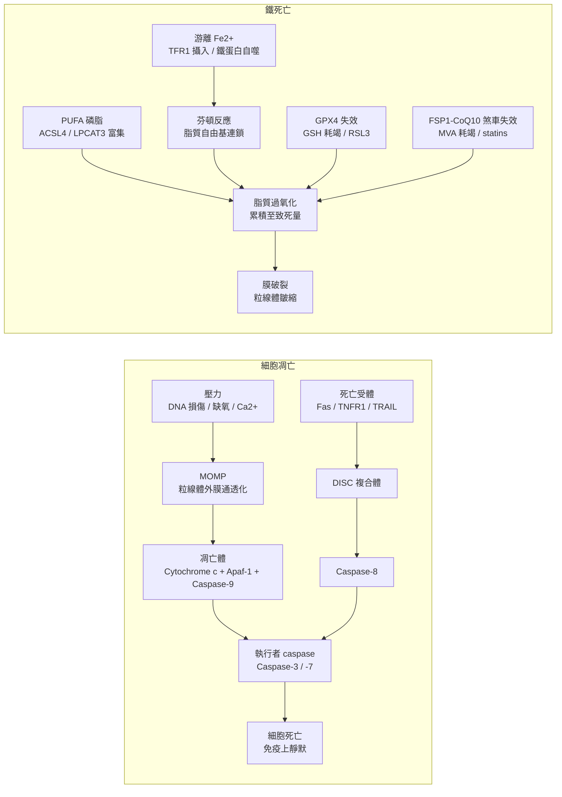

# 比較綜述——鐵死亡與癌症 vs. 細胞凋亡與癌症

> [!info]
> **資料來源背景**
> 本篇的主要維基來源：[[Ferroptosis|鐵死亡]]、[[Apoptosis|細胞凋亡]]、[[Cancer|癌症]]、
> [[_document_ - Apoptosis in cancer from pathogenesis to treatment|Apoptosis in cancer: from pathogenesis to treatment]]（Wong，2011）、
> [[_document_ - Evading apoptosis in cancer|Evading apoptosis in cancer]]（Fernald & Kurokawa，2013）、
> [[_document_ - Ferroptosis past present and future|Ferroptosis: past, present and future]]（Li 等，2020）、[[MUC1]]。

---

## 摘要

[[Apoptosis|細胞凋亡]]與 [[Ferroptosis|鐵死亡]]同屬**調節性細胞死亡**，但兩者位於機制光譜的相反端——而癌症已學會以不同方式分別破解這兩套系統。由於它們的執行機制幾乎不重疊，一個鎖死凋亡機器的腫瘤，仍可能對鐵死亡完全脆弱；反之亦然。

> [!important]
> ==「非重疊性」是並行開發兩種療法的核心論據==：靶向凋亡與靶向鐵死亡的策略經由幾乎互不重疊的機制殺死細胞，因此對其中之一的耐藥性，*並不*賦予對另一方的耐藥性。

---

## 一覽表

| 對照軸 | [[Apoptosis]] 與癌症 | [[Ferroptosis]] 與癌症 |
|---|---|---|
| **核心執行者** | caspase 級聯反應（[[Caspase-3]]、-8、-9） | 鐵催化之 [[Lipid Peroxidation|脂質過氧化]]（[[Fenton Reaction|芬頓反應]]） |
| **關鍵守門者** | [[Mitochondria|粒線體]]處的 [[Bcl-2 family|Bcl-2 家族]]平衡（[[MOMP]]） | [[GPX4]]/GSH 與 [[FSP1]]–CoQ10 兩道抗氧化防線 |
| **典型腫瘤逃逸** | Bcl-2 擴增、p53 突變（約 50%）、IAPs、caspase 缺失 | xCT/[[SLC7A11]] 與 MUC1-C 上調、GPX4 依賴、CoQ10/MVA 通量 |
| **與 p53 的關係** | 失去 p53 即解除凋亡煞車 | p53 反而*主動驅動*鐵死亡（SLC7A11↓、SAT1↑） |
| **型態特徵** | 染色質凝集、膜起泡、凋亡小體 | 粒線體皺縮、細胞核完整、膜破裂 |
| **免疫學特性** | 靜默（磷脂醯絲胺酸外翻 → 吞噬） | 具免疫原性潛力（DAMP 釋放）* |
| **臨床成熟度** | 已有核准藥物（BH3 擬似劑）；2005 年代起多項試驗 | 尚無核准誘導劑；僅有老藥新用 |
| **最適腫瘤情境** | Bcl-2 成癮的血液惡性疾病（CLL/淋巴瘤） | 耐藥型、EMT/持留細胞、高鐵高脂代謝狀態 |

---

## 定位：兩種死亡程序、兩場不同的戰役

- **[[Apoptosis|細胞凋亡]]**是古老且由基因硬接線的「==自殺程式==」——由 caspase 驅動、免疫上靜默，依賴粒線體通透化或死亡受體訊號。
- **[[Ferroptosis|鐵死亡]]**是近年定義（2012）的非凋亡性死亡，由**鐵依賴的 [[Lipid Peroxidation|脂質過氧化]]**攻擊膜磷脂所驅動——==氧化性劇烈、代謝高度相關==，且免疫學特性截然不同。

---

## 細胞凋亡與癌症

### 途徑如何運作

caspase 既是起始者也是執行者，經三條路徑活化（依 [[Apoptosis|細胞凋亡]]與 Wong 2011）：

- **內源性（粒線體）途徑**——壓力（[[DNA Damage|DNA 損傷]]、缺氧、高胞質 Ca²⁺）增加粒線體通透性；[[Cytochrome c|細胞色素 c]] 釋出後組裝成 [[Apoptosome|凋亡體]]（[[Apaf-1]] + [[Caspase-9]]）→ 活化 [[Caspase-3]]。此途徑受 **[[Bcl-2 family|Bcl-2 家族]]平衡**主導：促凋亡成員（[[Bax]]、[[BAK]] 及僅含 BH3 的蛋白如 [[Bid]]、[[Bim]]、[[Puma]]、[[Noxa]]）對抗抗凋亡成員（[[Bcl-2]]、[[Bcl-xL]]、[[Mcl-1]]、[[Bcl-w]]）。
- **外源性（死亡受體）途徑**——[[Fas]]/[[TNFR1]]/[[TRAIL]] 受體 → [[DISC]] 複合體 → [[Caspase-8]]。
- **內質網途徑**——依賴 [[Caspase-12]]，研究較少。

### 癌症如何擊敗它

凋亡逃逸是癌症的明確**標誌性特徵**（[[Hallmarks of Cancer|癌症標誌]]；[[Cancer|癌症]]）。文獻記載的逃逸路線如下：

| 逃逸路線 | 機制 | 維基文獻證據 |
|---|---|---|
| Bcl-2 平衡失衡 | 抗凋亡擴增 vs. 促凋亡缺失 | 濾泡性淋巴瘤的 t(14;18) BCL2 轉位；微衛星不穩定[[Colorectal Cancer|大腸直腸癌]]的 bax 移碼突變；CLL 中升高的 Bcl-2/Bax 比值 |
| p53 缺失 | 失去 [[Bax]]、[[Puma]]、[[Noxa]]、[[Apaf-1]] 轉錄；抬高 [[MOMP]] 門檻 | >50% 人類癌症缺陷；另可被 [[SIRT1]] 去乙酰化轉錄後抑制 |
| IAP 過量表達 | 直接抑制 caspase | NSCLC 的 [[XIAP]] + [[Survivin]]；黑色素瘤的 Livin；神經膠質瘤中 Apollon 造成[[Cisplatin]] 耐藥 |
| caspase 功能減損 | 起始或執行者 caspase 缺失 | 乳癌／卵巢癌／子宮頸癌的 caspase-3 缺失；二期結直腸癌的 caspase-9 下調 |
| 死亡受體訊號缺損 | 受體下調、誘餌受體 | 耐藥白血病／黑色素瘤的 CD95 缺失；子宮頸癌變全程中 Fas/DR4/DR5 失調 |
| 轉錄後破壞 | 磷酸化開關翻轉效應分子 | Src→[[Caspase-8]] Tyr380；PAK2→[[Caspase-7]]（乳癌化療耐藥）；ERK2→[[BAX]]；Akt→[[XIAP]] Ser87 穩定化 |

> [!note]
> 癌細胞會**同時**從轉錄、轉譯及轉錄後層次調控凋亡網絡——miR-15/16 缺失解除 BCL-2 轉譯抑制的同時，[[Akt]]/[[ERK]] 也壓制 [[FOXO Transcription Factors|FOXO]] 驅動的 [[Bim]] 表達。這些機制==彼此並不互斥==。

### 治療利用

凋亡軸是目前臨床上最成熟的細胞死亡靶點：

- BH3 擬似劑（[[BH3 mimetics]]）——[[ABT-737]]、[[ABT-263]]/navitoclax
- 反義寡核苷酸策略——[[Oblimersen sodium]]、XIAP/Survivin siRNA
- MDM2–p53 解離劑——[[Nutlins]]、[[MI-219]]
- Smac 擬似劑——[[SM-164]]
- p53 基因治療與疫苗

> [!warning]
> Wong 2011 的提醒：多數藥物為==多重靶點==，毒性與耐藥風險高——正常細胞同樣依賴凋亡，治療窗口狹窄。

---

## 鐵死亡與癌症

### 途徑如何運作

當抗氧化防禦擋不住鐵驅動的 PUFA 磷脂過氧化時，細胞即走向死亡（依 [[Ferroptosis|鐵死亡]]）：

- **GPX4/GSH 軸**——[[System Xc-|System xc⁻]]（[[SLC7A11]]）攝入胱氨酸 → [[Glutathione|麩胱甘肽（GSH）]] → [[GPX4]] 修復磷脂氫過氧化物。[[Erastin]]（抑制 xc⁻）或 [[RSL3]]（直接抑制 GPX4）均可阻斷。
- **FSP1–CoQ10–NAD(P)H 平行軸**——肉豆蔻醯化的 [[FSP1]] 在細胞膜再生泛醇，作為不依賴 GPX4 的自由基捕捉劑；與 [[Mevalonate pathway|甲羥戊酸途徑]]匯流（statins/FIN56 耗竭泛醌）。
- **鐵供給**——[[Transferrin receptor 1|轉鐵蛋白受體 1]] 攝入、[[Ferritin|鐵蛋白]]儲存、[[NCOA4]] 介導的鐵蛋白自噬、[[HO-1]] 血基質降解，共同供給紅氧活性 Fe²⁺ 以驅動 [[Fenton Reaction|芬頓反應]]。
- **脂質受質**——[[ACSL4]] 與 [[LPCAT3]] 使膜富含可氧化 PUFA；下游由 p53–SAT1 軸的 [[ALOX15]] 擴大過氧化。

> [!tip]
> GPX4–GSH 與 FSP1–CoQ10 兩道防線是==協同冗餘==：單獨失去任一軸尚可容忍，==合併抑制則強烈致死==——這正是鐵死亡併用療法的核心邏輯。

### 癌細胞為何脆弱——又如何防禦

- **脆弱面：**間質化與藥物耐受**持留細胞**高度依賴 GPX4——==恰是凋亡靶向治療後存活的族群==。維基已標記的耐藥情境包括 [[Breast Cancer|乳癌]]、[[Renal Cell Carcinoma|腎細胞癌]]、[[Melanoma|黑色素瘤]]與 [[leukemia|白血病]]。
- **防禦面：**腫瘤維持同一套抗氧化盾。在三陰性 [[Breast Cancer|乳癌]]中，[[MUC1|MUC1-C]]/xCT（[[SLC7A11]]）/CD44v 複合體維持 GSH、壓抑鐵死亡——阻斷該複合體即可殺死 TNBC 細胞或降低其自我更新能力。

> [!important]
> **p53 在兩種死亡程式中的極性恰好相反。**在凋亡中，p53 缺失拆除了促凋亡煞車（有利腫瘤）。在鐵死亡中，p53 卻==促進==細胞死亡：轉錄抑制 [[SLC7A11]]、並活化 [[SAT1]] → [[ALOX15]]。同一個腫瘤抑制基因，對兩種程式的淨效應完全相反。

維基已記載的藥物增敏劑：

| 藥物 | 腫瘤情境 | 機制鉤子 |
|---|---|---|
| [[Sorafenib]] | 肝細胞癌 | Rb 缺失下才能誘導鐵死亡 |
| [[Artesunate]] | 胰腺／卵巢／頭頸部模型 | 鐵依賴性誘導（抗瘧藥老藥新用） |
| [[Mitotane]] | 腎上腺皮質癌 | ACC 對鐵死亡極度敏感 |
| SIRT6 沉默 | [[Gastric Cancer|胃癌]] | 經鐵死亡克服 VEGF 耐藥 |
| Statins / FIN56 | 廣泛（臨床前） | 經 MVA 途徑耗竭泛醌，瓦解 FSP1–CoQ10 煞車 |

### 治療現況

> [!warning]
> 目前尚無核准的鐵死亡誘導劑；erastin/RSL3 類似物仍屬臨床前，或以老藥新用形式出現（sorafenib、artesunate、statins）。生物標記——[[Malondialdehyde|丙二醛（MDA）]]、[[4-Hydroxynonenal|4-HNE]]、C11-BODIPY 氧化、電鏡下粒線體皺縮——均==仍處研究等級，未達臨床==。

---

## 正面交鋒比較

要點見前述**一覽表**；其中最具決定性的是守門者邏輯與 p53 極性兩列：

- 凋亡的門檻設在**[[MOMP|粒線體外膜通透化]]**，以蛋白比值撥盤（[[Bcl-2 family|Bcl-2 家族]]）調控；腫瘤靠撥動撥盤或刪除 [[p53]] 取勝。
- 鐵死亡則==沒有單一門檻==——它是鐵驅動的脂質自由基生成與兩道冗餘抗氧化煞車之間的持續拉鋸；腫瘤靠餵飽煞車取勝（[[System Xc-|System xc⁻]]、GSH、CoQ10 通量）。

---

## 綜論：互補而非競爭

- **機制不重疊＝正交殺傷開關。**腫瘤可以擴增 [[Bcl-2]]、丟失 [[p53]]，但只要讓 [[GPX4]] 與 [[FSP1]] 同時崩潰，它仍會死亡。
- **對一方耐藥＝對另一方致敏。**逃過凋亡的藥物耐受持留細胞，因高度依賴 GPX4 而對鐵死亡極度敏感——鐵死亡誘導是凋亡靶向治療失敗後合理的==第二波攻勢==。
- **共享上游節點提供併用邏輯。**恢復 [[p53]] 可同時重新武裝兩種程式（BAX/PUMA 供凋亡；SLC7A11 壓抑供鐵死亡）；[[Mevalonate pathway|甲羥戊酸途徑]]抑制（statins）同時打擊預基化生存訊號與 FSP1-CoQ10 煞車。
- **安全側輪廓不同。**靶向凋亡會波及正常凋亡組織造成骨髓抑制；誘導鐵死亡則可能傷害富含鐵、高 PUFA 的器官（腎、心、腦），因為這些器官的病變正由鐵死亡驅動（[[Ischemia-reperfusion Injury|缺血再灌注損傷]]、神經退化）。

---

## 本維基值得追蹤的開放問題

- 內源性兒茶酚胺衍生誘導劑（[[Adrenochrome|腎上腺素紅]]假說）是否於活體內運作。
- 衰老相關的 [[Acid ceramidase|酸性神經醯胺酶]]上調，是否在 [[Tumor Microenvironment|腫瘤微環境]]中創造可被利用的鐵死亡窗口。
- SASP 介導的鐵死亡敏感性傳遞（[[IL-6]]、[[IL-8]]）能否被治療性放大。

---

## 維基交叉參照

`[[Ferroptosis]]` · `[[Apoptosis]]` · `[[Cancer]]` · `[[Hallmarks of Cancer]]` · `[[GPX4]]` · `[[FSP1]]` · `[[SLC7A11]]` · `[[p53]]` · `[[Bcl-2 family]]` · `[[MUC1]]` · `[[Lipid Peroxidation]]` · `[[Mevalonate pathway]]` · `[[Multidrug Resistance]]`

---

*註腳：* \* 鐵死亡的免疫學特性（DAMP 釋放、免疫原性潛力）屬一般知識補充，現有維基筆記尚未涵蓋。所有機制細節皆取自上方所列維基來源。
